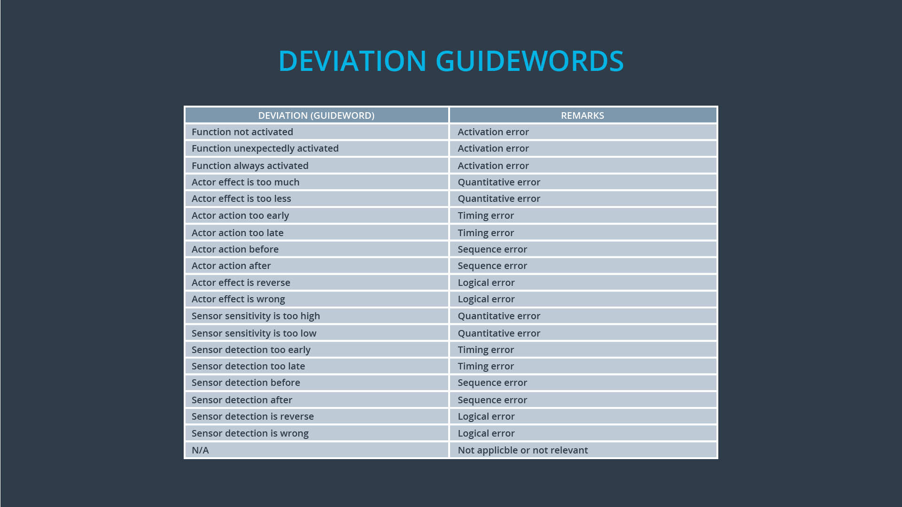
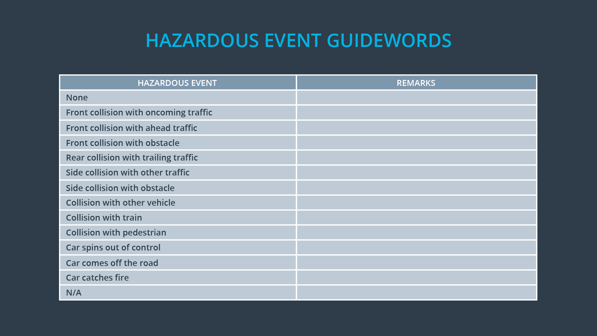

# Identification of Hazards

> Part of: **Functional Safety: Hazard Analysis and Risk Assessment**

## Video

[Watch on YouTube](https://www.youtube.com/watch?v=LXp7ScZaKp4)

## Summary

**Hazard Identification in ISO 26262**
=====================================

This lesson covers the process of identifying hazards in a safety-critical system, specifically in the context of ISO 26262. Hazard identification is a crucial step in ensuring the safety of electronic systems that could cause injury to humans or damage human health.

**Key Concepts**
---------------

* **Hazardous situations**: Electronic malfunctions that could cause injury to humans or damage human health.
* **Malfunctions**: Unintended behavior of an electronic system, such as excessive vibration in a lane departure warning function.
* **Guide words for malfunction identification**: A list of potential malfunctions to consider when identifying hazards.
* **Potential accidents or hazardous events**: Possible outcomes of a malfunction, such as loss of control of the steering wheel.
* **Function definition**: A clear description of the system's intended functionality.
* **Malfunction under consideration**: The specific malfunction being analyzed for its potential impact on safety.

**Practical Notes**
-------------------

When identifying hazards, consider the following steps:

1. Define the function and purpose of the electronic system.
2. Identify potential malfunctions using guide words or other relevant criteria.
3. Determine the details of each malfunction, including its cause and effect.
4. Consider the potential accidents or hazardous events that could occur as a result of each malfunction.
5. Assume that all other components in the vehicle are functioning correctly.

By following these steps, you can complete a hazard identification process for your safety-critical system. In the next step, we will combine situations and hazards together to measure risk.

## Transcript

<v English>After a situation analysis,</v> <v English>the next step is to identify hazards.</v> <v English>Remember that for ISO 26262 hazardous situations arise</v> <v English>from electronic malfunctions that could cause injury to humans or damage human health.</v> <v English>Malfunctions are unintended behavior.</v> <v English>If the purpose of the lane departure of</v> <v English>warning function is to vibrate the steering wheel,</v> <v English>a malfunction could be that the vibration is too strong.</v> <v English>The hazard is that the driver could lose control of</v> <v English>the steering wheel which could result in a risk of collision with another vehicle.</v> <v English>Like the situation analysis,</v> <v English>we have a list of guide words to identify malfunctions.</v> <v English>We also have a list of potential accidents or hazardous events that could occur.</v> <v English>Notice that we are not yet concerned with the technical implementation of the item.</v> <v English>For instance, we are not yet thinking about which part of</v> <v English>the lane departure of warning is causing the excessive vibrations.</v> <v English>Maybe it could be a software bug or an issue with the vibration motor.</v> <v English>But we are not concerned with that level of detail yet.</v> <v English>We also assume that every other item in the vehicle is functioning correctly.</v> <v English>We're only concerned with the lane assistance item.</v> <v English>An entire hazard identification would include the function definition,</v> <v English>the malfunction under consideration chosen from the guide words,</v> <v English>the details of the malfunction,</v> <v English>the accident called the hazardous event,</v> <v English>details about the event and a summary description of the hazardous event.</v> <v English>So the complete hazard identification for</v> <v English>our lane departure warning example would look like this.</v> <v English>In the next step we'll combine situations and hazards together and measure risk.</v>

## Images

## Additional Content

### Table with the Hazard Identification
| Function            | Lane Departure Warning (LDW) function shall apply  an oscillating steering torque to provide the driver haptic feedback.                                                            |
|---------------------|-------------------------------------------------------------------------------------------------------------------------------------------------------------------------------------|
| Malfunction         | Actor effect is too much.                                                                                                                                                           |
| Malfunction details | The LDW function applies an oscillating torque with very high torque (above limit).                                                                                                 |
| Hazardous event     | Collision with other vehicle.                                                                                                                                                       |
| Event details       | High haptic feedback can affect driver's ability to steer as intended.  The driver could lose control of the vehicle and collide  with another vehicle or with road infrastructure. |
| Summary description | The LDW function applies too high an oscillating torque to the steering wheel (above limit).                                                                                        |
### Lane Keeping Assistance Function Hazard Identification

In terms of the lane keeping assistance function, we previously developed an example where the driver was misusing the function by taking both hands off the wheel and incorrectly treating the car as a fully autonomous vehicle. 

In this example, the malfunction is that the lane keeping assistance function is always activated. 

Here as well, there is potential for a vehicle collision. Using the list of potential accidents, we will choose "collision with other vehicle". 

The lane keeping assistance function should add extra steering torque for a limited amount of time and then stop providing extra torque. That way, the driver cannot treat the function as if it were meant for fully autonomous driving.
### Malfunction (Deviation) Guidewords Table
### Hazardous Event Guidewords Table
### Quiz: Malfunction Guidewords
### Quiz: Hazardous Event Guidewords
### Quiz: Vocabulary Check
