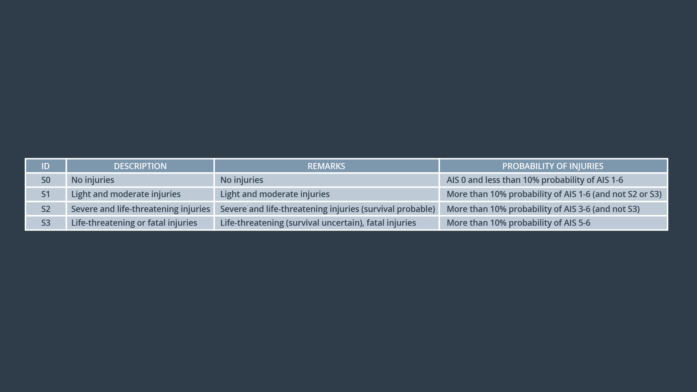
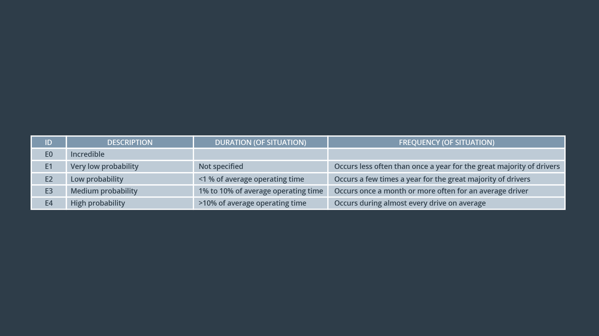
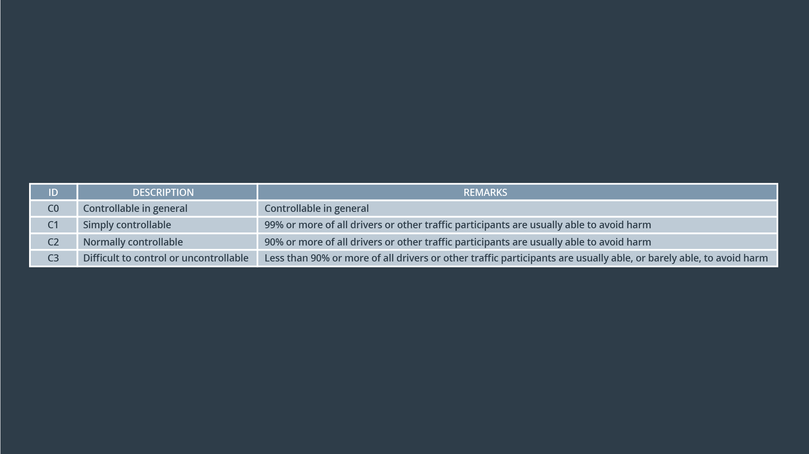

# Risk Assessment, Severity, Exposure, Controllability

> Part of: **Functional Safety: Hazard Analysis and Risk Assessment**

## Video

[Watch on YouTube](https://www.youtube.com/watch?v=44NYK53gOAM)

## Summary

**Risk Evaluation: Combining Situations and Hazards**

This lesson builds upon the introductory concepts of evaluating risk by combining situations and hazards. We will explore how to calculate risk using the ISO 26262 standard's equation: **risk = severity × exposure × controllability**.

### Key Concepts

* **Severity**: Measures the potential harm or injury in an accident, with four levels:
	+ S0: No injuries
	+ S1: Minor injuries
	+ S2: Moderate injuries
	+ S3: Life-threatening or fatal injuries
* **Exposure**: Measures how often drivers would find themselves in a specific situation, with five levels:
	+ E0: Never exposed
	+ E1: Rarely exposed
	+ E2: Occasionally exposed
	+ E3: Frequently exposed
	+ E4: Almost always exposed
* **Controllability**: Measures the likelihood of a driver regaining control of the vehicle during a hazardous event, with four levels:
	+ C0: High controllability
	+ C1: Moderate controllability
	+ C2: Low controllability
	+ C3: Very low controllability

### Practical Notes

To apply these concepts in practice:

* Use the severity table to evaluate the potential harm or injury in a situation.
* Determine exposure levels based on how often drivers would find themselves in a specific situation, using the exposure chart as a guide.
* Assess controllability by considering how likely a driver is to regain control of the vehicle during a hazardous event, using the controllability table as a reference.

By combining these factors, you can calculate the risk of a particular situation or hazard. In the next section, we will discuss ASIL (Automotive Safety Integrity Level), which is used to evaluate and classify the safety integrity level of a system based on its calculated risk.

## Transcript

<v English>It's time to combine situations and hazards together and then evaluate risks.</v> <v English>Once we know how high our risks are,</v> <v English>we can figure out how to bring risks down to acceptable levels.</v> <v English>Back in the introductory lesson,</v> <v English>we talked about evaluating risk with the equation risk equal severity,</v> <v English>times probability of occurrence.</v> <v English>In that lesson, we simplified things a bit.</v> <v English>In the ISO 26262 standard,</v> <v English>the risk is defined slightly differently with the equation risk</v> <v English>equal severity of a malfunction times probability of loss due to a malfunction.</v> <v English>You have already seen severity in the introduction.</v> <v English>Probability of loss due to a malfunction takes into</v> <v English>account two terms called exposure and controllability.</v> <v English>Risk then equals severity times exposure, times controllability.</v> <v English>Let's discuss each one of these factors in turn.</v> <v English>We introduce severity earlier.</v> <v English>Severity measures how badly a person could get injured in an accident.</v> <v English>In the ISO 26262 standard,</v> <v English>severity has four levels,</v> <v English>labeled S0, S1, S2 and S3.</v> <v English>S0 represents no injuries whereas S3 implies life threatening or fatal injuries.</v> <v English>For example, a situation in which the vehicle travels</v> <v English>over 40 kilometers per hour would have severity of S3.</v> <v English>In the situational analysis for the lane departure warning,</v> <v English>we considered that the driver was traveling at a high speed,</v> <v English>so the severity would be S3.</v> <v English>You can use this table below as a guide for</v> <v English>evaluating the severity of the situation under consideration.</v>

<v English>Now, let's talk about Exposure.</v> <v English>Do you remember from the introductory lesson the definition of probability of occurrence,</v> <v English>probability of occurrence actually measures how often or</v> <v English>how long drivers would find themselves in a specific situation?</v> <v English>For example, driving on a freeway parked in a parking lot,</v> <v English>or driving on a wet road.</v> <v English>Exposure is defined exactly like how</v> <v English>we define probability of occurrence in the introductory lesson.</v> <v English>Exposure has scale from E0 to E4.</v> <v English>For our lane departure warning example,</v> <v English>the situation involved highway driving on VicRoads.</v> <v English>According to functional safety standard,</v> <v English>driving on VicRoads is E3.</v> <v English>The chart below gives a sense of how to determine exposure levels.</v>

<v English>The final tone for evaluating risk is controllability.</v> <v English>Controllability measures how likely the driver will be</v> <v English>able to gain control of the vehicle during a hazardous event.</v> <v English>Controllability has a scale from C0 to C3,</v> <v English>where C3 is a situation</v> <v English>where an average driver could not maintain control of the vehicle.</v> <v English>If the lane departure warning function causes the steering wheel to</v> <v English>vibrate excessively with wild swings of the steering wheel,</v> <v English>most drivers would have difficulty controlling the vehicle.</v> <v English>We will put the controllability at C3.</v> <v English>We are also providing a table to help</v> <v English>distinguish between different controllability levels.</v> <v English>We can now evaluate the risk of our lane departure.</v> <v English>One example, we will combine severity,</v> <v English>exposure and controllability into a risk factor called ASIL.</v> <v English>Next, we will discuss ASIL in more depth.</v>

## Images

## Additional Content

### Risk Assessment: Severity
##### Table to Determine Severity
In the last column, you will see that probability of injury involves using a scale called AIS. AIS stands for **accident injury scale**. 

The accident injury scale is published by the [Association for the Advancement of Automotive Medicine](https://www.aaam.org/) (AAAM) and contains seven levels: AIS 0 through AIS 6. Here are examples of the injuries associated with each level.

* AIS 0: no injuries
* AIS 1: light injuries such as skin-deep wounds, muscle pains, whiplash
* AIS 2: moderate injuries such as deep flesh wounds
* AIS 3: severe but not life-threatening injuries such as skull fractures without brain injury
* AIS 4: severe injuries that are life-threatening but with probable survivability such as concussion with or without skull fractures with up to 12 hours of unconsciousness
* AIS 5: critical injuries (life-threatening, survival uncertain) such as spinal fractures below the fourth cervical vertebra with damage to the spinal cord
* AIS 6: extremely critical or fatal injuries such as fractures of the cervical vertebrae above the third cervical vertebra with damage to the spinal cord
Note that AIS is provided in the standard as an example. There is no requirement to use AIS and the "Probability of Injuries" field is a suggested guideline, not a strict requirement.
### Risk Assessment Exposure
##### Table to Determine Exposure
### Risk Assessment Controllability
##### Table to Determine Controllability
### Lane Keeping Assistance Example Severity, Exposure and Controllability

Here again is the situation we are analyzing for the lane keeping assistance example: 

"Normal driving on country roads during normal conditions with high speed (the driver is misusing the lane keeping assistance function as a fully autonomous function)". 

Because the driver is traveling at high speed, severity would be S3. The driver is on a country road and misusing the system. That combination probably does not happen often, so we will label the exposure E2. 

The malfunction was that the lane keeping assistance was always on and had no time limit, so drivers could take both hands off the wheel. Because hands aren't on the wheel at high speeds, a vehicle accident would not be controllable. We will label this hazardous situation as C3.
