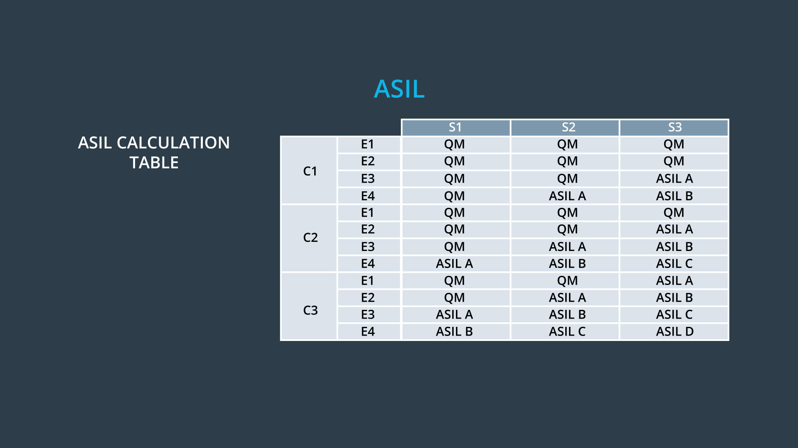

# Automotive Safety Integrity Levels (ASIL)

> Part of: **Functional Safety: Hazard Analysis and Risk Assessment**

## Video

[Watch on YouTube](https://www.youtube.com/watch?v=l7vx-w06fZw)

## Summary

**Automotive Safety Integrity Level (ASIL) and Risk Evaluation**
===========================================================

This lesson introduces a systematic approach for evaluating risk using severity, exposure, and controllability. The Automotive Safety Integrity Level (ASIL) metric is used to measure the amount of risk associated with each hazardous situation.

**Key Concepts**
---------------

* **Severity (S)**: A measure of how severe the consequences of a hazard are.
* **Exposure (E)**: A measure of how often or frequently the hazard occurs.
* **Controllability (C)**: A measure of how easily the hazard can be controlled or mitigated.
* **ASIL**: A metric that combines severity, exposure, and controllability to evaluate risk. ASIL levels range from A (lowest risk) to B (highest risk).
* **Quality Management (QM)**: A designation given when a hazard has a severity, controllability, or exposure level of S0, E0, or C0, indicating that the risk is already below acceptable levels.

**Practical Notes**
------------------

To calculate ASIL for a hazardous situation:

1. Determine the severity (S), exposure (E), and controllability (C) levels.
2. Use the ISO 26262 table to combine these values into an ASIL level.
3. If any of the values are S0, E0, or C0, the risk is automatically marked as QM.

Note: The IATF 16949 standard applies to hazardous situations classified as QM, in addition to ISO 26262.

## Transcript

<v English>Severity, exposure and controllability provide a systematic way for evaluating risk.</v> <v English>We take these three factors and combine them into</v> <v English>a metric called Automotive Safety Integrity Level or ASIL.</v> <v English>ASIL measures the amount of risk of each hazardous situation.</v> <v English>Lower risks are classified as ASIL A,</v> <v English>whereas the highest risks are classified as ASIL B. ISO 26262</v> <v English>provides a table for combining the three terms together into an ASIL.</v> <v English>Let's calculate the ASIL for our lane departure warning example.</v> <v English>You can see in the table that combining S3,</v> <v English>E3 and C3 leads to ASIL C. So</v> <v English>excessive steering wheel vibration is a hazard with relatively high risk.</v> <v English>This table brings up a couple of points that we haven't covered yet. What is QM?</v> <v English>And what happens if a hazard has a severity,</v> <v English>controllability or exposure levels of S0, E0 or C0?</v> <v English>If the risk assessment contains an S0,</v> <v English>E0 or C0, then the risk is automatically marked as QM.</v> <v English>QM stands for quality management and</v> <v English>implies that the risk is already below acceptable levels.</v> <v English>There is no need to apply ISO 26262 to</v> <v English>a hazardous situation of QM because risk is already low enough.</v> <v English>However, there are other standards that apply including</v> <v English>the automotive quality management standard IATF 16949.</v> <v English>Now that we know how to evaluate risks,</v> <v English>we will discuss what the system needs to do in order to lower the risk.</v>

## Images

*Table for Calculating ASIL*

## Additional Content

### ASIL
Note: In the video, it's noted that QM implies risk is already below acceptable levels. What should be properly stated is that Quality Management approaches need to be applied to ensure lower level risks are mitigated.
Now, we can evaluate the risk of our lane keeping assistance function's hazardous situation. We combine the severity, exposure and controllability to find the ASIL.
Combining S3, E2 and C3 from the lane keeping assistance example gives ASIL B. 

ASIL shows how high the risk is above acceptable levels so that you know how much work needs to be done to lower risk. Coming up, we will examine ASIL in more detail and discuss the differences between ASIL A, B, C, and D.
### Quiz: Calculating ASIL
### Examples of How Driving Situations Affect ASIL

To reinforce how severity, exposure, and controllability relate to ASIL, let's look at the lane departure warning example one more time. In the original situational analysis, we said that the vehicle was driving on the highway in the rain at high speed, which led to ASIL C.

What about driving on a wet road on a city street at low speed? A low speed collision implies severity of S1. Exposure remains E3 because of the wet road. Controllability would could still remain C3 because the steering wheel jerking back and forth violently would be difficult to control even at lower speeds. S1, E3 and C3 result in ASIL A. The ASIL went down to A whereas originally we had ASIL C. Intuitively, this makes sense; the driver is driving more slowly with all other conditions remaining the same, so the risk has gone down.

What about driving on a dry road on a city street at low speed? Severity would stay at S1. Exposure now increases to E4 and controllability remains at C3. ASIL now increases to B. Perhaps counterintuitively, if we consider driving on a dry road instead of a wet road, risk increases. The increased risk comes from the exposure. A driver is more likely to be driving on a dry road than a wet road, so there is a higher probability that a random malfunction will occur on a dry road; hence risk increases for the dry road scenario.

What if we had considered high speed highway driving on a dry road? Exposure would go up to E4, severity would be S3, and controllability C3. The ASIL would then increase to ASIL D. 

When more than one situation maps to the same hazard, you will be conservative and choose the highest ASIL level for the hazard. If we were considering the possibility that the lane departure warning system vibrates too much on wet highways and also dry highways, we would assign ASIL  D. 
### Analysis and Testing for Different ASILs

Higher ASIL levels require more analysis, requirements and testing to reduce risk to acceptable levels. So in the lane assistance example, the first hazardous situation with ASIL C will require more work than the second hazardous situation with ASIL B.

Here are a few examples of extra measures that may need to be taken for higher ASILs:

* Deductive analysis, an example of which is [Fault Tree Analysis](https://en.wikipedia.org/wiki/Fault_tree_analysis) is recommended for ASIL C and ASIL D
* ASIL D suggests a target for the PMHF metric failure rate of no greater than 10 dangerous, undetected failures per billion hours of operation whereas ASIL B only suggests a failure rate of no more than 100 failures per billion hours
* For Software units with ASIL D more rigorous testing such as [MC/DC coverage](https://en.wikipedia.org/wiki/Modified_condition/decision_coverage) are highly recommended whereas ASIL B only mandates DC coverage.

Compensatory measures like Fault Tree Analysis, and MC/DC coverage are beyond the scope of this module, but you can learn more about them at the links.
### Quiz: Severity, Exposure and Controllability
