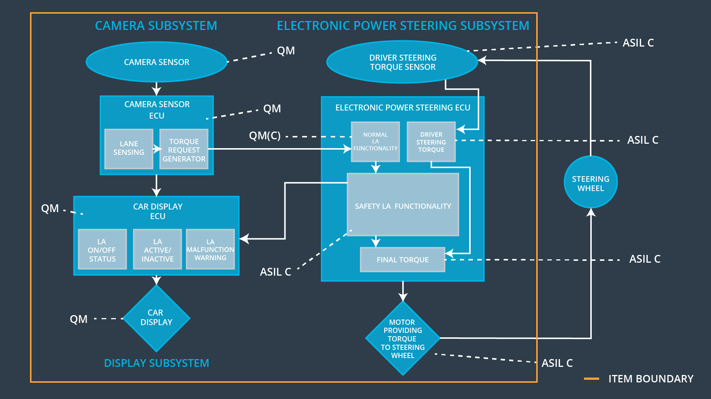
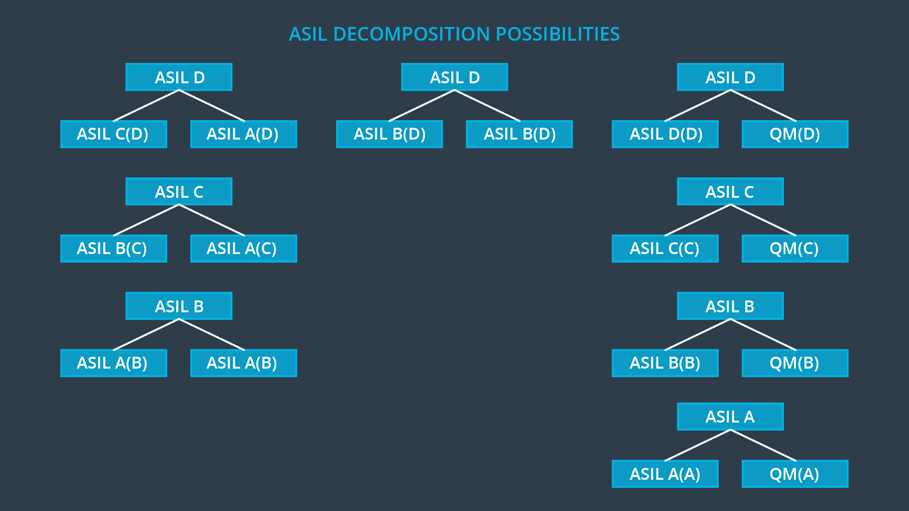
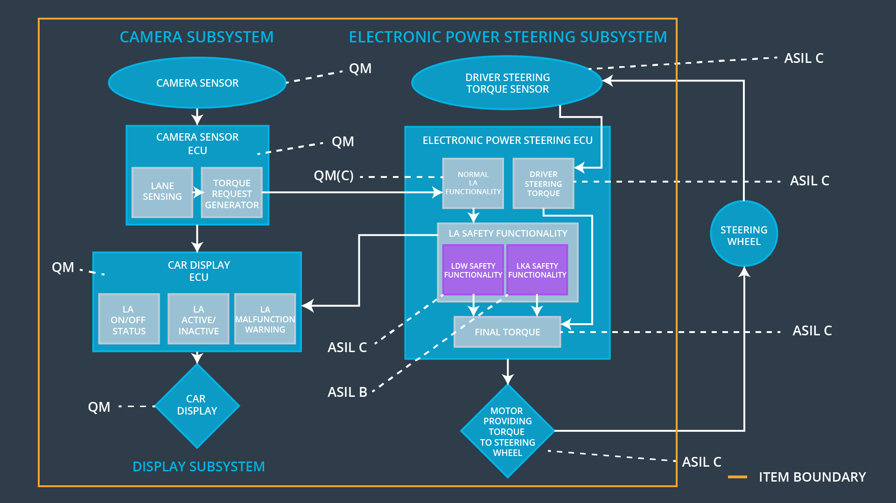

# ASIL Decomposition

> Part of: **Functional Safety: Functional Safety Concept**

## Video

[Watch on YouTube](https://www.youtube.com/watch?v=dphScT1QTNY)

## Summary

**ASIL Decomposition for Automotive Systems**
==============================================

This document summarizes the key concepts and practical notes from a lesson on ASIL decomposition, a technique used in automotive systems to reduce the risk associated with safety-critical functions.

### Key Concepts

* **ASIL (Automotive Safety Integrity Level)**: A standard used to classify the level of risk associated with safety-critical functions in automotive systems. The levels range from A ( lowest risk) to D (highest risk).
* **ASIL Decomposition**: A technique that allows for the decomposition of a single ASIL into multiple, lower-risk ASILs by creating independent and redundant systems.
* **Redundancy**: Creating duplicate systems or components to reduce the probability of malfunction. In ASIL decomposition, redundancy is used to lower the risk associated with safety-critical functions.
* **Probability of Malfunction**: The likelihood that a system or component will fail. According to ISO 26262, if two independent redundant systems have a probability of malfunction of 0.8, the combined probability of both failing together is 0.64.
* **ASIL B(D)**: A label used to indicate that an original ASIL D system has been decomposed into multiple, lower-risk ASILs.

### Practical Notes

* **Decomposing a System**: To apply ASIL decomposition, identify a safety-critical function and split it into two or more independent and redundant systems. Each redundant system should have its own ASIL label.
* **Labeling Decomposed Systems**: Label each decomposed system with the corresponding ASIL level (e.g., ASIL B(D) for an original ASIL D system).
* **Benefits of ASIL Decomposition**:
	+ Reduced analysis and testing requirements
	+ Lower risk associated with safety-critical functions
	+ Improved system reliability

Example Use Case:

Suppose we have a lane departure warning software block labeled as ASIL C. By applying ASIL decomposition, we can split the software into two parts: one for normal functional behavior (QM(C)) and another for functional safety requirements (ASIL C). This allows us to reduce the risk associated with the original ASIL C label and improve system reliability.

## Transcript

<v English>We've already said that the electronic power steering subsystem</v> <v English>is ASIL C for the lane departure warning functionality.</v> <v English>Although ASIL C is not the highest level of risk,</v> <v English>ASIL C still does add</v> <v English>many extra testing and verification demands not required by a lower ASIL.</v> <v English>Is there any way to lower the ASIL for at least some of the architectural elements?</v> <v English>It turns out that there is.</v> <v English>It's called ASIL decomposition.</v> <v English>Imagine part of our system is label ASIL D. If</v> <v English>we create two completely independent but redundant systems,</v> <v English>ISO 26262 actually allows us to label each redundant system ASIL B.</v> <v English>This comes from basic probability.</v> <v English>If the probability of a malfunction equals .8 then the probability that</v> <v English>two completely independent redundant systems will fail</v> <v English>together is .8 times .8 which equals .64,</v> <v English>redundant systems lower risk.</v> <v English>What is the benefit of creating independent redundant systems?</v> <v English>ASIL B requires less analysis and testing than ASIL D. For reference,</v> <v English>we should label the new Independent Systems ASIL B(D),</v> <v English>in recognition that the system was originally ASIL D. What are</v> <v English>the most common ASIL decompositions is splitting off</v> <v English>a single element into a non-safety relevant and safety relevant part.</v> <v English>The non-safety relevant block will be QM.</v> <v English>The benefit is that ISO 26262 will only apply to part of the original element.</v> <v English>Let's see how this works.</v> <v English>We are going to decompose the lane departure</v> <v English>warning software block inside the power steering ECU.</v> <v English>We will split the latest system software into two parts.</v> <v English>One software element will contain code for normal functional behavior.</v> <v English>We will create a separate software element to</v> <v English>take care of our functional safety requirements.</v> <v English>Let's look at our system architectural diagram again.</v> <v English>The electronic power steering software a block is labeled</v> <v English>ASIL C. With ASIL decomposition,</v> <v English>the software block that takes care of normal functional behavior now gets a QM(C) label.</v> <v English>The software block that takes care of malfunctions inherits the ASIL C.

Now we no</v> <v English>longer have to apply ISO 26262 to the normal behavior software block.</v> <v English>By refining the architecture and determining ASILs,</v> <v English>we are figuring out how much risk is in each element and subsystem.</v> <v English>Decomposition then allows us to lower the ASIL of some of the architectural elements.</v>

## Images

*ASIL Decomposition Results*

*Possible ASIL Decompositions*

*Criteria for Co-existence*

## Additional Content

### System Diagram after ASIL Decomposition

Here is the system diagram after decomposing the safety lane block:
### ASIL Decomposition

Splitting off an element into a QM and ASIL C element is actually offering some amount of redundancy in a sense. Let's just say after some user testing that we decide to limit the vibrational torque to +/- 3 N-m. Anything beyond +/- 3 N-m was too difficult for drivers to control. 

Maybe we'll put in a buffer and say that the "normal lane assistance functionality software block" will ask for a torque of +/- 2.8 N-m. 

The "safety lane assistance functionality" block's only job is to make sure the torque does not go beyond +/- 3 N-m. 

So you could program the "normal" block to only make requests between +/- 2.8 N-m. The "safety" block is then adding an extra check to make sure the request never goes beyond +/- 3 N-m. If the torque request goes beyond +/- 3 N-m, the safety software block will assume something has gone wrong with the system. The safety software block might not know why the malfunction occurred or what the source was. But the safety software block knows that something has gone wrong.

Why would the "normal" block ever request a torque beyond +/- 2.8 N-m? Two sources could be either a software bug or an ECU hardware component failure. Maybe an electrical short circuit could cause the malfunction as well.

The benefit of the ASIL decomposition is that the "normal" block, which will have functionality for receiving and interpreting camera subsystem signals, only needs to go through quality management protocols; otherwise, all of that functionality would have to go through the extra rigors of ASIL C testing.
### Lane Keeping Assistance Example: ASIL Inheritance and ASIL Decomposition

Where do we put the software block for the lane keeping assistance function? And what is its ASIL?

Let's go back to the safety goal and functional safety requirements for the lane keeping function:

From the Hazard Analysis and Risk Assessment, the safety goal was the "lane keeping assistance function shall be time limited and the additional steering torque shall end after a given timer interval so that the driver can not misuse the system for autonomous driving". We rated this ASIL B.

We then derived the functional safety requirement: "the lane keeping item shall ensure that the lane keeping assistance torque is applied for only Max_Duration".

The functional safety requirement inherits the ASIL from the safety goal, so this functional safety requirement is ASIL B as well.

What do we do now? We already decided that the lane departure warning made the lane assistance software block ASIL C. But we also have a functional safety requirement with ASIL B for the same software block. If two safety requirements are assigned to the same block, the higher ASIL prevails. So the simplest answer is that the lane assistance software block would have ASIL C.

The rule in ISO 26262 is that sub-elements should inherit the highest ASIL level unless you can prove that the lower ASIL sub-element has no impact on and does not cause a failure in the higher ASIL sub-element. This is called criteria for co-existence. If you can prove that the lane keeping assistance software would not affect the lane departure warning, then you can separate out the functionality into two blocks with ASIL C and ASIL B.

### Criteria for Co-existence

If a failure in the lane keeping assistance software element has no impact on the lane departure warning software element, then the lane keeping assistance software block can be ASIL B; otherwise, the lane keeping assistance software block needs ASIL C.

These types of failures where one element fails and then causes another element to fail is called a cascading failure.

You can avoid cascading failures by carefully designing the data and control flow of software or the input/output signals and control lines for hardware.

For the purposes of the lesson, we will assume that a failure in the lane keeping assistance function will not impact the lane departure warning function.
### System Diagram after Adding Extra Safety Elements

Here is the system diagram after adding safety elements for the lane departure warning and lane keeping assistance:
### Quiz: ASIL Decomposition
