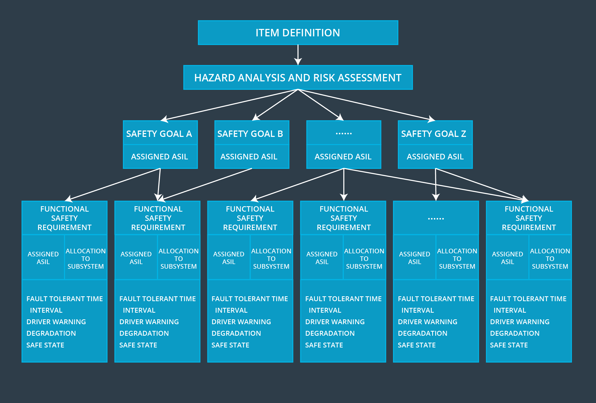

# Summary

> Part of: **Functional Safety: Functional Safety Concept**

## Video

[Watch on YouTube](https://www.youtube.com/watch?v=NVCU1mOxnAo)

## Summary

**Functional Safety Requirements**
=====================================

This summary covers the key concepts from a Udacity lesson on functional safety requirements in system design. The main topic is the transition from defining safety requirements at a high level to allocating those requirements to specific hardware and software components.

### Key Concepts
* **Functional Safety**: A set of requirements that ensure a system behaves safely under all possible operating conditions.
* **Risk Allocation**: The process of assigning safety responsibilities to specific components or systems within an item architecture.
* **Technical Requirements**: The detailed specifications for implementing functional safety, including hardware and software elements required to meet those requirements.

### Practical Notes
To implement functional safety in a system, you need to:

* Identify the technical elements (hardware and software) needed to limit specific hazards (e.g., vibration amplitude and frequency).
* Determine how these elements will interact with each other to ensure safe operation.
* Refine your functional safety requirements based on technical feasibility and practical considerations.

Note: This summary is a brief overview of the key concepts from the lesson. For more detailed information, please refer to the original Udacity lesson video or additional resources provided by the instructor.

## Transcript

<v English>We have defined safety requirements at the functional level</v> <v English>and then allocated those requirements to the item architecture.</v> <v English>We now know what level of risk is contained in the item and we</v> <v English>have added extra functionality to make sure that the item behaves in a safe manner.</v> <v English>The next step is to look at the safety requirements from a technical perspective.</v> <v English>We've said, for example,</v> <v English>that the steering wheel warning vibration amplitude and frequency need to be limited.</v> <v English>But what software and hardware elements are we</v> <v English>going to need in order to limit the vibration?</v> <v English>What are those hardware and software elements going to do to ensure functional safety?</v> <v English>In the next lesson,</v> <v English>we will refine our functional safety requirements and the technical safety requirements.</v>

## Images

*Steps Up Until Functional Safety Concept*

## Additional Content

### Summary
Here is a diagram giving an overview of what we have covered so far:
### Summary

In the final project, you'll be asked to document the functional safety requirements for both the lane departure warning malfunctions as well as the lane keeping assistance malfunction.

You'll need to keep in mind the following information:
- functional safety requirements and their attributes (ASIL, Fault Tolerant Time Interval, Safe State, Verification and Validation Acceptance Criteria)
- system diagram with an updated architecture (we will provide this for you)
- warning and degradation concept, which explains the warnings that the driver will receive as well as how the system will be shut down when a malfunction occurs.
