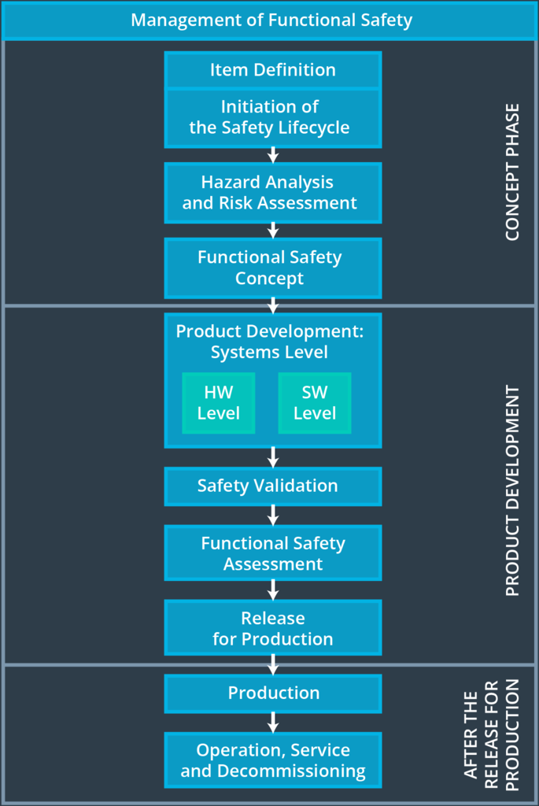
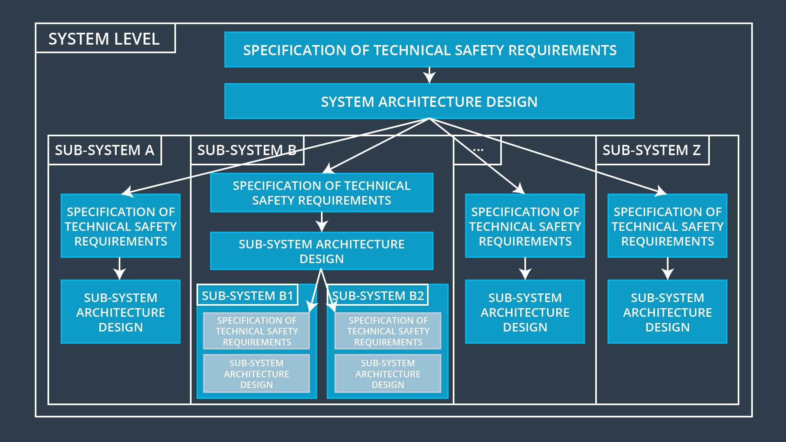

# Introduction

> Part of: **Functional Safety: Technical Safety Concept**

## Video

[Watch on YouTube](https://www.youtube.com/watch?v=wBKlo2Lk_A0)

## Summary

**Technical Safety Concept Summary**
=====================================

A **technical safety concept** is a detailed plan for ensuring the safe operation of a system, focusing on specific components and their interactions. This lesson teaches you how to develop and document a technical safety concept by transforming functional safety requirements into concrete technical specifications.

### Key Concepts

*   **Functional Safety Concept**: A high-level approach that considers the overall system from a bird's eye view.
*   **Technical Safety Concept**: A detailed, component-focused plan for ensuring safe operation.
*   **Allocation of Requirements**: Transferring functional safety requirements to specific components within the system architecture.

### Practical Notes

To develop a technical safety concept:

1.  Start with the functional safety requirements defined in previous lessons.
2.  Identify the relevant components (sensors, control units, actuators) that need to be considered for each requirement.
3.  Document the technical safety requirements by specifying how each component will meet the corresponding functional safety requirement.

Example of a Technical Safety Concept:

| Functional Safety Requirement | Component | Technical Safety Requirement |
| --- | --- | --- |
| Prevent sensor damage | Sensor | Implement shock-absorbing material around the sensor to prevent physical impact. |
| Ensure control unit reliability | Control Unit | Use redundant components and implement regular software updates to minimize downtime. |

By following this process, you can create a comprehensive technical safety concept that ensures the safe operation of your system.

## Transcript

<v English>A technical safety concept and a functional safety concept look quite similar.</v> <v English>Again, we will be defining new requirements and</v> <v English>then allocating those requirements to our system architecture.</v> <v English>The difference is that functional safety concept</v> <v English>considers an item from a bird's eye view.</v> <v English>The technical safety concept is more concrete,</v> <v English>looking at the safety requirements of sensors,</v> <v English>control unit, and actuators.</v> <v English>In this lesson, we'll focus on how to develop and document a technical safety concept.</v> <v English>We will take the functional safety requirements</v> <v English>and turn them into technical safety requirements.</v>

## Images

*Functional Safety Lifecycle*

*Technical Safety Concept at the System and Sub System Level*

## Additional Content

### Concept Phase Versus Product Development Phase

ISO 26262 places the functional safety concept in the concept phase while the technical safety concept is part of the product development phase.

This is because the technical safety concept is more concrete and gets into the details of the item's technology. The product development phase also includes designing hardware and software. This lesson will only focus on the technical safety concept, and the next lesson will discuss hardware and software development.

As a reminder, here is a version of the V model that has been stretched out vertically. You can see the functional safety concept is the last step in the concept phase. The technical safety concept would belong to the product development at the systems level:
### Product Development Phase

The product development phase is divided into two parts:
* Product development at the system level
* Product development at the hardware and software level

ISO 26262 treats an item as if it were a system of systems. Take the lane assistance item as an example. The item has three systems:
* Vision system (camera)
* Display system (car dashboard)
* Motion system (electronic power steering)

Before developing hardware or software, the technical safety requirements need to be determined for each of these systems. And before the technical safety requirements can be determined for each system, the functional safety requirements need to be determined for the lane keeping item.

So the technical safety concept involves:
* Turning functional safety requirements into technical safety requirements
* Allocating technical safety requirements to the system architecture

This will set us up for drilling down into software and hardware implementation in the next lesson.
### Technical Safety Concept at the System Level versus Technical Safety Concept at the ECU Level

In the ADAS lane assistance example, we have said that the only safety-relevant subsystem is the electronic power steering. And our example has put most of the safety-relevant functionality in the power steering ECU.

This is a simplified example. Most of the time, multiple subsystems will be involved in a technical safety analysis. When there are multiple subsystems, the technical safety concept might have to be divided into more than one document.

One technical safety concept will be called the "Technical Safety Concept at the System Level". This document would look at how the subsystems interact with each other.

There might be a separate technical safety concept that drills down to the ECU level. 
Each safety relevant ECU would have its own technical safety concept document. 

In our simplified lane assistance example, the only safety relevant element was the electronic power steering ECU; thus, our technical safety concept will go directly to the ECU level. But in general, you will need to develop multiple technical safety concepts; one at the system level and then one for each safety relevant ECU.

Here is an diagram showing how a technical safety concept might be divided into several documents:
