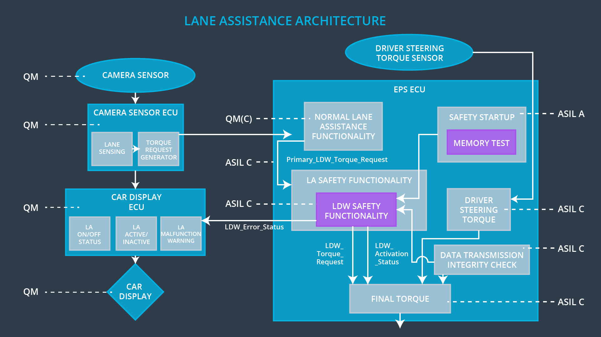

# Allocation of Requirements to System Architecture Elements

> Part of: **Functional Safety: Technical Safety Concept**

## Video

[Watch on YouTube](https://www.youtube.com/watch?v=dA2up9vZCcM)

## Summary

**Technical Safety Requirements Allocation**
=============================================

This project involves allocating technical safety requirements to a system architecture, specifically for an autonomous vehicle's lane departure warning (LDW) system. The goal is to ensure that the system meets functional safety standards.

### Key Concepts
* **ASIL**: Automotive Safety Integrity Level, a standard used to classify the severity of potential hazards in automotive systems.
* **Functional Safety**: A concept that ensures the safe operation of complex electronic and electrical systems by identifying and mitigating potential hazards.
* **LDW Safety Software Component**: A software component responsible for ensuring the safe operation of the LDW system.
* **Vibrational Torque Request**: A signal sent from the basic lane keeping functionality block to the LDW safety software element, which checks its amplitude and frequency before sending it to the final EPS torque generator block.

### Practical Notes
To implement this project, you will need to:

* Allocate technical safety requirements to the system architecture based on the ASIL classification.
* Implement a softer block between the LDW safety block and the final EPS torque generator block to check the validity of the torque request.
* Use an external block with separate code for the memory test requirement, which runs when the vehicle is turned on.
* Label safety-relevant blocks with their corresponding ASIL classification (e.g., ASIL C) and non-safety relevant blocks with a lower classification (e.g., QM).

## Transcript

<v English>Like in the functional safety concept,</v> <v English>we will now allocate technical safety requirements to the system architecture.</v> <v English>The first three technical safety requirements we</v> <v English>identified will be allocated to the LDW safety software component.</v> <v English>Let's summarize what these three safety requirements are doing.</v> <v English>The LDW safety software element receives</v> <v English>the vibrational torque request from the basic lane keeping functionality block.</v> <v English>The LDW safety element checks to make sure that</v> <v English>the torque request is below the maximum amplitude and frequency.</v> <v English>If the maximum amplitude or frequency is crossed,</v> <v English>the LDW safety element deactivates the functionality and sets the torque request to zero.</v> <v English>The LDW safety block then sends</v> <v English>its stock request to the final EPS torque generator block.</v> <v English>A warning light needs to alert the driver to the malfunction.</v> <v English>The LDW safety block will send a status signal out to the car display.</v> <v English>The signal indicates whether or not</v> <v English>the lane assistance item is active and functioning properly.</v> <v English>The status signal would also go to the final EPS torque generator block.</v> <v English>This block could use the status signal as</v> <v English>an extra check on sending an invalid signal to the motor.</v> <v English>To check the validity and integrity of the torque request,</v> <v English>a softer block would be added specifically for this task between</v> <v English>the LDW safety block and the final EPS torque generator block.</v> <v English>This block is ensuring that the signal has not been corrupted during the transmission.</v> <v English>For the memory test requirement,</v> <v English>there is a separate external block with the code.</v> <v English>This block will run when the vehicle is turned on</v> <v English>because the ECUs throughout the vehicle can't share this block.</v> <v English>The ASIL for the functional blocks are inherited from the technical safety requirements.</v> <v English>You can see that safety relevant blocks are labeled ASIL C,</v> <v English>except for the memory test code,</v> <v English>which we previously explained only needs to be labeled ASIL A.</v> <v English>The basic lane assistance functionality is labeled QM,</v> <v English>which we discussed in the previous lesson in reference to ASIL decomposition.</v> <v English>We have now derived technical safety requirements and allocated them to the architecture.</v>

## Images

*System Architecture Taking into Account Lane Departure Warning Technical Safety Requirements*

## Additional Content

### Technical Safety Requirements Review

Here is a list of the technical safety requirements we have identified so far. This list might be helpful as you watch the video below.

* The LDW safety component shall ensure that the amplitude of the 'LDW_Torque_Request' sent to the 'Final electronic power steering Torque' component is below 'Max_Torque_Amplitude.

* As soon as a failure is detected by the LDW function, it shall deactivate the LDW feature and the 'LDW_Torque_Request' shall be set to zero.

* As soon as the LDW function deactivates the LDW feature, the 'LDW Safety' software block shall send a signal to the car display ECU to turn on a warning light. 

* The validity and integrity of the data transmission for 'LDW_Torque_Request' signal shall be ensured.

*  Memory test shall be conducted at start up of the EPS ECU to check for any faults in memory.

### Other Things to Consider

Here are a few constraints to consider when refining a system architecture in a technical safety concept:
* Elements inherit the highest ASIL from the technical safety requirements. So if the same software element provides functionality to the lane departure warning and lane keeping assistance functions, the higher ASIL wins. In this case, the lane departure warning had ASIL C whereas the lane keeping assistant had ASIL B. So ASIL C wins.
* If an element contains subelements with different ASILs, both sub-elements receive the highest ASIL. If a subelement has an ASIL but another subelement is QM, then the same rule applies and both will take the highest ASIL. The exception is if the criteria for coexistence is met. Criteria for coexistence was already discussed in the previous lesson. If a failure in one sub-element will not affect the other sub-element, then the sub-elements can have different ASILs.
* Internal and external interfaces for safety-related elements need to be clearly defined. This way non-safety related elements are clearly identified as well. 

### System Diagram

Here is a system diagram with the added functionality from the technical safety requirements:
### Allocation: Functional Safety Concept versus Technical Safety Concept

In the functional safety concept, you allocated all of the requirements to the EPS ECU. Now, your system diagram has a lot more detail. So it isn't enough to say that the technical safety requirements are allocated to the EPS ECU; the technical safety requirements will be allocated to different software elements such as the "LDW Safety Functionality" block, the "Data Transmission Integrity Check", or other relevant blocks inside the EPS ECU.
### Allocation for the Other Technical Safety Requirements

With the information we've given about the lane departure warning technical safety requirements, you can derive a few technical safety requirements for the lane keeping assistance function and then allocate the requirements to the architecture. This will be part of the project.

### Quiz: Functional Safety Requirements versus Technical Safety Requirements
