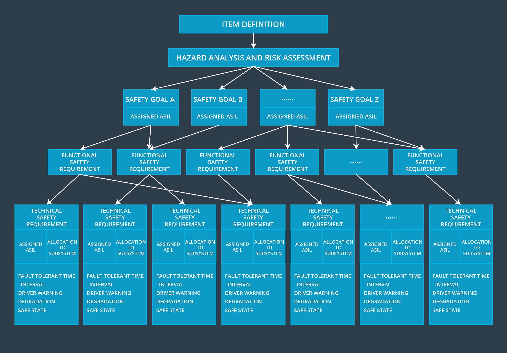

# Summary

> Part of: **Functional Safety: Technical Safety Concept**

## Video

[Watch on YouTube](https://www.youtube.com/watch?v=sIe4SZfDUmM)

## Summary

**Technical Safety Requirements for System Architecture**
===========================================================

This summary outlines the key concepts related to technical safety requirements and their allocation in system architecture.

### Key Concepts
* **V-model**: A development process model that guides the creation of a system from concept to delivery, with a focus on technical safety.
* **Functional Safety Standard**: An international standard (e.g. IEC 61508) that outlines requirements for ensuring the safe functioning of electrical and electronic systems.
* **Hardware and Software Development**: The process of creating hardware and software components that meet specified safety requirements.

### Practical Notes
No specific practical steps or code patterns are mentioned in this transcript, but it is noted that the next lesson will provide an introduction to software and hardware development according to the functional safety standard. This suggests that future lessons will cover more detailed technical information related to implementing technical safety requirements in system architecture.

## Transcript

<v English>We have now the right technical safety requirements</v> <v English>and allocated these requirements to the system architecture.</v> <v English>Traveling down the V-model from technical safety concept,</v> <v English>we arrive at hardware and software development.</v> <v English>Developing hardware and software follows a similar arc to what we have already done.</v> <v English>We first specify safety requirements.</v> <v English>Next, we design the hardware and software architectures.</v> <v English>In the next lesson, we'll give an introduction to the software</v> <v English>and hardware development according to the functional safety standard.</v>

## Images

*Steps Covered Through Technical Safety Concept*

## Additional Content

### Summary
Here is an overview of what we have covered so far:
