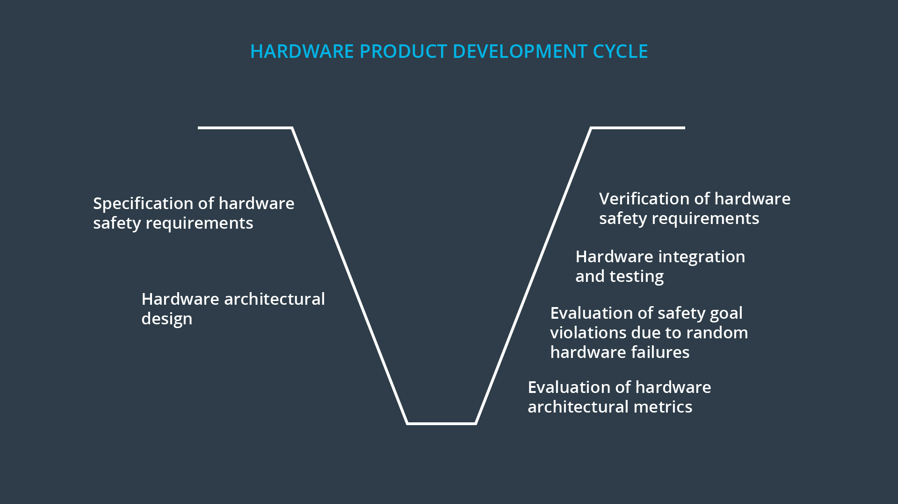
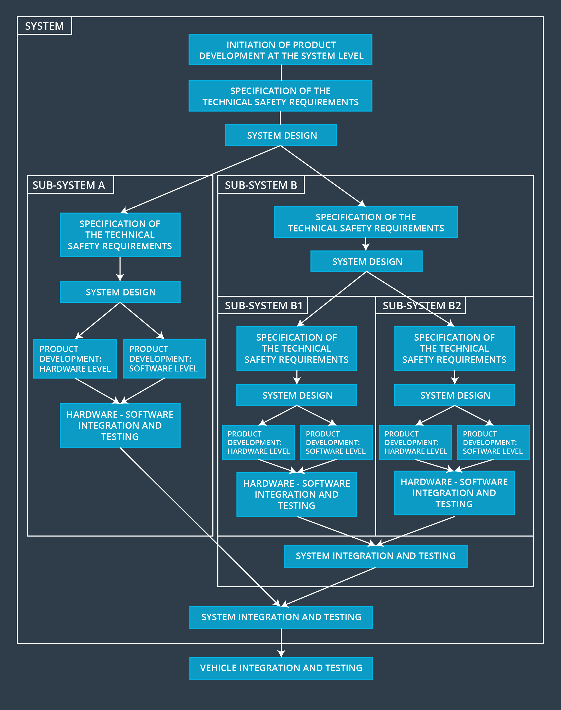

# V model

> Part of: **Functional Safety at the Software and Hardware Levels**

## Images

*Summary of ISO 26262 V Model*

*Functional Safety Bird's Eye View*

## Additional Content

### Hardware and Software Product Development Life-Cycle

Let's get an overview of the hardware and software product development cycle. The V model divides hardware and software into their own mini-Vs:

The general idea represented in each V stays the same; first, you specify safety requirements. Then you allocate these requirements to a system architecture. Finally you test, integrate, and verify. Each V model process is the same one we discussed back in the first lesson.

But there is an extra step on the hardware and software sides. For hardware, the V model includes sections about hardware architectural metrics and evaluation of random hardware failures. Here is a more detailed view of the hardware V model:

On the software side, there is an architectural design section as well as a unit design section:
In this lesson, we will discuss random hardware failures as well as how to develop software safety requirements.

### Architectural Design vs Unit Design

The software architectural design is a higher level view of software components. For example, this could be a camera ECU from our lane assistance example. 

A unit is a smaller part of a software architecture. A unit could be a software driver to read raw data from a camera sensor. There is no hard and fast rule as to what belongs in the architectural design section versus the unit design section. Functional safety in general can be an iterative process where developing a new section of the V model can lead to changes in a previous section and vice versa.

In the following diagram, you can see a general outline of what would be involved in a functional safety project. You can see that the steps of the V model have been stretched out vertically. Oftentimes an item will have multiple systems and sub systems. Sub systems will have their own software and hardware requirements. And these subsystems need to be integrated into larger systems:

Please note that the "in-context" development described here can become impractical due to a need to development custom software and hardware. To mitigate this, a commonly used approach is "Safety Element out of Context" (SEooC), which considers using standard safety hardware and software components to address functional safety implementation. You may enjoy [this interesting paper](http://papers.sae.org/2012-01-0033/) describing a practical approach to SEooC.
