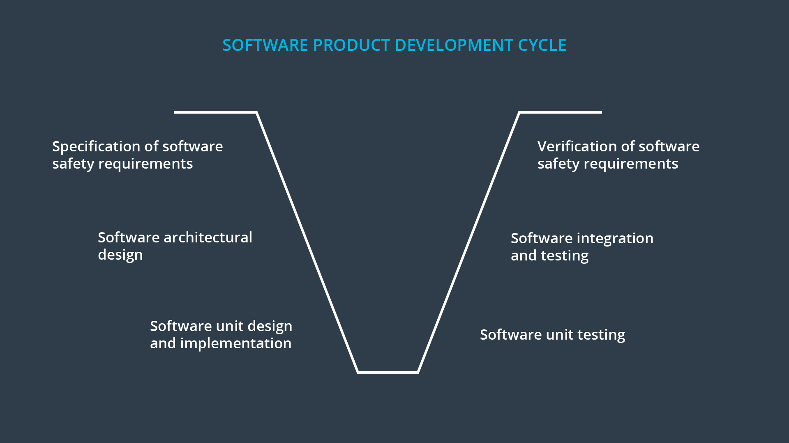

# Software Safety Life-cycle

> Part of: **Functional Safety at the Software and Hardware Levels**

## Video

[Watch on YouTube](https://www.youtube.com/watch?v=OJMGRtJciNI)

## Summary

**Software Development for Functional Safety**
=============================================

This lesson covers the main tasks involved in software development from a functional safety perspective. The four key tasks are developing software safety requirements, specifying a software architecture, testing the software to ensure it meets the requirements, and integrating software with hardware.

### Key Concepts
* **Functional Safety**: Ensuring that systems operate safely and do not cause harm to people or the environment.
* **Software Safety Requirements**: Derived from technical safety requirements, these cover functions that enable a system to maintain or reach a safe state. Examples include:
	+ Detecting faults in both hardware and software
	+ Indicating and handling faults
	+ Timing constraints (e.g., fault-tolerant time intervals)
* **Software Architecture**: The overall product architectural design, which includes allocating safety requirements to the architecture.
* **Lane Departure Warning Technical Safety Requirements**: An example of technical safety requirements that can be used to derive software safety requirements.

### Practical Notes
When developing software for functional safety, it's essential to consider the following:

* Derive software safety requirements from technical safety requirements and allocate them to the overall product architectural design.
* Consider timing constraints, warning light functionality, communication interfaces (e.g., CAN, Ethernet), and user interfaces when specifying software safety requirements.
* There is no separate "safety software architecture" – safety requirements are allocated to the overall product architectural design.

## Transcript

<v English>From the standpoint of functional safety,</v> <v English>software development involves four main tasks.</v> <v English>The first task is developing software safety requirements.</v> <v English>The second task is to specify a software architecture.</v> <v English>Then, the third task is to test</v> <v English>the software to make sure that the architecture meets the requirements.</v> <v English>Lastly, software is integrated with hardware.</v> <v English>These four tasks might look familiar.</v> <v English>They are the same four steps we've discussed previously for all levels of the V-diagram.</v> <v English>Where do software safety requirements come from?</v> <v English>Many software safety requirements are</v> <v English>derived directly from the technical safety requirements.</v> <v English>In general, these requirements cover functions that</v> <v English>enables the system to maintain or reach a safe state.</v> <v English>Functions for detecting, indicating,</v> <v English>and handling faults in both hardware and software.</v> <v English>Typical software safety requirements might be based on</v> <v English>timing constraints such as fault tolerant time intervals.</v> <v English>Warning light functionality is also often associated with software safety requirements.</v> <v English>Communication interfaces like CAN, Ethernet connections,</v> <v English>or user interfaces are also commonly solved with software safety requirements.</v> <v English>In the text below we will derive</v> <v English>a few software safety requirements from</v> <v English>the lane departure warning technical safety requirements.</v> <v English>And then we'll allocate at these requirements to the architecture.</v> <v English>Keep in mind that there is no such thing as a separate safety software architecture.</v> <v English>The safety software requirements are</v> <v English>allocated to the overall product architectural design.</v> <v English>Besides technical safety requirements,</v> <v English>there are a few other sources of</v> <v English>software safety requirements that we will talk about in the next part of the.</v>

## Images

*ISO 26262 Software V Model*

## Additional Content

### Software Safety Requirements, Architecture, Testing and Integration
### Software V diagram

In the video, we simplified the software safety V model to show that the software safety life-cycle involves the same four steps as other levels of the functional safety analysis:
1. specifying safety requirements
2. designing an architecture and allocating the requirements to the architecture
3. software testing
4. software integration

Here is a slightly more detailed version of the software safety life-cycle:
Developing a software architecture should consider both safety and non-safety requirements. Software safety requirements and software product requirements cannot be separated into two different architectures; a software architecture will be a mixture of product requirements and safety requirements. 

An architectural design might involve multiple micro-controllers or ECUs. So software interfaces, data paths, process sequences and timing behaviors need to be specified. 

### Software Units

Software architectures are often further refined into smaller pieces called units. So technical safety requirements lead to software safety requirements, which are further refined into software safety unit requirements. Unit requirements then lead to further refinements of the architecture.

### Test Specifications

On the right side of the V model, test specifications and test cases are derived from the safety requirements. Remember that the V model has hierarchical levels. As you go up the V model integrating software with higher system levels, each stage will require its own testing.
