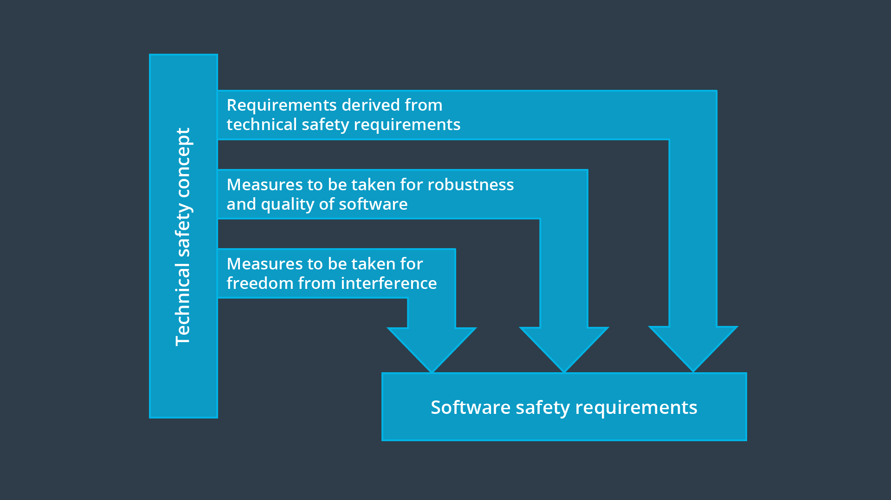

# Other Sources of Software Safety Requirements

> Part of: **Functional Safety at the Software and Hardware Levels**

## Video

[Watch on YouTube](https://www.youtube.com/watch?v=RQEnvtti3sM)

## Summary

**Software Safety Requirements for Critical Systems**
=====================================================

This project focuses on the importance of software safety requirements in critical systems. The standard ISO 26262 provides guidelines for developing safe software, which is essential to prevent accidents caused by flaws in the system.

**Key Concepts**
---------------

* **Robustness**: Ensuring that software can withstand embedded inputs or stressful environmental conditions.
* **Quality**: Meeting both functional and non-functional requirements, such as maintainability, adaptability, usability, and performance.
* **Freedom from Interference**: Preventing one software element from causing a failure in another software element.
* **ASIL (Automotive Safety Integrity Level)**: A rating system for software components based on their safety criticality.
* **ECU (Electronic Control Unit)**: A computer that controls and monitors the operation of an electronic or electromechanical system.

**Practical Notes**
------------------

When developing software for critical systems, it's essential to follow the guidelines outlined in ISO 26262. This includes:

* Ensuring robustness by validating inputs and handling errors
* Meeting quality requirements through regular testing and maintenance
* Partitioning software elements to prevent interference between them
* Proving freedom from interference when software components with different ASIL ratings communicate or run on the same ECU

Note: The instructor will go into more detail about each of these concepts, including spatial, temporal, and communication interference.

## Transcript

<v English>Flaws of the requirements are one of the major causes of accidents.</v> <v English>The standard provides many recommendations about how to develop safety critical software.</v> <v English>For example, the standard discusses driving</v> <v English>software safety requirements from</v> <v English>two core principles beside technical safety requirements.</v> <v English>The first principle is ensuring robustness and quality.</v> <v English>The second principle is freedom from interference.</v> <v English>We will talk first about ensuring robustness and quality.</v> <v English>Robustness specifically refers to whether we have</v> <v English>software in the face of embedded inputs or stressful environmental conditions.</v> <v English>An invalid input for example could be a parameter that is outside its allowed range.</v> <v English>Quality means that the software meets</v> <v English>its functional requirements as well as its nonfunctional requirements,</v> <v English>like maintainability, adaptability, usability, and performance.</v> <v English>So far, we have seen how technical safety requirements,</v> <v English>as well as quality and robustness,</v> <v English>lead to software safety requirements.</v> <v English>Next, we will talk about software safety requirements for freedom from interference.</v> <v English>Interference between elements can happen at any level in the V model.</v> <v English>Because software elements cannot always be physically separated,</v> <v English>software interference is an especially important topic.</v> <v English>Freedom from interference means that</v> <v English>one software element should not cause a failure in another software element.</v> <v English>Hence, software is partitioned into separate pieces so that the failures do not spread.</v> <v English>ISO 26262 does stop mandates freedom from interference,</v> <v English>in cases where the software elements have the same ASIL.</v> <v English>However, you need to prove freedom from interference</v> <v English>when software components with different ASIL ratings communicate with each other,</v> <v English>or are running on the same ECU.</v> <v English>To ensure software elements do not interfere with each other,</v> <v English>we need to understand three types of interference.</v> <v English>These are spatial, temporal, and communication interference.</v> <v English>We will go in-depth about each of these.</v>

## Images

*Sources of Software Safety Requirements*

## Additional Content

At this point, you have all of the information you need to do the final project. The rest of the lesson focuses on some of the most important sources of software safety requirements.

Many software safety requirements are derived directly from technical safety requirements; however, there are other sources of software safety requirements besides technical safety requirements:
* requirements to ensure robustness and quality of software
* requirements to ensure freedom from interference

Here is a diagram showing the three sources of software safety requirements:
Software bugs are a very important source of error if not the number one source of error in terms of automotive functional safety. The more you understand about safety critical software, the better your software safety requirements will be.
### Software Robustness and Quality
