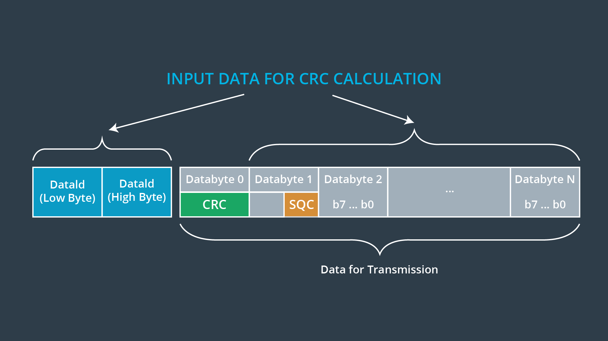
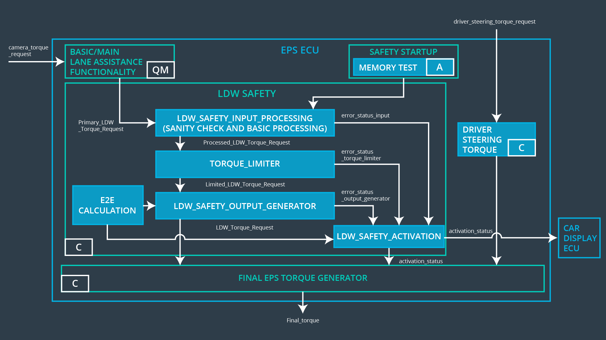

# Freedom from Interference - Communication

> Part of: **Functional Safety at the Software and Hardware Levels**

## Video

[Watch on YouTube](https://www.youtube.com/watch?v=J2T842SLPgs)

## Summary

**Communication Interference in Vehicle Systems**
=====================================================

This lesson discusses communication interference, a critical aspect of vehicle systems where software elements exchange information within and between Electronic Control Units (ECUs). Even with the same Automotive Safety Integrity Level (ASIL), there is a need to protect against interference, which can occur through hardware, software, or electromagnetic means.

**Key Concepts**
---------------

* **Communication Interference**: Occurs when data transmission errors corrupt the integrity of information exchanged between ECUs.
* **Protected Communication Channel**: Detects data transmission errors and ensures the safety goal by leading the vehicle to a safe state in case of corruption.
* **End-to-End (E2E) Protocol**: A common mechanism for ensuring freedom from communication interference, which checks for data corruption during transmission.
* **ASIL (Automotive Safety Integrity Level)**: A rating system that measures the criticality of software elements and their potential impact on safety goals.

**Practical Notes**
------------------

To implement E2E protection mechanisms in vehicle systems:

1. Identify technical safety requirements that can be solved with an E2E protection mechanism.
2. Refine these requirements into software safety requirements, as demonstrated in the lane departure warning example.
3. Use E2E protocols to detect data transmission errors and ensure the integrity of information exchanged between ECUs.

Note: The code or formulas related to this topic are not provided in the transcript. If you need further assistance with implementing E2E protection mechanisms, please consult additional resources or seek guidance from a qualified expert.

## Transcript

<v English>The last source of interference you will discuss is communication interference.</v> <v English>In vehicle systems, software elements need to exchange</v> <v English>information both within ECUs and between ECUs.</v> <v English>Even if the sender and receiver have the same ASIL,</v> <v English>there is a need to protect against interference.</v> <v English>Communication channels between software elements</v> <v English>often will have a lower ASIL or a QM rating.</v> <v English>A protected communication channel will detect data transmission errors.</v> <v English>One of the most common mechanisms for ensuring freedom from communication interference,</v> <v English>is called E2E or End to End Protocol.</v> <v English>An E2E Protocol can help protect against communication falls due to hardware,</v> <v English>software, and electromagnetic interference.</v> <v English>The protocol checks that data was not corrupted during transmission.</v> <v English>This way, when there is data corruption that could violate the safety goal,</v> <v English>the vehicle can be led to a safe state.</v> <v English>In the lane departure warning example,</v> <v English>we had a technical safety requirement that could be</v> <v English>solved with an E2E protection mechanism.</v> <v English>One requirement was that a vanity and integrity of</v> <v English>the data transmission of the LDW torque request signal shall be ensured.</v> <v English>In the text below,</v> <v English>we will show you how to refine this requirement into software safety requirements.</v>

## Images

*Example of an E2E Protocol*

*System Software Architecture*

## Additional Content

### Common Causes of Communication Interference

There are many causes for communication faults. These causes would be analyzed in a software safety analysis or sometimes in a technical safety analysis:
* Repetition of information
* Loss of information
* Delay of information
* Insertion of information
* Masquerade or incorrect addressing of information
* Incorrect sequence of information
* Corruption of information

### Other Mechanisms for Ensuring Freedom from Communication Interference

There are a handful of measures for avoiding communication interference. These mechanisms could be used to define software safety requirements that help avoid communication faults. Mechanisms for ensuring freedom from interference include:
* Loopback of information
* Acknowledgement of information
* Appropriate configuration of I/O pins
* Bus arbitration by priority
* E2E protocol

For example, one technical safety requirement was "the validity and integrity of the data transmission for 'LDW_Torque_Request' signal shall be ensured". This technical safety requirement could be refined into a software safety requirement that the data shall be protected by an End2End mechanism.

### Example specification for E2E protection protocol
The image below shows an example of an E2E protocol.
The mechanism involves adding two extra data-bytes called a CRC (Cyclical Redundancy Check) and an SQC (Sequence Counter) when transmitting data. To calculate the CRC, you run a mathematical formula on the data to be transmitted. You then attach the CRC result to the data prior to transmission.  When the data is received, the mathematical formula is run on the data set again. The CRC attached to the data and the CRC calculated on the receiving end should be the same; otherwise, data data has probably been corrupted in transmission.

The SQC is just a counter that gets sent along with the data. That way the receiver can make sure that messages haven't been lost.

### E2E Software Safety Requirements for the Lane Departure Warning (LDW)

In the concept about "Software Safety Requirements Lane Departure Warning", we already discussed that technical safety requirement 02 could be taken care of with an E2E protocol. Let's go into more depth about this technical requirement and the related software safety requirements. Here was the technical safety requirement:
| ID | Technical Safety Requirement | ASIL | Fault  Tolerant  Time  Interval | Allocation to Architecture | Safe State |
|------------------------------|-------------------------------------------------------------------------------------------------|------|---------------------------------|------------------------------------|------------|
| TechnicalSafetyRequirement02 | The validity and integrity of the data transmission forLDW_Torque_Request signal shall be ensured | C | 50 ms | Data  Transmission Integrity Check | N/A |
And here as well is the software safety architecture:
You can see we've added an E2E calculation for the two signals that leave the LDW Safety component. We need to make sure there is no corruption when the 'Processed_LDW_Torque_Request' signal travels to the "Final EPS Torque Generator". The E2E Calculation component would run a calculation on the signal to be transferred and attach the calculation to the signal. 

Then the "Final EPS Torque Generator" component would run the same calculation and compare the results from before and after transmission. If the results are the same, then you can assume the data remains intact.

We would use the same mechanism when the "LDW_Safety_Activation" component sends its signal to the "Final EPS Torque Generator".  

So here again are the software safety requirements:
| ID | Technical Safety Requirement | ASIL | Allocation Software Elements | Safe State |
|--------------------------------|-----------------------------------------------------------------------------------------------------------------------------------------------------------------------------------------------------------|------|------------------------------|----------------------|
| SoftwareSafetyRequirement02-01 | Any data to be transmittedoutside of the LDW Safetycomponent (“LDW Safety”)including "LDW_Torque_Req"and “activation_status” (seeSofSafReq03-02) shall beprotected by an End2End(E2E)protection mechanism | C | E2ECalc | LDW_Torq_Req= 0 (Nm) |
| SoftwareSafetyRequirement02-02 | The E2E protection protocolshall contain attach the controldata: alive counter (SQC) andCRC to the data to betransmitted. | C | E2ECalc | LDW_Torq_Req= 0 (Nm) |
