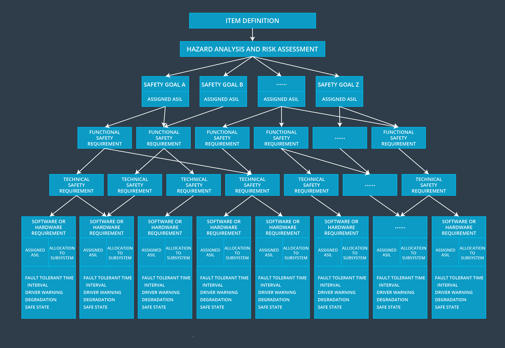

# Lesson Summary

> Part of: **Functional Safety at the Software and Hardware Levels**

## Video

[Watch on YouTube](https://www.youtube.com/watch?v=zSyoNGrZZ0k)

## Summary

**Safety-Driven Hardware and Software Development**
=====================================================

This summary covers the key concepts and takeaways from a lesson on developing safety-driven hardware and software. The main topic is understanding the sources of faults in both hardware and software, and how to use this knowledge to reduce risks and design safer systems.

### Key Concepts

* **Random Faults**: Unavoidable errors that can occur in hardware due to various factors such as manufacturing defects or environmental conditions.
* **Fault Minimization and Detection**: Techniques used to minimize the occurrence of random faults and detect them when they do happen.
* **Choosing a Programming Language and Software Tools**: Criteria for selecting programming languages and software tools that meet safety requirements, such as reliability and maintainability.
* **V-Model in Software Development**: A development model that applies to software development, ensuring that each phase is thoroughly tested before moving on to the next one.
* **Deriving Software Safety Requirements**: Converting technical safety requirements into specific software requirements to ensure safe system operation.
* **Sources of Software Safety Requirements**:
	+ Robustness: Ability of a system to withstand faults and continue operating safely.
	+ Quality: Ensuring that software meets its intended function and does not introduce new hazards.
	+ Freedom from Interference: Preventing software from interfering with other systems or causing unintended behavior.

### Practical Notes

While this lesson focuses on theoretical concepts, it's essential to apply these ideas in real-world projects. When designing safety-driven hardware and software, consider the following:

* Use fault-tolerant design techniques to minimize the impact of random faults.
* Select programming languages and software tools that meet your project's safety requirements.
* Apply the V-model development process to ensure thorough testing at each phase.
* Derive specific software safety requirements from technical safety requirements.
* Consider robustness, quality, and freedom from interference when designing your system.

## Transcript

<v English>You have now seen some of the main concerns</v> <v English>on developing safety driven hardware and software.</v> <v English>For hardware, we discussed how random faults</v> <v English>are unavoidable but must be minimized and detected.</v> <v English>In terms of software, we went over</v> <v English>the basic criteria for choosing a programming language and software tools.</v> <v English>We also showed how the V-model applies to software development.</v> <v English>We then discussed deriving</v> <v English>software safety requirements from technical safety requirements.</v> <v English>And then, we saw other sources of software safety requirements,</v> <v English>such as robustness, quality,</v> <v English>and freedom from interference.</v> <v English>The main point is to use this knowledge for reducing risks and avoiding harm.</v> <v English>Being aware of different sources of faults allows you to make</v> <v English>more robust safety requirements and design safer systems.</v>

## Images

*Outline from Item Definition to Software and Hardware Requirements*

## Additional Content

### Lesson Summary
