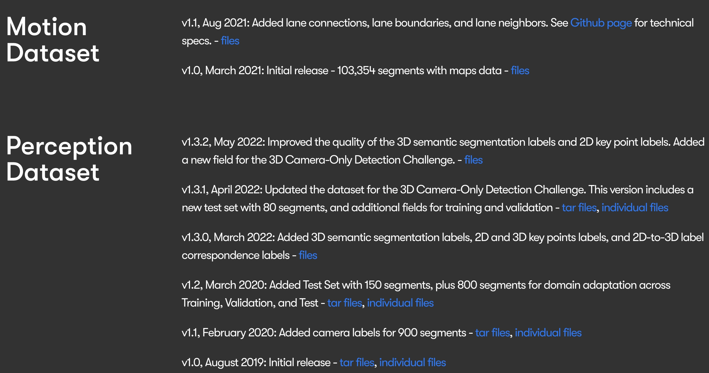
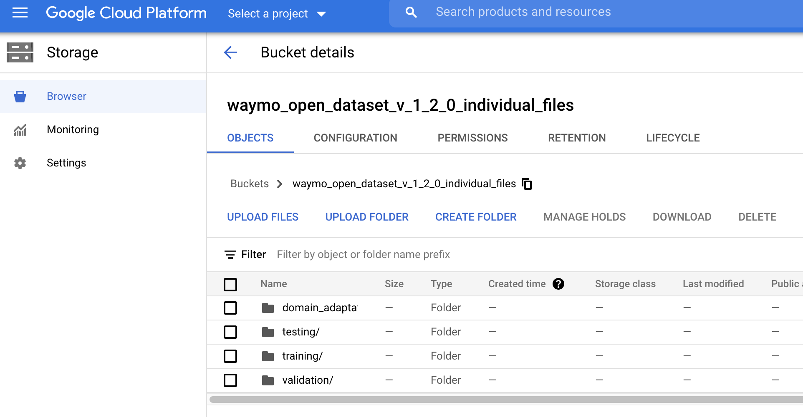
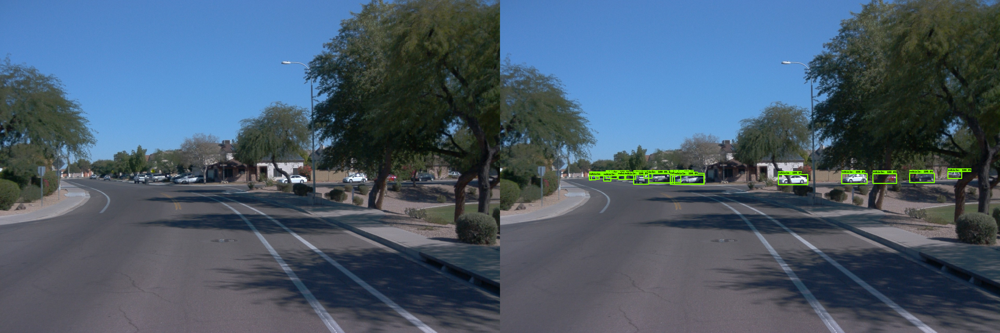

# INTRODUCTION TO DEEP LEARNING FOR COMPUTER VISION

- [INTRODUCTION TO DEEP LEARNING FOR COMPUTER VISION](#introduction-to-deep-learning-for-computer-vision)
- [Prerequisites](#prerequisites)
- [Lesson Outline](#lesson-outline)
  - [Summary](#summary)
- [Course Outline](#course-outline)
  - [Summary](#summary-1)
- [Key Stakeholders](#key-stakeholders)
- [Introduction to Deep Learning and Computer Vision](#introduction-to-deep-learning-and-computer-vision)
  - [Summary](#summary-2)
- [Supervised Learning](#supervised-learning)
  - [Summary](#summary-3)
- [Why CV Is Important for SDC](#why-cv-is-important-for-sdc)
  - [Summary](#summary-4)
- [When to Use Deep Learning for Computer Vision](#when-to-use-deep-learning-for-computer-vision)
  - [Summary](#summary-5)
- [History of Deep Learning](#history-of-deep-learning)
  - [Summary](#summary-6)
- [Introduction to TensorFlow](#introduction-to-tensorflow)
  - [Summary](#summary-7)
- [Waymo Open Dataset](#waymo-open-dataset)
  - [The Waymo Open Dataset Cloud Bucket](#the-waymo-open-dataset-cloud-bucket)
- [Tools, Environment \& Dependencies](#tools-environment--dependencies)
  - [Summary](#summary-8)
- [Project: Object Detection in an Urban Environment](#project-object-detection-in-an-urban-environment)
  - [Summary](#summary-9)
- [Recap](#recap)
- [Glossary](#glossary)

# Prerequisites

Before we get started,I want to be sure that you have the right background.To get the best possible experience from this course,we're asking you to be proficient in Python.You need to be familiar with the concept of object-oriented programming,as well as the numpy and matplotlib libraries.This entire course will be taught in Python,and I will not go over this concept during the course.Because computer vision and machine learning requires some mathematical background,you will need to have some basic Calculus skills,such as derivative calculations,as well as some basic linear algebra knowledgesuch as matrix multiplication and dot products.Being familiar with those concept is necessary to understand the content of this course,which I'm going to describe in the following videos.

# Lesson Outline
At the beginning of each lesson,I will introduce the content of that lesson.In this introductory lesson,we'll talk about the following, first,we'll start with the course outline,where I will describe the different lessons of this course.Like in self-driving cars systems,deep learning is at the core of this course,and we will spend some time introducing some high-level concept.Then we'll learn about computer vision in the context of self-driving cars.As future self-driving car engineers,you should not only know about the different aspect of the technology,but you should also understand who will be impacted by it.We will review together the different stakeholders of the self-driving car technology.We'll follow with a quick overview of the history of deep learning.Because this course will require you to implement code,we'll review some of the tools you will need.Finally, I will introduce the final project with which the course ends.

In this lesson, we'll look at the following:

* The overall course outline
* An introduction to computer vision in the context of self driving car (SDC)
* Why do we need cameras in SDC?
* Going from classic computer vision to Deep Learning
* The challenges of detecting objects in SDC
* Tools and Environment for the Course
* The Final Course Project

## Summary
The "Lesson Outline" video introduces the key topics that will be covered in the lesson. It begins with an overview of the course structure, highlighting the importance of deep learning in the context of self-driving cars (SDC). The video discusses the role of cameras in SDC and transitions from classic computer vision techniques to deep learning approaches.

It also addresses the challenges of detecting objects in SDC and outlines the tools and environment that will be utilized throughout the course. Finally, the video provides a brief introduction to the final project that students will complete by the end of the course. Overall, it sets the stage for what students can expect to learn and accomplish in the lesson.

# Course Outline
What is this first course about?In this lesson, I'm going to introduceyou the concept of computer vision and deep learning.The goal of this course is to teach you how to become machine learning engineers.Therefore, the second lesson,we'll focus on the machine learning workflow,which will give you an overview of the work of the machine learning engineer.You will learn how to think about the machine learning problem.Any machine learning engineer will tell you the following;being a machine learning engineer,means spending a lot of time with data.Since we are focusing on digital images in this course,we'll spend an entire lesson on the camera sensor.With this knowledge, you will be able tostart building your first machine learning models.We'll get started with linear regression,but rapidly move to the core family of algorithm of this course, neural networks.Using neural networks, and especially using convolutional neural network,we'll learn how to classify images.Finally, we will usethose convolutional neural networks to detect and classify object on images.Throughout this course, you will have exercises andquizzes to practice and deepen these newly acquired skills.This course ends with the final project,where you will solve your first real life machine learning problem.

The overall course is structured as follows:

* Introduction to Deep Learning for Computer Vision (this lesson)
* Overview of the Machine Learning Workflow
* Linear and Logistic Regression: Introduction to Neural Networks
* Classify Images using a Convolutional Neural Network
* Detect Objects in an Image
* Final Project

## Summary
The "Course Outline" video provides an overview of the structure and key components of the course. It begins by introducing the concept of computer vision and deep learning, emphasizing the goal of training students to become machine learning engineers. The video outlines the progression of the course, starting with an overview of the machine learning workflow, followed by lessons on linear regression, neural networks, and convolutional neural networks (CNNs) for image classification.

It also mentions the importance of understanding camera sensors and how they relate to digital images. The course culminates in a final project where students will apply their knowledge to solve a real-world machine learning problem. Throughout the course, students will engage in exercises and quizzes to reinforce their learning. Overall, the video sets clear expectations for what students will learn and achieve by the end of the course.

# Key Stakeholders
Self-driving cars are not only a very exciting technology from an engineering point ofview but it will also dramatically impact our lives when deployed at scale.Because self-driving calls at the highest level ofautonomy will not require any attention from the driver,the commute experience will be improved.Commuters will be able to re-invest the timespent in the car to focus on other activities.With a wide adoption of self-driving cars,we will also observe a reduction oftraffic as well as the reduction of the number of accident.Ultimately, we could imagine cities where self-driving cars have beingused as taxis and people would not necessarily use their own vehicles anymore.The number of parking lots will be reduced and the layoutsof modern cities built around cars will be impacted.This would also limit the number of cars and circulation and diminish the air pollution.Because self-driving cars have such a huge potential impact on society,many stakeholders can be considered,such as insurance companies,city planners, lawmakers, and daily drivers.Many layers of engineering are required to develop self-driving car system andeach team will play a critical role inthe deployment and maintenance of self-driving cars.We'll review some of the engineering teams involved in this process.The data operation team, for example,focuses on the data acquisition by driving prototypes around the city.They also manage the data labeling and the city mapping processes.The hardware team works on improving the different sensors of the self-driving car,such as Lidar or cameras and also developsembedded system to run a different algorithm in the car directly.Because data is at the core of the self-driving car technology,an the entire team is dedicated to data pipelines to ensure thatdata is flowing from the sensor to the Cloud where it's being stored.The research and development team focuses on improving the different algorithmsdeployed in the car from detecting objects to plan optimal trips.Many other teams are also involved,such as ones developing the user-interface.I hope this gives you a good overview ofthe different stakeholders of the self-driving car technologies,from the daily drivers to the different engineering team developing it.Self-driving car will have a huge impact on our lives and Icannot wait to live in a future where this technology is deployed at scale.

Self-driving cars or autonomous vehicles will have a huge impact on our society once the technology is deployed at scale. The following articles highlight the [economic impact](https://www.bosch.com/stories/economic-impact-of-self-driving-cars/#:~:text=Self%2Ddriving%20cars%20will%20change,a%20thing%20of%20the%20past.&text=According%20to%20a%20McKinsey%20study,and%20cities%20from%202030%20onwards.) as well as the [broader consequences](https://www.investopedia.com/articles/investing/052014/how-googles-selfdriving-car-will-change-everything.asp) of the technology.

# Introduction to Deep Learning and Computer Vision
Let's now talk about machine learning.But before we can understand what machine learning is,we need to take a step back and look at a broader concept, Artificial Intelligence.A system is defined as intelligent when it's able to learn fromexternal data and use this knowledge to achieve specific task.You've been interacting with AI for a long time.For example, video games non playable characters,are a type of AI.What differentiate machine learning from such a type ofartificial intelligence is the necessity of being explicitly programmed.Let's consider a game of Tic-Tac-Toe example.Well, you could build an AI using a hard-coded set of rule,such as if my open-end text one corner,text the opposite corner.However, machine learning algorithm do notneed such hard-coded rules and learn from data instead.To do so, we will have to gather data frompreviously played game and train an algorithm to learn from that data.Let's now talk about deep learning,a subset of machine learning algorithm.While deep learning finds it foundation on neural network,a type of machine learning algorithm.The term deep learning illustrates the number of layers in such network.How is deep learning exactly different from machine learning?Well, one great thing about deep learning is the ability to work with raw data.Whereas for machine learning,we sometimes need to handcraft features.Let's consider an example.We are trying to classify an image as containing a dog or not.Well, a machine learning approach will consist in building dog features such as the nose,or ears detectors and find these features in the image.Deep learning, however, we directly takethe image and compute the most meaningful features to classify a dog.It does come at a cost though,which is the amount of data required to train good deep learning algorithms.In this course, we are going to study a couple of machine learning algorithms,such as linear regression and logistic regression.But we will quickly shift to neural network anddeep learning because they are the core of the self-driving car technology.In this course, we're going to focus on a specific class of machine learning problems,which is supervised learning.To use supervised learning,we need labeled data.But what do I mean by that?Well, to train a machine learning algorithm,we need to give the algorithm example of data.But in the case of supervised learning,we also need to annotate or label that data.For example, let's say that you're trying to builda machine learning algorithm that classifies cats and dogs from images.To do so, you gather hundreds of images of both animals.However, before you can use this data in your supervised learning approach,you need to associate a cat or dog label to each image in your data-set.In unsupervised learning, however,we can feed the algorithm directly the raw, unlabeled data.An example of such an algorithm would be a clustering algorithm.Where we try to group data in clusters by using shared features.What are the downsides of supervised learning?Well, the labeling task can come at a great cost.Actually, with the deep learning revolution,some companies solely focus on labeling data for deep learning teams.Where some tasks like classification,where we attribute a single label to an image,do not require lengthy labeling process.Other task, such as object detection,may take much longer because we need to annotate every single object in the image.These schools will be entirely focusing on supervised learning.But fear not, you will have access to labeled data-sets.

* Artificial Intelligence (AI): a system that leverages information from its environment to make decisions. For example, a video game bot.
* Machine Learning (ML): an AI that does not need to be explicitly programmed, and instead learns from data. For example, a spam classification * algorithm.
* Deep Learning (DL): a subset of ML algorithms that do not require handcrafted features and can work with raw data. For example, an object detection algorithm with a convolutional neural network.

## Summary
The "Introduction to Deep Learning and Computer Vision" video provides an overview of the fundamental concepts and significance of deep learning in the field of computer vision. It begins by defining artificial intelligence, machine learning, and deep learning, explaining how deep learning is a subset of machine learning that utilizes neural networks to analyze and interpret visual data.

The video discusses the importance of computer vision in various applications, such as self-driving cars, facial recognition, and image classification. It highlights the advancements in deep learning techniques that have improved the accuracy and efficiency of computer vision tasks. Additionally, the video sets the stage for the course by outlining the key topics that will be covered, including neural networks, convolutional neural networks (CNNs), and practical applications in the real world.

Overall, it aims to inspire students by showcasing the potential of deep learning and computer vision to solve complex problems and drive innovation in technology.

# Supervised Learning
Before we learn more about machine learning,I wanted to introduce some naming convention of supervised learning.Let's consider the task of classifying traffic signs.We're building a supervised learning algorithm to classify a traffic sign image.This image will be the input or input variable to our model.We can also use the letter x to describe it,as well as the term observation.Our algorithm will predict a class using this image.In this case, the class is traffic lights aheadsign depending on whether this class has been predicted or annotated,we'll use different terms.We will use Ŷ or output variable in the case of prediction,for an annotation, we will use the term ground truth,label, or just the letter y.Keep in mind these definitions as those termsare going to frequently come back in later lessons.

In this course, we will focus on supervised learning, where we use annotated data to train an algorithm. In supervised learning, we will define the following:

* Input variable / X / Observation: the input data to the algorithm. For example, in spam classification, it would be an email.
* Ground truth / Y / label: the known associated label with the input data. For example, a human created label describing the email as a spam or not.
* Output variable / Y^ / prediction: the model prediction given the input data. For example, the model predicts the input as being spam.

## Summary
The "Introduction to Deep Learning and Computer Vision" video provides a foundational overview of the concepts and significance of deep learning within the realm of computer vision. It begins by defining key terms such as artificial intelligence (AI), machine learning (ML), and deep learning (DL), explaining how deep learning is a subset of machine learning that utilizes neural networks to process and analyze visual data.

The video highlights the applications of computer vision in various fields, including self-driving cars, facial recognition, and image classification, showcasing the impact of deep learning techniques on improving accuracy and efficiency in these tasks. It sets the stage for the course by outlining the topics that will be covered, such as neural networks, convolutional neural networks (CNNs), and practical applications in real-world scenarios.

Overall, the video aims to inspire students by demonstrating the potential of deep learning and computer vision to solve complex problems and drive technological innovation.

# Why CV Is Important for SDC
To build intelligent cars that are able tonavigate through environments as complex as cities,we need to provide some usable signal.How is our car going to decide when to turn or stop?Well, obviously, it needs some understanding of its environment.The same way that humans are using their eyes to analyze the road when driving,cars are going to use cameras.The field of computer vision consists in a range of techniques that allowa computer to get a high-level understanding of its environment from digital images.For example, let's look at this image of a busy road together.What information do you think is relevant for the self-driving car system?Well, we could start by detecting all the car on image.We can also detect and read traffic signs,such as stop signs,which will be important fora self-driving car system to take into account when making decisions.Finally, we also need to detect pedestrians.All these objects will be taken into account bythe self-driving car system to make optimal decisions.You can now easily understand whycomputer vision is at the core of the self-driving car system.Some self-driving car system also use another type of sensor called Lidar,but this will be covered in another course of this of this nanodegree.

Self-driving cars have multiple sensors, such as cameras, radar or lidar. In this course, we will focus on the **camera sensor**. Using this sensor, the system will be able to perform multiple tasks critical to its autonomy, such as detecting pedestrian, lanes or traffic signs. Later in the Nanodegree, you will perform **sensor fusion** using camera and lidar data!

## Summary
The "Why CV Is Important for SDC" video explains the critical role of computer vision (CV) in self-driving cars (SDC). It begins by highlighting the necessity for autonomous vehicles to understand their environment, similar to how humans use their eyes while driving. The video discusses how CV techniques enable cars to interpret visual data from cameras, allowing them to detect essential elements such as pedestrians, lane markings, and traffic signs.

These detections are crucial for making informed driving decisions, such as when to stop or turn. The video also mentions the integration of other sensors, like Lidar, for enhanced perception, which will be covered later in the course. Overall, it emphasizes that computer vision is at the core of enabling self-driving cars to navigate complex environments safely and effectively.

# When to Use Deep Learning for Computer Vision
Previously, we discovered how computer visionis at the core of the self-driving car technology.Analyzing digital images is critical to createan intelligent car that can navigate complex environments.But to do so, we needperformance algorithm to get the best understanding of an image possible.Well, it appears that Deep Learning is doing very well at image analysisand tend to have much better performances than traditional computer vision method.Moreover, Deep Learning algorithms are able to extractsignals from complex environments such as busy city centers.However, the field of computer vision existed way before the Deep Learning revolution.Whereas Deep Learning excels at certain tasks such as object detection,it should not necessarily be the default algorithm when it comes to analyzing images.For example, Deep Learning comes ata computational cost because of the complexity of the algorithm.Because of said complexity,they are harder to deploy in self-driving carssystem where hardware is often a limitation.Overall, Deep Learning approaches tend to outperformtraditional computer vision method and they are definitely atthe core of many self-driving car systems.However, classic computer vision methods should not beoverlooked and they can be particularly useful in many cases.

Deep Learning algorithms are now the **state of the art (SOTA)** in most computer vision problems, such as image classification or object detection. Therefore, they are now in every SDC system. However, using deep learning adds additional constraints to the system because they require more computational power.

## Summary
The "When to Use Deep Learning for Computer Vision" video discusses the scenarios in which deep learning techniques are most effective for computer vision tasks. It emphasizes that deep learning algorithms have become the state-of-the-art (SOTA) for various computer vision problems, such as image classification and object detection.

The video outlines the advantages of using deep learning, including its ability to handle large datasets and complex patterns that traditional methods may struggle with. However, it also highlights the additional computational resources required for deep learning models. The video provides examples of situations where deep learning is particularly beneficial, such as detecting cars, reading characters on traffic signs, estimating pedestrian poses, and classifying activities from videos.

Overall, the video serves as a guide for understanding when deep learning is the appropriate choice for tackling computer vision challenges.

# History of Deep Learning

Before we dive into the history of deep learning,let's introduce a few terms to describe neural networks.By neural network, I actually want to talk about artificial neural network or ANN.This name come from their resemblance to neural networks in our brain.We can see an example of a neural network here.It's shown in this figure represents a neuronand the edges between the neurons represent the connection between them.Neural networks are organized in layers,represented here as vertical stacks of neuron.This particular network has four layers.The left-most is the input and the right-most, the output layer.Any layer that is not the input or the output is called a hidden layer.This network has two hidden layers,but we'll later see in this course a lot of neural networks with many more layers.The term deep learning comes from deep neural network where many layers are stacked.In this neural network,each neuron of a layer is connected to each neuronof the previous layer and each neuron of the next layer.We call such a network a feedforward neural network.Neurons received an input signal and are activated or not based on this input.We sometimes say that the neuron is firing when it's activated.Don't worry, we'll go over all these notions again in the third lesson of this course.For now, I just want you to be familiar with these terms.Let's talk a little bit about the history of deep learning.Because of the recent deep learning revolution,one could assume that this technology is fairly young.However, the first deep neural networks date from the 70s.The backpropagation algorithm, which is at the core of training neural network,was created in 1989 by Yann LeCun.He created this algorithm to train a network to recognize handwritten digits on mail.The 1990s are considered as the winter ofdeep learning when neural network were overlooked by many.However, many scientists kept working on the topic,and some groundbreaking papers were published,such as the Long Short-Term Memory paper in 1997.One of the core limitations of deep learning at the time was the hardware.Training that digit recognition algorithm,for example, took over three days.However, at the beginning of the 2000s,computer became much faster and hours was less of a bottleneck.Deep learning started to be adopted in the industry.2009 marks the creation of the first large scale data set.A Stanford University professor led the effort to createone of the biggest image data set to date, ImageNet.With this dataset came a yearly competition where a researcher fromboth academia and the industry tried to createthe best possible image classification algorithm.In 2012, a paper introduced a novel approach to image classification,a neural network called AlexNet.In my opinion, this paper isthe single most groundbreaking research in deep learning for computer vision.This paper showed how a convolutional neural network can betrained using multiple graphic processing units or GPUs.It crushed the competition that year, and since AlexNet,a neural network-based approach train on the GPU has always won the competition.Let's fast forward to 2020.In the past eight years,tens of thousands of papers have been published in the field ofdeep learning and deep neural network are now everywhere,from your phone where the process camera images totranslation tool when natural language processing relies heavily on this technology,and finally, to self-driving cars.Deep neural networks are the core of the self-driving car technology,from digital image processing to 3D point lab processing to decision-making.This is a very exciting field to be working in right now.This course should give you a good introduction to the power of deep learning.

**Artificial neural networks (ANN)** or simply neural networks are the type of systems at the core of deep learning algorithms.

* **ANN**: machine learning algorithms vaguely based on human neural networks.
* **Neurons**: the basic unit of neural networks. Takes an input signal and is activated or not based on the input value and the neuron's weights.
* **Layer**: structure containing multiple neurons. Layers are stacked to create a neural network.

## Summary
The "History of Deep Learning" video explores the evolution of deep learning, tracing its roots from early artificial neural networks (ANNs) to the modern advancements that have shaped the field. It discusses key milestones, such as the development of the backpropagation algorithm, which significantly improved the training of neural networks.

The video highlights the impact of increased computational power, particularly the use of GPUs for fast matrix multiplication, which has enabled the training of deeper and more complex models. It also emphasizes the importance of large datasets in driving the success of deep learning applications.

Overall, the video provides a comprehensive overview of how deep learning has evolved over the years, showcasing its significance in various applications, including computer vision and natural language processing.

# Introduction to TensorFlow
In your previous video,we saw how deep learning is now playing a significant role in our day to day technology.Deep learning models, deep learning your phone when self-driving cars are very complex.However, creating and deploying such a model has never been easier.Thanks to libraries such as TensorFlow.TensorFlow is a machine learning library that makes it easy to create,train, and deploy machine learning models.TensorFlow is mostly used with Python library interface.However, it relies on the C++ back-end.In addition, to being a great tool for research and development,TensorFlow also provides easy way to deploy machine learning model to web brothers,mobile devices, and to the cloud.In this class, you will learn how to masterTensorFlow to create and train your first neural networks.

In this course, we will be using the [TensorFlow](https://www.tensorflow.org/) library to create our machine learning models. TensorFlow is one of the most popular ML libraries and is used by many companies to develop and train algorithms. TensorFlow makes it very easy for the user to deploy such algorithms on different platforms, from a smartphone device to the cloud.

## Summary
The "Introduction to TensorFlow" video provides an overview of TensorFlow, a powerful machine learning library widely used for developing and training algorithms. It explains that TensorFlow simplifies the process of creating, training, and deploying machine learning models across various platforms, from mobile devices to cloud environments.

The video highlights the library's flexibility and efficiency, particularly in handling complex computations and large datasets. It also mentions the integration of TensorFlow with Python, which is the primary programming language used for building models. Overall, the video sets the stage for students to learn how to utilize TensorFlow effectively in their machine learning projects.

# Waymo Open Dataset
One of the truly exciting parts of this version of the Self-Driving Car Engineer Nanodegree program is the usage of the Waymo Open Dataset in some of the exercises and projects. Formerly the Google Self-Driving Car project (also originally headed by Sebastian Thrun, Udacity's founder, years ago), [Waymo](https://waymo.com/) is one of the leaders of self-driving car technology. The Waymo Open Dataset contains [tons of high quality data](https://waymo.com/open/about/) from both lidar and camera sensors from diverse locations and conditions.

Before we continue in the course, it's important to access the Waymo Open Dataset using [this link](https://waymo.com/open/terms).

Accessing the Waymo Open Dataset

Once you have been successfully registered, or if you return to the Waymo Open Dataset site, you should see the below page, where you are able to download chunks of the dataset 25GB at a time from the ~2TB total dataset. There is also another method further download the page that further splits these up; note that Udacity workspaces in some cases will have smaller chunks ~1GB pre-loaded for you post-registration as well.

Dataset Download Page

## The Waymo Open Dataset Cloud Bucket
Earlier, we mentioned that the dataset files come in ~25GB chunks if you download from the earlier shown page. However, there are smaller chunks available from a cloud storage bucket as well. Some of the files you will be provided later on in workspaces come from these buckets so that they are easier to work with.

Travel to [this link for the cloud bucket](https://console.cloud.google.com/storage/browser/waymo_open_dataset_v_1_2_0_individual_files/). Once again, it's important to note that your registration may take 48 hours to become effective, so you may not be able to access it just yet, but you may want to bookmark it if you later want to download files from the bucket locally.

The top level of the cloud bucket

[Individual dataset files within the training subdirectory](./images/image4.png)
Individual dataset files within the training subdirectory

While you do not need to download any portions of the dataset right now, please make sure that you can access the Waymo Open Dataset before proceeding.

# Tools, Environment & Dependencies
Let's take some time to talk about the tools you will need during this course.We're going to use a data set that is being hosted on the Google Cloud Platform or GCP.You will need to create an account to be able to use gsutil,the Google command-line interface to manipulate objects stored in the Cloud.Code for the exercises and the project will be stored on GitHub,a software development and version control platform.A good understanding of Git commands is a requirement for any software engineer.You will also be using Jupyter Notebooks,a web interface to write and share code in Python.Jupyter Notebooks are great for rapid prototyping,and I'm personally a big fan of them.Finally, you will actually write most of the code forexercises in an Integrated Development Environment or IDE.You can use your favorite IDE,but I will personally recommend Visual Studio and PyCharm.Over the course of this nanodegree,we'll be using the Waymo open data sets.Waymo is one of the leading self-driving car companies in the Silicon Valley,and they built a very unique data set consisting of hundreds of trips made bytheir self-driving cars consisting of a collection ofhigh-resolution sensor data in diverse environment.In this course, we'll be focusing on the camera sensor.While in other courses in this nanodegree,the Lidar data will be introduced.We'll get to learn more about this data set in later lessons.As of now, you only need to know that a tripis made of a sequence of frames from multiple cameras.Each single frame is annotated with labels.Your first task is to register directly on the Waymo open data set website,such that you can access the data when you need it.It usually takes a day or two to be granted access to the data set,and I would recommend that you take care of this now.The Waymo data set is unique,and it will give you a good understanding of the kind ofdata self-driving car engineer deal with.I could not think of any better data set for this nanodegree.

In this course, you will need the following:

* Install gsutil: a Python application to manipulate Google Cloud Storage items. You will find the tutorial to install it [here](https://cloud.google.com/storage/docs/gsutil).
* Create a Github account: a version control system. You will need to create an account [here](https://github.com/). You will need a github account to access some of the material and create your submission for the final project. If you already have an account, you are good to go for this step!
* Set up an Integrated development environment (IDE): a software application to write code. For this course, I would recommend either [Pycharm](https://github.com/) or [VS Code](https://code.visualstudio.com/).

## Summary
The "Tools, Environment & Dependencies" video outlines the essential tools and setup required for the course. It emphasizes the importance of having the right environment to effectively work on deep learning and computer vision projects. The video discusses the need to install specific tools, such as gsutil for managing Google Cloud Storage, and encourages students to create a GitHub account for version control and project submissions.

Additionally, it highlights the recommendation to set up an Integrated Development Environment (IDE), suggesting options like PyCharm or VS Code for writing and managing code efficiently. Overall, the video provides a clear checklist of tasks to ensure students are well-prepared to engage with the course material and complete their projects successfully.

# Project: Object Detection in an Urban Environment
The final project is the part of this course I'm the most excited about because you willget to take all the knowledge you have acquired duringthe lessons and apply it to real world problem.The project consist the training inobject detection algorithm to detect and classify cars,pedestrian, and cyclist using the Waymo open datasets.With this project, you will learn how to use the Tensorflow object detection API.You will have access to a machine with a GPU,giving you the opportunity to train your algorithmmultiple times with different sets of parameters.You will also get to performan in-depth error analysis to understand your model's limitation.With this project, you will havea better understanding of the full workflow of a machine learning engineer.Once you are done with the project,you will get personalized feedback from a machine learning professional.You can use this feedback to improve on a GitHub repository youcreated making this project ready to be added to your portfolio.We will also provide the code to generatesuch video of any trip of the Waymo open dataset.I'm looking forward to seeing what you will build.

For the final project of this course, you will have to train an object detection model using the TensorFlow Object Detection API. This API simplifies the training and development of object detection models in TensorFlow. You will learn how to master it in this project. This API makes the exploration of the optimal parameters for your model extremely easy by using config files. Because you should try to create the best possible model, you will have to tweak and test different parameters. Finally, you will have to perform an in-depth error analysis.

## Summary
The video for the project "Object Detection in an Urban Environment" highlights the excitement of applying the knowledge gained throughout the course to a real-world problem. In this project, you will train an object detection algorithm to detect and classify cars, pedestrians, and cyclists using the Waymo open datasets. 

Key points from the video include:

- You will learn to use the TensorFlow Object Detection API, which simplifies the training and development of object detection models.
- Access to a machine with a GPU will allow you to train your algorithm multiple times with different parameter sets.
- An in-depth error analysis will help you understand your model's limitations.
- The project aims to provide a comprehensive understanding of the full workflow of a machine learning engineer.
- Upon completion, you will receive personalized feedback from a machine learning professional, which you can use to improve your project and add it to your portfolio.

Overall, the project is designed to enhance your practical skills in object detection and machine learning.

# Recap
We started with an overview of the lessons of this course.Next, we introduced the concept of machine learning and deep learning.Then we discovered why cameras weresuch a critical component of self-driving cars system.Because the self-driving car technology will have such an important impact on our lives,we reviewed the different stake holders of this technology.We followed with a short history of deep learning,as well as a brief description of the elements of a neural network.Finally, we reviewed the tool necessary for this course,and we introduced the final project.You are now ready to learn about the machine learning workflow.Well, now, you should have a good overview of what to expect.This course is going to be dense,but you will get exercises,and quizzes, to check that you haveunderstood each one of the concepts you have learned about.Good luck, and I hope you will enjoy this course.

In this lesson, we focused on the following:

* Overall course outline: overview of the different lessons of this course.
* Cameras and Computer Vision in SDC: we learned why the camera sensor is critical to SDC systems, and its strength and weaknesses.
* From classic computer vision to Deep Learning: we learned about the history of deep learning and discovered the different components of a neural * network.
* Tools and Environment for the Course: we listed the different tools and software we will be using in this course.
* Final Course Project: we listed the different aspects of the final project.

# Glossary
* Artificial Intelligence (AI): a system that leverages information from its environment to make decision. For example, a video game bot.
* Artificial Neural Networks (ANN): machine learning algorithm vaguely based on human neural networks.
* Deep Learning (DL): a subset of ML algorithms that do not require handcrafted features and can work with raw data. For example, an object detection * algorithm with a convolutional neural network.
* Layer: structure containing multiple neurons. Layers are stacked to create neural networks.
* Machine Learning (ML): an AI that does not need to be explicitly programmed and instead learns from data. For example, a spam classification * algorithm.
* Neurons: the basic unit of ANNs. Takes an input signal and is activated or not based on the input value and the neuron's weights.
* TensorFlow: ML library using a Python interface. Extremely useful to develop, train and deploy ML algorithms on multiple platforms.
* TensorFlow Object Detection API: This API simplifies the training and development of object detection models in TensorFlow.