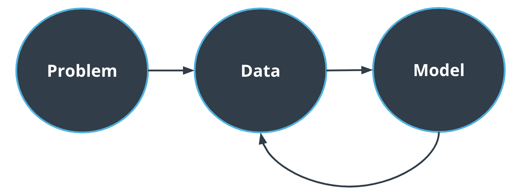
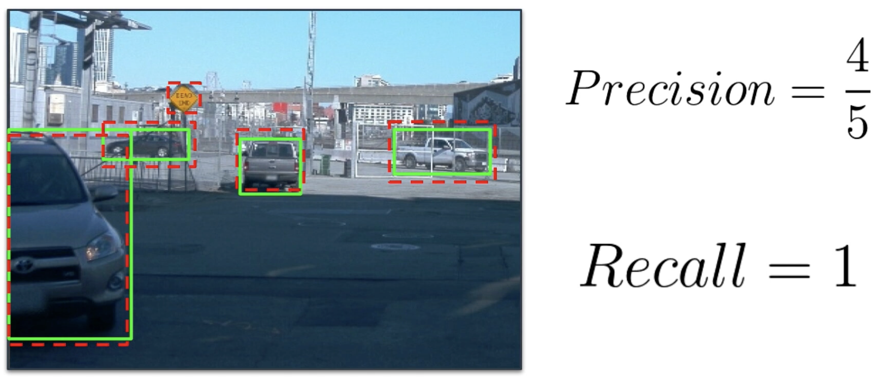
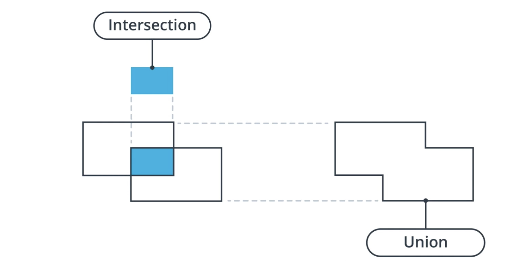

- [Introduction to the Machine Learning Workflow](#introduction-to-the-machine-learning-workflow)
- [Big Picture](#big-picture)
- [Framing the Problem](#framing-the-problem)
- [Identifying the Key Stakeholders](#identifying-the-key-stakeholders)
- [Choosing Metrics](#choosing-metrics)
  - [Classification \& Object Detection Metrics](#classification--object-detection-metrics)
- [Exercise 1](#exercise-1)
  - [Part 1 - Calculate IoU](#part-1---calculate-iou)
  - [Part 2 - calculate Precision / Recall](#part-2---calculate-precision--recall)
  - [Solution: Choosing Metrics](#solution-choosing-metrics)
- [Data Acquisition and Visualization](#data-acquisition-and-visualization)
- [Exercise 2 - Visualization](#exercise-2---visualization)
  - [Solution: Data Acquisition and Visualization](#solution-data-acquisition-and-visualization)
- [Exploratory Data Analysis](#exploratory-data-analysis)


# Introduction to the Machine Learning Workflow

Hi, and welcome to the first lesson of this course,Introduction to the machinery workflow.Together, we will take the step necessary for any machine learning project,from the problem setup to the model-building phase,and the error analysis.This lesson will focus on the high-level component of any machine learning workflow,and we will dive into the details later in the course.First of all, what is machine learning?A machine learning algorithm is a type of artificial intelligence or AI,where a computer is learning how to extract information from data.To train a machine learning algorithm,we have to fit it with example data.In this course, we'll be using a few different data-set.But for now, we will focus onthe German traffic sign recognition benchmark or GTSRB data-set.This data-set consists of thousands ofimages of traffic sign with their associated labels.We will focus on classifying these traffic signsusing different algorithm in the following lessons.In this lesson, we'll use it as an example of a task you couldface in your future job as a machine learning engineer. Let's get started.


In the lesson, we are going to learn how to think about Machine Learning problems. Machine Learning (ML) is not only about cool math and modeling but also about choosing setting the problem, identifying the client needs and the long term goals. This lesson is going to be organized as follow:

* We will practice framing Machine Learning problems by identifying the key stakeholders and choosing the correct metrics.
* Because ML is about data, we will discuss the different challenges linked to data.
* We will also tackle how to organize your dataset when solving a ML problem to be confident that you created a model that will perform well on new data.
* Finally, we will see how you can leverage different tools to pinpoint your model's limitations.

In this course, we will be using the [German Traffic Sign Recognition Benchmark (GTSRB)](https://benchmark.ini.rub.de/) multiple times for exercises. A downsampled version of the dataset has already been downloaded to your workspace.

**Summary**

The "Introduction to the Machine Learning Workflow" video provides an overview of how to approach machine learning (ML) problems effectively. It emphasizes that ML is not just about mathematics and modeling but also involves understanding the problem context, identifying client needs, and setting long-term goals. 

Key points covered in the video include:

1. **Framing ML Problems**: The importance of identifying key stakeholders and selecting appropriate metrics for success.
2. **Data Challenges**: Discussing the various challenges associated with data, which is crucial for ML.
3. **Organizing Datasets**: How to structure your dataset to ensure that the model performs well on unseen data.
4. **Model Limitations**: Leveraging different tools to identify and understand the limitations of your model.

Overall, the video sets the stage for a comprehensive understanding of the machine learning workflow, guiding viewers on how to think critically about ML projects. 

If you have any specific questions about the content or concepts presented in the video, feel free to ask!

# Big Picture
The machine learning workflow is always following these steps.First, we need to frame the problem.What are we trying to achieve here?Why? Who cares about this problem?Do we even need machine learning?Once we have answered this question,we need to focus on data.How much data do we need?Is it easy to obtain?How much processing is required?When our data set is ready,we can focus on the model.Which approach is best for this problem?What are the constraints?For example, are limited because of the hardware?We then have a feedback loop between data and model.We can use the model predictions to decide if we need more data or not for example.Let's go back to the traffic sign data set.In this machine learning problem,we are trying to classify traffic signs just by using images.The available data, consisting thousands of images for each type of traffic sign.As for the model, we will experiment with different algorithm,such as logistic regression and neural networks.

In the following videos and lessons, we are going to take a deeper dive into each component of the workflow.

* Problem setup is the phase where we set the boundaries of the problem and will be tackled in the next few videos.
* The Data part of the workflow consists in getting familiar with the available dataset and will be the main focus of the next lesson on * the camera sensor.
* Modeling is such a critical step that we will spend 3 lessons on it. Modeling consists in choosing and training different models and * picking the best one.



**Summary**
The "Big Picture" video provides an overview of the machine learning workflow, breaking it down into key components that are essential for successfully tackling machine learning projects. Here are the main points covered:

1. **Problem Setup**: This phase involves defining the boundaries of the problem you're trying to solve. It’s crucial to understand what the problem is and what success looks like.

2. **Data**: The video emphasizes the importance of familiarizing yourself with the available dataset. Understanding the data is fundamental to any machine learning project, as it directly impacts model performance.

3. **Modeling**: This is a critical step where you choose and train different models. The video highlights that multiple lessons will be dedicated to this phase, focusing on selecting the best model for your specific problem.

Overall, the "Big Picture" video sets the foundation for understanding the workflow in machine learning and prepares learners for deeper dives into each component in subsequent lessons.

If you have any questions about these components or need further clarification, just let me know!


# Framing the Problem
Let's get started with the first step inany machine learning workflow, framing the problem.This step is especially critical for business-oriented machine learning application.First of all, do we even need machine learning?A lot of problems can be solved using a hard-coded set of rules.You then need to identify the key stakeholders.Often, machine learning is solving a business problem.Who cares about the problem that we're trying to solve?What are the constraints and objectives?Data can be a bottleneck,and it's important to understand the data pipeline.Where is the data coming from?How much data do I have access to?Is it expensive to obtain and annotate?Finally, you need to decide on which metrics are relevant to your problem.Machine learning engineers use precision, recall,or accuracy, but this might not transit directly in a good business metric.By following these steps,you will eventually gain a good understanding of the problem you're trying to solve.As a machine learning engineer,it is easy to solely focus on model performances,but you may need to consider other factors as well.

Unless you are taking part in a Machine Learning competition, the model's performance is rarely the only thing you care about. For example, in a self-driving car system, the model's inference time (the time it takes to provide a prediction) is also an important factor. A model that can digest 5 images per seconds is better than a model that can only manage one image per second, even if the second one is performing better. In this case, the inference time is also a metric to choose our model.

Understanding your data pipeline is very important because it will drive your model development. In some cases, getting new data is relatively easy but annotating them (by associating a class name for example) may be expensive. In this case, you would want to create a model that requires less data or that can work with unlabeled data.

**Summary**
The "Framing the Problem" video focuses on the crucial first step in the machine learning workflow, which is to clearly define the problem you are trying to solve. Here are the main points discussed:

1. **Understanding the Context**: It's essential to understand the broader context of the problem, including the stakeholders involved and their needs.

2. **Defining Success**: The video emphasizes that success should be defined in measurable terms. This could include various metrics depending on the specific application, such as accuracy, speed, or cost-effectiveness.

3. **Considering Constraints**: Identifying any constraints, such as data availability, computational resources, and time limitations, is vital for realistic problem framing.

4. **Iterative Process**: Framing the problem is not a one-time task; it may require iterations as you gather more information and insights throughout the project.

By effectively framing the problem, you set a solid foundation for the subsequent steps in the machine learning workflow. If you have any questions about how to apply these concepts to your own projects, just let me know!


# Identifying the Key Stakeholders
To help you frame the problem,you need to identify the key stakeholders.Who is going to be impacted by the algorithm that you're building?Maybe this algorithm will be used byanalytical teams in your company to better understand patterns.Maybe it will be a critical part of an app or website.It may be client facing or not.By identifying the key stakeholders,you will gain clarity on the purpose of the model that you're trying to build.Let's consider the following example.You're building a ride-sharing app.In particular, you creating a machine learning model to findthe optimal path between the drivers and the clients occasion.Who's going to care about this algorithm?Well, first of all,the experience of both drivers and passenger will be affected.If your algorithm does not predict the arrival time correctly,the passenger may get frustrated.Similarly, the drivers choice to accept or refuse a ride is impacted by your prediction.Other engineering teams will also be interested in your algorithm,such as UI engineering team,who need to display the most accurate time range possible in the app.This is why identifying the key stakeholders isan essential steps that drives your model development.

As a Machine Learning Engineer, you will rarely be the end user of your product. Therefore, you need to pinpoint the different stakeholders of the problem you are trying to solve. Why? Because this will drive your model development.

The "Identifying the Key Stakeholders" video highlights the importance of recognizing the various stakeholders involved in a machine learning project. Here are the main points discussed:

**Summary**

1. **Understanding Stakeholders**: As a Machine Learning Engineer, you are often not the end user of your product. It's crucial to identify who will be impacted by the algorithm you are building.

2. **Impact on Users**: The video emphasizes that your algorithm's performance can affect both drivers and passengers in a ride-sharing app scenario. For instance, if the algorithm fails to predict arrival times accurately, it can lead to frustration for passengers and impact drivers' decisions.

3. **Collaboration with Teams**: Other engineering teams, such as the UI engineering team, will also be interested in your algorithm, as they need to present accurate information to users.

4. **Clarity of Purpose**: By identifying key stakeholders, you gain clarity on the purpose of the model you are developing, which ultimately drives the model's development process.

Overall, the video underscores that understanding stakeholders is a critical step in ensuring the success of your machine learning project. If you have any questions about identifying stakeholders or how to apply this concept, feel free to ask!

# Choosing Metrics
Now that we have a better understanding of our problem,we need to evaluate how good we are at solving it.To evaluate our solution,we want to create a set of metrics.Keep in mind that these metrics may be different fromthe ones you will use to evaluate your algorithm performances.A good metric must be easy to understand and adapted to a specific problem.In the case of traffic sign classification,metrics like accuracy, or recall,may be used to evaluate the model's performance.But we may be putting more weights in accuratelyclassifying certain traffic signs than other.For example, misreading speed limit signs can result in a speeding ticket,or a missed up sign can lead to an accident.Whereas Machine Learning Metrics,like accuracy, can generalize well across problems.You may need to find custom business metrics that best fit your situation.Let's take a step back fromthe traffic sign classification problem and tackle an even simpler problem.You're creating a phone app that classifies an image as containing a burger or not.Let's go over some definition of Machine Learning Metric.A true positive or TP is whenthe image contains a burger and the model predicts the burger.A true negative or TN is when the image doesnot contain a burger and the model does not predict a burger.A false positive, or FP is when the image does not contain a burger,but the model predicts burger.Finally, a false negative or FN is whenthe image contains a burger and the model does not predict burger.Let's go over this definition one more time.This is the picture of a burger and our algorithm detected a burger.We have a true positive.In the second case,we have a picture of a hot dog,but our algorithm predicted a burger.This is a false positive.In this third example,we have a picture of a burger,but our algorithm is classifying it as not burger,which is a false negative.Finally, the last picture contains a dog,and our algorithm does not classify it as a burger,making it a true negative.A two-by-two matrix, such as the one shown here,where we display the counts for each metric is called a confusion matrix.True positive, false positive, false negative,and true negatives are the building blocks of many Machine Learning Metrics.It is critical that you have a good understanding of them.


Each Machine Learning problem requires its own metrics, and whereas some metrics like **Accuracy** may be suited for many problems, you need to keep in mind the consequences of misprediction. Let's consider the following: you are building a spam classification algorithm. Well, you should aim for very few **False Positives**, because you do not want your algorithm to classify some potentially important emails to your spam folder. A **False Negative** however is simply a spam located in your inbox, which could be manually removed by the user.


**Summary**

The "Choosing Metrics" video focuses on the importance of selecting the right metrics to evaluate the performance of machine learning models. Here are the key points discussed:

1. **Importance of Metrics**: Metrics are crucial for assessing how well your model is performing and whether it meets the defined objectives.

2. **Accuracy**: The video explains accuracy as a common metric, defined as the ratio of correctly classified instances (True Positives and True Negatives) to the total instances. However, it emphasizes that accuracy may not always be the best metric, especially in cases of class imbalance.

3. **Consequences of Misprediction**: The video highlights the need to consider the consequences of mispredictions. For example, in a spam classification algorithm, minimizing False Positives (legitimate emails marked as spam) may be more critical than minimizing False Negatives (spam emails that reach the inbox).

4. **Choosing Appropriate Metrics**: Different machine learning problems require different metrics. It's essential to select metrics that align with the specific goals and context of your project.

Overall, the video underscores that choosing the right metrics is a vital step in the machine learning workflow, as it directly impacts the evaluation and improvement of your model. If you have any questions about specific metrics or how to apply them, feel free to ask!

## Classification & Object Detection Metrics
False negative and false positive are sometime used by themselves,but they are often combined to create the following metrics.First of all, let's talk about precision.Precision is defined as the ratio of a true positives plus false positives.It is going to give the error rate of our algorithm when it's predicting a hamburger.The recall is defined as the ratio oftrue positives over true positives plus false negatives.It indicates the error rate when the picture is a burger.Finally, accuracy is a metric that will give us the total error rate,meaning how good our algorithm is at predicting burgers and not burgers.Precision, recall, and accuracy are beingused for many different categories of machine learning problem,such as classification, semantic segmentation, or object detection.Therefore, it is critical that you have a good understanding of them.Let's now consider an example.We have three images.The first image contains a burger,and a burger is predicted.The second image contains a hot-dog,and not burger is predicted.The last one contains a steak,and burger is predicted.We therefore have one true positive,one true negative, and one false positive,giving us a precision of 0.5,a recall of one,and an accuracy of two-thirds.You will perform such calculation overthe entire traffic sign data-set later in this course.Later on, we will focus on object detection.But now is a good time to introduce some metrics definition for this task.Let's look at this image from the Waymo data-set andlet's consider that we're building an algorithm that detects cars.The red boxes are the ground-truth and the green dash boxes are the models detections. As we can see, one of the detection is not a car but a traffic sign. The precision of our algorithm for this image is four out offive and the recall is one because all the cars in this image are detected. How do we define true positive in the context of object detection? By using something called **intersection over union** or **IOU**.



Let's consider these two bounding boxes.The IOU is defined as the ratio of the intersectionof these bounding boxes and the union of these bounding boxes.An IOU of 0.5 between a ground-truth bounding box anda detected bonding box isa pretty common threshold to qualify the detection as a true positive.The IOU is a very important concept when it comes to object detection.It will not only be used to define true positives,but will also be used in algorithm such as non-max suppression,which we will tackle later on in this course.




> [!NOTE]
> Correction at 2:03: Green boxes are ground truth, and red dotted boxes are model's predictions.


$$Precision = \frac{TP}{TP + FP}$$

**Precision:** Of the elements classified as a particular class, how many did we get right? For example, we classified 6 images as containing burgers and only 5 of them actually contain a burger. The precision is `5/6`.

$$Recall = \frac{TP}{TP + FN}$$

**Recall:** The number of images classified correctly divided by the total number of images. For example, we have 40 images of burgers and we classified 15 of them correctly. The recall is `15/40`.

We use the same definitions of precision and recall for object detection but instead we consider the number of instances of an object per image.

$$Accuracy = \frac{TP + TN}{TP + FN + FP + TN}$$

**Accuracy:** (Only for classification problems) The number of correctly classified images over the total number of images.

**Summary**

1. **Understanding Different Metrics**: Different problems require different metrics. For example, accuracy is a common metric, but it may not be sufficient for all scenarios, especially when dealing with imbalanced datasets.

2. **Consequences of Misprediction**: It's important to consider the implications of false positives and false negatives. For instance, in a spam classification model, a false positive (important email marked as spam) might be more critical than a false negative (spam email that reaches the inbox).

3. **Specific Metrics**: Depending on the problem, metrics such as precision, recall, F1 score, and area under the ROC curve (AUC-ROC) may be more appropriate than accuracy.

4. **Contextual Decision Making**: The choice of metric should align with the business goals and the specific context of the application.


# Exercise 1
**Structure**
For this exercise, you will only need to use the following files:

* ground truth data: `data/ground_truth.json` contains the labels (bounding boxes and classes) for the ground truth data. The file contains 20 observations, each observation is a dict with the following fields.

```json
{filename: str, boxes: List[List[int]], classes: List[int]}
```

The bounding boxes are using the `[x1, y1, x2, y2]` format.

* predictions data `data/predictions.json` contains the labels (bounding boxes and classes) for the predictions data (think of it as an output of your model). The format is similar than the ground truth data.

Finally, the `utils.py` file contains helper function. One of them, `check_results`, will validate your IoU calculation and the other one, `get_data` will load both the ground truth and the prediction data to Python dictionaries.

## Part 1 - Calculate IoU
**Objectives**
In the first part of this exercise, your task is to implement a function that calculates the iou between two bounding boxes.

**Details**
The `calculate_ious` function in `iou.py` takes two arrays containing the bounding boxes coordinates as inputs. Both arrays are 1x4 numpy arrays. The array are using the following format:
```math
[x1, y1, x2, y2]
```

where `x1 < x2` and `y1 < y2`. `(x, y1)` are the coordinates of the upper left corner and `(x2, y2)` the coordinates of the lower right corner of the bounding box.

**Example**
```math
iou = calculate_iou(np.array([0, 0, 100, 100]), np.array([101, 101, 200, 200]))
```

> [!TIP]
> Keep in mind that the bounding boxes may not intersect, in which case the IoU should be equal to 0.
> By running `python iou.py`, you will be able to check your implementation.

## Part 2 - calculate Precision / Recall
**Objectives**

Then, you are asked to calculate the precision and recall for a given set of predictions and ground truths. You will use a threshold of 0.5 IoU to determine if a prediction is a true positive or not.

**Details**
The `precision_recall` function in `precision_recall.py` takes as inputs a `ious` NxM array of IoU values as well as two list pred_classes andgt_classes containing the M predicted classes ids and the N ground truth classes ids.

The `ious` array contains the pairwise IoU values between the N ground truth bounding boxes and the M predicted bounding boxes such that:
```math
ious[x, y] = calculate_iou(groundtruth[x], predictions[y])
```

**Example**
```python
precision, recall = precision_recall(np.array([[0.5, 0.1],[0.8, 0.1]), 
                                     np.array([1, 2]), 
                                     np.array([1, 0]))
```

> [!TIP]
> You need to calculate the number of False Negatives to calculate the recall. You can use the IoU array to find the ground truth bounding boxes that are not predicted.
>
> By running python `precision_recall.py`, you will be able to check your implementation.

## Solution: Choosing Metrics

In this exercise, you were asked to implement a functionthat calculates the intersection of a union between two bounding boxes.Both bounding boxes were defined by four coordinates.Two, for the upper left corner and two for the lower right corner of the bounding box.First, we need to calculate the coordinates ofthe bounding box created by the intersection of these two bounding boxes.We need to keep in mind that these bounding boxes may not intersect,and this is why I am using the max function here.Then to calculate the union,we need to first calculate the area of both input bounding boxes.Finally, when calculating the union,we should not forget to subtract the area of the intersection.This function is very useful and we will be reusing it in further exercises.In the second part of this exercise,you were asked to implement a function that calculates precision andrecall for a list of predicted and ground truth bounding boxes.We can use the numpy.where function tofind where bounding boxes are intersecting with an iou over 0.5.We can then loop over the values andcompare the ground truth classes with the predicted classes.If they are equal,we have a true positive.But if they are not equal,we have a false-positive.To calculate the false negatives,we first get the number of ground truthbounding boxes that have not been matched with any predicted bounding boxes.The false negative are calculated by subtractingthis number to the total number of ground truth bounding boxes.Finally, we use the formula learned in the lesson to calculate precision and recall.

> [!NOTE] 
> Correction in the video: The formula for calculating recall should be: recall = tps / (tps + fns)

```python
# iou.py
import numpy as np

from utils import get_data, check_results


def calculate_iou(gt_bbox, pred_bbox):
    """
    calculate iou 
    args:
    - gt_bbox [array]: 1x4 single gt bbox
    - pred_bbox [array]: 1x4 single pred bbox
    returns:
    - iou [float]: iou between 2 bboxes
    """
    xmin = np.max([gt_bbox[0], pred_bbox[0]])
    ymin = np.max([gt_bbox[1], pred_bbox[1]])
    xmax = np.min([gt_bbox[2], pred_bbox[2]])
    ymax = np.min([gt_bbox[3], pred_bbox[3]])
    
    intersection = max(0, xmax - xmin + 1) * max(0, ymax - ymin + 1)
    gt_area = (gt_bbox[2] - gt_bbox[0]) * (gt_bbox[3] - gt_bbox[1])
    pred_area = (pred_bbox[2] - pred_bbox[0]) * (pred_bbox[3] - pred_bbox[1])
    
    union = gt_area + pred_area - intersection
    return intersection / union


def calculate_ious(gt_bboxes, pred_bboxes):
    """
    calculate ious between 2 sets of bboxes 
    args:
    - gt_bboxes [array]: Nx4 ground truth array
    - pred_bboxes [array]: Mx4 pred array
    returns:
    - iou [array]: NxM array of ious
    """
    ious = np.zeros((gt_bboxes.shape[0], pred_bboxes.shape[0]))
    for i, gt_bbox in enumerate(gt_bboxes):
        for j, pred_bbox in enumerate(pred_bboxes):
            ious[i,j] = calculate_iou(gt_bbox, pred_bbox)
    return ious


if __name__ == "__main__": 
    ground_truth, predictions = get_data()
    # get bboxes array
    filename = 'segment-1231623110026745648_480_000_500_000_with_camera_labels_38.png'
    gt_bboxes = [g['boxes'] for g in ground_truth if g['filename'] == filename][0]
    gt_bboxes = np.array(gt_bboxes)
    pred_bboxes = [p['boxes'] for p in predictions if p['filename'] == filename][0]
    pred_boxes = np.array(pred_bboxes)
    
    ious = calculate_ious(gt_bboxes, pred_boxes)
    check_results(ious)
```

```python
# precision_recall.py
import numpy as np

from iou import calculate_ious
from utils import get_data


def precision_recall(ious, gt_classes, pred_classes):
    """
    calculate precision and recall
    args:
    - ious [array]: NxM array of ious
    - gt_classes [array]: 1xN array of ground truth classes
    - pred_classes [array]: 1xM array of pred classes
    returns:
    - precision [float]
    - recall [float]
    """
    xs, ys = np.where(ious>0.5)

    # calculate true positive and true negative
    tps = 0
    fps = 0
    for x, y in zip(xs, ys):
        if gt_classes[x] == pred_classes[y]:
            tps += 1
        else:
            fps += 1

    matched_gt = len(np.unique(xs))
    fns = len(gt_classes) - matched_gt

    precision = tps / (tps+fps)
    recall = tps / (tps + fns)
    return precision, recall


if __name__ == "__main__": 
    ground_truth, predictions = get_data()
    
    # get bboxes array
    filename = 'segment-1231623110026745648_480_000_500_000_with_camera_labels_38.png'
    gt_bboxes = [g['boxes'] for g in ground_truth if g['filename'] == filename][0]
    gt_bboxes = np.array(gt_bboxes)
    gt_classes = [g['classes'] for g in ground_truth if g['filename'] == filename][0]
    

    pred_bboxes = [p['boxes'] for p in predictions if p['filename'] == filename][0]
    pred_boxes = np.array(pred_bboxes)
    pred_classes = [p['classes'] for p in predictions if p['filename'] == filename][0]
    
    ious = calculate_ious(gt_bboxes, pred_boxes)
    precision, recall = precision_recall(ious, gt_classes, pred_classes)
    print(f'Precision: {precision}')
    print(f'Recall: {recall}')
```

# Data Acquisition and Visualization
We can now dive into the next step of our workflow, data.This is a critical step of any machine learning workflow.This is where a machine learning engineer will spend most of their time.We often say that the engineer must become one with the data.The engineer must understand where the data comes from,know the sensor, and be familiar with the labeling process.Here is one secret about the job of machine learning engineer.Everything is about data.You will spend your time building data pipelines,creating data visualization, and tryingto understand as much as possible about your dataset.The next sections, we'll give you a good overview of this process.

In many cases, you will need to gather your own data but in some, you will be able to leverage Open Source datasets, such as the [Google Open Image Dataset](https://storage.googleapis.com/openimages/web/index.html). However, keep in mind the end goal and where your algorithm will be deployed or used.

Because of something called **domain gap**, an algorithm trained on a specific dataset may not perform well on another. For example, a pedestrian detection algorithm trained on data gathered with a specific camera may not be able to accurately detect pedestrians on images captured with another camera.

# Exercise 2 - Visualization

**Objective**
For this exercise, you need to implement a function to visualize the ground truth boxes on a set of images in `visualization.py`. You need to display color coded bounding boxes using the class id associated with each bounding box. You need to display all the data in a single figure. You should aim for visibility as clear data visualization is critical to communicate a message.


Color-coded bounding boxes on multiple images in a single figure.

**Details**
The labels (bounding boxes and classes) are located is the data/ground_truth.json file. It contains 20 observations, each observation is a dict with the following fields.

```json
{filename: str, boxes: List[List[int]], classes: List[int]}
```

The bounding boxes are using the `[y1, x1, y2, x2]` format. Images (png files) are located in the `data/images` folder. Each image is associated can be matched with its labels with the filename.

The `utils.py` file contains an help function get_data that you can import to load the ground truth and the predictions. You will only need the ground truth for this exercise though.

> [!TIP]
> You can use matplotlib patches to create the bounding boxes visualizations. You can improve over the above visualization by adding the classes name by the bounding boxes.

## Solution: Data Acquisition and Visualization

In this exercise, you are asked to implement a function that visualizes a list ofimages in a grid and displays color-coded bounding boxes using Matplotlib.I started by reformattingour ground_truth input to a dictionary to make the data more accessible.I then created a Colormap, in this case,a dictionary that maps each class ID to a RGB triplet.We can use the subplots function in Matplotlib to create a grid.We can loop through the different images to display them in the grid.Using Matplotlib patches, we can display on each image,the different bounding boxes using the Colormap we created.Creating such visualization is extremely useful to better understand your data.


```python
# visualization.py

import glob
import json
import os

import matplotlib.pyplot as plt
from matplotlib.patches import Rectangle
from PIL import Image

from utils import get_data


def viz(ground_truth):
    """
    create a grid visualization of images with color coded bboxes
    args:
    - ground_truth [list[dict]]: ground truth data
    """
    paths = glob.glob('data/images/*')

    # mapping to access data faster
    gtdic = {}
    for gt in ground_truth:
        gtdic[gt['filename']] = gt

    # color mapping of classes
    colormap = {1: [1, 0, 0], 2: [0, 1, 0], 4: [0, 0, 1]}

    f, ax = plt.subplots(4, 5, figsize=(20, 10))
    for i in range(20):
        x = i % 4
        y = i % 5

        filename = os.path.basename(paths[i])
        img = Image.open(paths[i])
        ax[x, y].imshow(img)

        bboxes = gtdic[filename]['boxes']
        classes = gtdic[filename]['classes']
        for cl, bb in zip(classes, bboxes):
            y1, x1, y2, x2 = bb
            rec = Rectangle((x1, y1), x2- x1, y2-y1, facecolor='none', 
                            edgecolor=colormap[cl])
            ax[x, y].add_patch(rec)
        ax[x ,y].axis('off')
    plt.tight_layout()
    plt.show()


if __name__ == "__main__": 
    ground_truth, _ = get_data()
    viz(ground_truth)
```


# Exploratory Data Analysis

