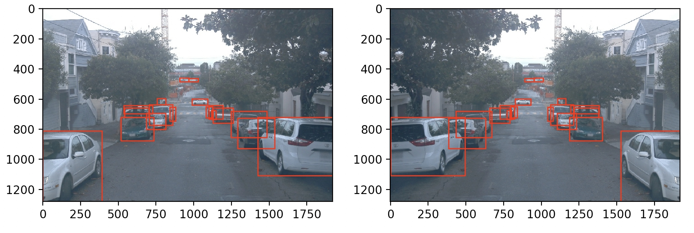
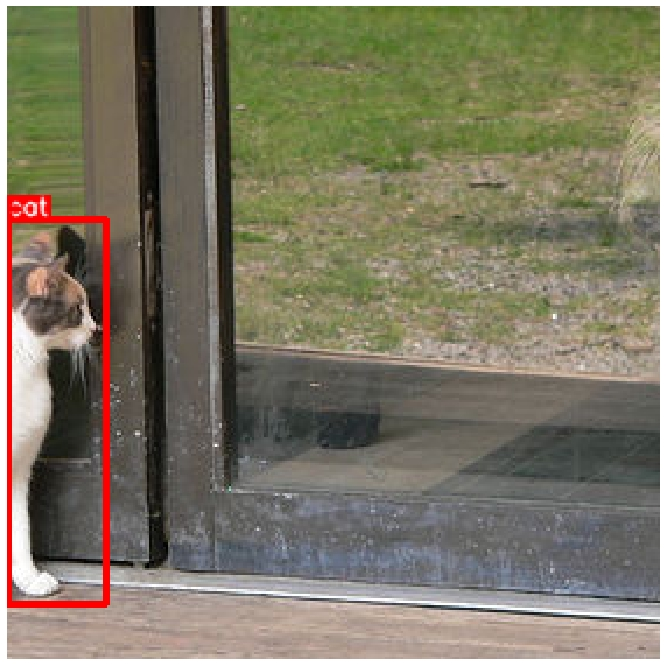

- [Intro to the Camera Sensor](#intro-to-the-camera-sensor)
- [Big Picture](#big-picture)
- [Distortion Correction](#distortion-correction)
- [Pinhole Camera Model](#pinhole-camera-model)
  - [Distortion Coefficients and Correction](#distortion-coefficients-and-correction)
- [Camera Calibration](#camera-calibration)
  - [Examples of Useful Code](#examples-of-useful-code)
  - [A note on image shape](#a-note-on-image-shape)
  - [Note on real chessboard dimension vs. calibration camera chessboard](#note-on-real-chessboard-dimension-vs-calibration-camera-chessboard)
  - [Solution: Camera Calibration](#solution-camera-calibration)
- [Image Manipulation](#image-manipulation)
- [Exercise 2](#exercise-2)
  - [Solution: Image Manipulation](#solution-image-manipulation)
- [Pixel Level Transformation](#pixel-level-transformation)
    - [**Key Highlights and Techniques**](#key-highlights-and-techniques)
    - [**Comparison of Color Models**](#comparison-of-color-models)
    - [**Quick Code Reference**](#quick-code-reference)
  - [Image Enhancement and Filtering](#image-enhancement-and-filtering)
- [Geometric Transformation](#geometric-transformation)
    - [**Overview**](#overview)
    - [**Key Concepts Covered:**](#key-concepts-covered)
- [Exercise 3 - Geometric transformations](#exercise-3---geometric-transformations)
  - [Solution: Geometric Transformation](#solution-geometric-transformation)
- [Lesson Conclusion](#lesson-conclusion)
- [Glossary](#glossary)


# Intro to the Camera Sensor

Hi, and welcome to this lesson on the camera sensor. Why are we taking the time to understand the sensor?Well, this course is focusing on deepening forcomputer vision and a kind of data we'll be using is digital images. In the previous lesson,I highlighted how important it was forthe machine learning engineer to become one with the data. 

Well, this means that we need a good understanding of the origin of that data,and because we are using digital images as the principal source of data,we need to have a good understanding of the camera sensor. Self-driving cars rely heavily on cameras,and older self-driving cars have multiple of them. 

However, the raw data that we acquire withsuch sensor needs to be processed before we can use it in our machine learning algorithm. This lesson will show you how to process and manipulate digital images. First, we are going to learn about the physics ofthe camera sensor and how to correct the distortion in raw images. Next, we will learn about the camera pinhole model,a very useful simplification of the camera's sensor. Then we will focus on camera calibration. 

Camera calibration is a very critical step in processing digital imagesand every machine learning engineer working withthis kind of data should be familiar with this method. Because digital images are such complex data type,people came up with multiple column models to describe them. In this lesson, we will learn about three of them,the RGB, HSV, and HLS color models. Finally, we're going to learn how to manipulate image data in Python. In this lesson, I will be teaching with Cezanne. 

Cezanne is an expert in computer vision witha masters in electrical engineering from Stanford University. As a former researcher in Genomics and Biomedical Imaging,she has applied computer vision and deep learning to medical diagnostic applications. In this lesson, Cezanne builds some great content on camera calibration. You will be learning with her about distortion correction,the camera pinhole model,and how to use OpenCV,a Python image processing library to calibrate cameras. I am very excited to be working with her on this lesson.  Let's get started. 


This lesson will be organized as follow:

* The camera sensor and its distortion effect
* The camera pinhole model
* Camera calibration
* RGB and other color systems
* Image manipulation in Python


# Big Picture

Let's start with some high level concept. How does human vision work?The human eye captures light that is reflected from objects. Receptors inside our eyes convert the lightinto electric signals that are transmitted to the brain. The brain transforms these signal into the images we see. A camera works somewhat differently. It captures and focuses the light using lenses,which are pieces of glass that are placed in front of a digital sensor. 

Depending on their model,cameras can have one or multiple lenses. The light signal is then received by digital sensor that capture it in a digital format. There are many digital format images can be saved as,such as JPEG or PNG. In the next slide,we will see the usage of cameras in self-driving cars,as well as the limitations of the camera sensor. Why are cameras at the core of the self-driving car technology?First of all, cameras are very high resolution sensor. 

Let's consider a digital image. Such image is made of pixels,a square of a certain intensity. Modern cameras generate images made ofmillions of pixels providing us high quality information. Moreover, because cameras detect visible light,they have access to information that other sensor,such as LiDAR do not. This is extremely useful to detect colors or being able toperform optical character recognition to read traffic signs for example. Even though camera do not detect depths directly,it is possible to estimate the distance of an object onan image using a pair of cameras in a stereo system. 

Finally, cameras are relatively cheap and fairly small,making them easy to integrate in an existing car. However, cameras also have a lot of limitation as we will see in the next slide. One of the main challenges that cameras arefacing in self-driving cars system is the weather. Indeed, cameras are sensitive to weather condition and maynot perform as well in rainy or snowy weather for example. Furthermore, the raw data outputted bycameras does not provide any usable information by itself. 

It needs to be processed and fed into a machine learning algorithm. Finally, even though cameras can provide some depth's estimation,they are not the best at this task,which is a limiting factor when trying to estimate the position of an object in 3D. In most self-driving cars systems,cameras are often combined with other types of sensors,such as LiDAR or RADAR. Each sensor has its strengths and weaknesses,but combined together, they can solve most ofthe challenges a self-driving car's system is facing. 

Cameras are optical instruments capturing the light intensity on a digital image. The most important characteristics of a camera for a ML engineer are the following:

* **Resolution**: Number of pixels the image captured by the camera is made of (usually described in mega pixels).
* **Aperture**: size of the opening where the light enters the camera. Controls the amount of light received by the sensor.
* **Shutter speed**: duration that the sensor is exposed to the light. Also controls the amount of light by the sensor.
* **Focal length / field of view**: this parameter controls the angle of view of the image.

**Summary**

The video titled "Big Picture" provides an overview of the key concepts related to cameras and their role in machine learning, particularly in self-driving cars. Here are the main points covered:

1. **Camera Functionality**: Cameras are optical instruments that capture light intensity to create digital images. Important characteristics include resolution, aperture, shutter speed, and focal length.

2. **Human Vision vs. Camera Operation**: The video compares human vision to camera functionality, explaining how cameras capture and focus light using lenses and digital sensors to create images.

3. **Importance in Self-Driving Cars**: Cameras are crucial for self-driving technology due to their high resolution and ability to detect visible light, which helps in recognizing colors and reading traffic signs.

4. **Limitations**: While cameras provide valuable information, they have limitations, such as sensitivity to weather conditions and challenges in depth perception. They often need to be combined with other sensors like LiDAR or RADAR to address these challenges.

5. **Integration of Sensors**: The video concludes by emphasizing that using a combination of different sensors can help overcome the limitations of individual sensors, leading to more effective self-driving systems.


# Distortion Correction

When we talk about image distortion, we're talking about what happens whena camera looks at 3D objects in the real world andtransforms them into a 2D image. This transformation isn't perfect. For example, here's an image of a road and some images taken through differentcamera lenses that are slightly distorted. 

In these distorted images, you can see that the edges of the lanes are bent andsort of rounded or stretched outward. And distortion is actually changing what the shape andsize of these objects appears to be. This is a problem,because we're trying to accurately place the self-driving car in this world. 

Eventually, we'll want to look at the curve of a lane andsteer the correct direction. But if the lane is distorted, we'll get the wrong measurement forcurvature in the first place and our steering angle will be wrong. So, the frist step in analyzing camera images is to undo this distortion sothat we can get correct and useful information out of them. 


**Distortion**

Image distortion occurs when a camera looks at 3D objects in the real world and transforms them into a 2D image; this transformation isn’t perfect. Distortion actually changes what the shape and size of these 3D objects appear to be. So, the first step in analyzing camera images, is to undo this distortion so that you can get correct and useful information out of them.

**Summary**

The video on "Distortion Correction" explains the concept of image distortion that occurs when a camera captures 3D objects and transforms them into a 2D image. Here are the key points discussed:

1. **Understanding Distortion**: Distortion happens due to imperfections in the camera's optics, which can alter the perceived shape and size of objects in the image.

2. **Impact on Self-Driving Cars**: For applications like self-driving cars, accurate image representation is crucial. Distorted images can lead to incorrect measurements of objects, affecting navigation and decision-making.

3. **Importance of Correction**: The first step in analyzing camera images is to correct for distortion. This ensures that the information extracted from the images is accurate and useful for tasks like lane detection and obstacle avoidance.

4. **Techniques for Correction**: While the video does not delve into specific techniques, it implies that various methods exist to rectify distortion in images.

Overall, the video emphasizes the necessity of distortion correction to obtain reliable data from camera images, which is vital for the effective functioning of self-driving technology.

# Pinhole Camera Model

Youtube Video: [Link](https://www.youtube.com/watch?v=FBHyHUN-A8c)

Before we get into the code and start correcting fordistortion, let's get some intuition as to how this distortion occurs. Here's a simple model of a camera called the pinhole camera model. When the camera forms an image,it's looking at the world similar to how our eyes do. By focusing the light that's reflected off of objects in the world. In this case through a small pinhole, the camera focuses the light that'sreflected off of a 3D traffic sign, and forms a 2D imageat the back of the camera or a sensor or some film would be placed. 

In fact the image it forms here will be upside down, andreversed because rays of light that enter from the top of an object will continue on that angled path through the pinhole andend up at the bottom of the formed image. Similarly, light that reflects off the right side of an objectwill travel to the left of the formed image. In math this transformation from 3D object points, P of X, Y, and Z. To 2D image points, P of just X, andY is done by a transformative matrix called the camera matrix. Which I'll call C for camera andwe'll need this to calibrate the camera later on. However, real cameras don't use tiny pinholes like this,they use lenses to focus multiple light rays at a time. 

Which allows them to quickly form images. But lenses can introduce distortion too. Light rays often bend a little too much ortoo little at the edges of a curved lens of a camera, and this creates the effectwe looked at earlier that distorts the edges of images. So that lines or objects appear, more or less, curved than they actually are. This is called radial distortion, and it's the most common type of distortion. Another type, is tangential distortion, if the camera's lens is not alignedperfectly parallel to the imaging plane where the camera film orsensor is, this makes an image look tilted. So that some objects appear further away or closer than they actually are. And this is tangential distortion. There are even example of lenses that purposefully distort images like fisheyeor wide angle lenses which keep radial distortion for stylistic effect. 

But for our purposes we are using this imagesto position ourself driving car and eventually steer it the right direction. So we need undistorted images that accurately reflectour real world surroundings. Luckily, this distortion can generally be captured by five numbers calleddistortion coefficients, whose values reflect the amount of radial andtangential distortion in an image. In severely distorted cases, sometimes even more thanfive coefficients are required to capture the amount of distortion. If we know these coefficients,we can use them to calibrate our camera and undistort our images. And the mathematical details of correcting fordistortion are in the notes below. Next we'll see how to get these coefficients and calibrate a camera. 


**Types of Distortion**

Real cameras use curved lenses to form an image, and light rays often bend a little too much or too little at the edges of these lenses. This creates an effect that distorts the edges of images, so that lines or objects appear more or less curved than they actually are. This is called radial distortion, and it’s the most common type of distortion.

Another type of distortion, is tangential distortion. This occurs when a camera’s lens is not aligned perfectly parallel to the imaging plane, where the camera film or sensor is. This makes an image look tilted so that some objects appear farther away or closer than they actually are.


## Distortion Coefficients and Correction

There are three coefficients needed to correct for **radial distortion**: **k1**, **k2**, and **k3**. To correct the appearance of radially distorted points in an image, one can use a correction formula.

In the following equations, $(x, y)$ is a point in a distorted image. To undistort these points, OpenCV calculates **r**, which is the known distance between a point in an undistorted (corrected) image $(x_{corrected}, y_{corrected})$ and the center of the image distortion, which is often the center of that image $(x_c, y_c)$. This center point $(x_c, y_c)$ is sometimes referred to as the *distortion center*. These points are pictured below.

*Note:* The distortion coefficient **k3** is required to accurately reflect *major* radial distortion (like in wide angle lenses). However, for minor radial distortion, which most regular camera lenses have, k3 has a value close to or equal to zero and is negligible. So, in OpenCV, you can choose to ignore this coefficient; this is why it appears at the end of the distortion values array: [k1, k2, p1, p2, k3]. In this course, we will use it in all calibration calculations so that our calculations apply to a *wider* variety of lenses (wider, like wide angle, haha) and can correct for both minor and major radial distortion.


Points in a distorted and undistorted (corrected) image. The point (x, y) is a single point in a distorted image and (x_corrected, y_corrected) is where that point will appear in the undistorted (corrected) image.


$$x_{distorted} = x_{ideal}(1 + k_1r^2 + k_2r^4 + k_3r^6)$$

$$y_{distorted} = y_{ideal}(1 + k_1r^2 + k_2r^4 + k_3r^6)$$

**Radial distortion correction.**

There are two more coefficients that account for **tangential distortion: p1** and **p2**, and this distortion can be corrected using a different correction formula.

$$x_{corrected} = x + [2p_1xy + p_2(r^2 + 2x^2)]$$

$$y_{corrected} = y + [p_1(r^2 + 2y^2) + 2p_2xy]$$

**Tangential distortion correction.**


# Camera Calibration

Youtube Video: [Link](https://www.youtube.com/watch?v=lA-I22LtvD4)

I'll be going through the initial camera calibration stepsin this Jupyter notebook. The first step will be to read in calibration images of a chessboard. it's recommended to use at least 20 images to get a reliable calibration. And for this example,we have a lot of images in this calibration images folder. They are all images of a chessboard, taken at different angles and distances. And there's also a test image.  

I'll eventually want to test mycamera calibration and undistortion on. Each chessboard here has eight by six corners to detect. I'll go through the calibration steps forthe first calibration image in detail. First, you can see that I've already done my Numpy OpenCV andplotting imports. Then I'll read in the first image calibration1. jpg, and I'll display it. So here's our calibration image. I'll map the coordinates of the corners in this 2D image,which I'll call it's image points, to the 3D coordinates of the real,undistorted chessboard corners, which I'll call object points. So, I'll set up two empty arrays to hold these points, object points andimage points. The object points will all be the same. 

Just the known object coordinates of the chessboard corners foran eight by six board. These points will be 3D coordinates, x, y and z from the top left corner,0, 0, 0, to the bottom right, 7, 5, 0. The z coordinate will be zero forevery point, since the board is on a flat image plane. And x and y will be all the coordinates of the corners. So I'll prepare these object points,first by creating six by eight points in an array. Each with three columns for the x, y, and z coordinates of each corner. 

I'll initialize these all as zeros using Numpy's zero function. The z coordinate will stay zero so I'll leave that as it is but forour first two columns, x and yI'll use Numpy's mgrid function to generate the coordinates that I want. mgrid returns the coordinate values for a given grid size andI'll shape those coordinates back into two columns, one for x and one for y. Next, to create the image points, I want to lookat the distorted calibration image and detect the corners of the board. OpenCV gives us an easy way to detect chessboard corners with a functioncalled findChessboardCorners that returns the cornersfound in a grayscale image. So I'll convert this image to greyscale andthen I'll pass that into the findChessboardCorners function. This takes in our greyscale image along with the dimensions of the chessboardcorners. 

In this case, eight by six, and the last parameter is for any flags. And there are none in this example. If this function detects corners,I'll append those points to the image points array. I'll also add our prepared object points,objp, to the object points array. And these object points will be the same forall of the calibration images, since they represent a real chessboard. Next, I'll also draw the detected corners,with a call to drawChessboardCorners,that takes in our image, corner dimensions and corner points. A

nd I'll display these corners sothat we can see what was detected in an interactive window. So let's run this code. Here's what our detected corners look like. And if I zoom in, it looks like the corners were detected pretty accurately. The next step will be to do this for all the calibration images. I can read in all the calibration images by importing the glob API,which helps read in images with a consistent file name,like calibration one, two, three, and so on. 

Then, I'll iterate through each image file, detecting corners andappending points to the object and image points arrays. Then later, we'll be able to use the object points andimage points to calibrate this camera. I'll show you the OpenCV functions you'll need to calibrate the camera andfinally, undistort images. To calibrate a camera, OpenCV gives us the calibrateCamera function. This takes in our object points, our image points, andthe shape of the image. And using these inputs, it calculates andreturns the distortion coefficients and the camera matrix that we needto transform 3D object points to 2D image points. 

It also returns the position of the camera in the world, with values forrotation and translation vectors. The next function you'll need is undistort. This takes in a distorted image, our camera matrix, anddistortion coefficients. And it returns an undistorted, often called destination image. In the next quiz, you'll need to apply what you've learned to calibratethe camera and correct for image distortion. Good luck. 


> [!NOTE] 
> Note Regarding Corner Coordinates
> Since the origin corner is (0,0,0) the final corner is (6,4,0) relative to this corner rather than (7,5,0).

## Examples of Useful Code

Converting an image, imported by cv2 or the glob API, to grayscale:

```math
gray = cv2.cvtColor(img,cv2.COLOR_BGR2GRAY)
```

> [!NOTE]
> Note: If you are reading in an image using mpimg.imread() this will read in an RGB image and you should convert to grayscale using cv2.COLOR_RGB2GRAY, but if you are using cv2.imread() or the glob API, as happens in this video example, this will read in a BGR image and you should convert to grayscale using cv2.COLOR_BGR2GRAY. We'll learn more about color conversions later on in this lesson, but please keep this in mind as you write your own code and look at code examples.

**Finding chessboard corners (for an 8x6 board):**

```math
ret, corners = cv2.findChessboardCorners(gray, (8,6), None)
```

**Drawing detected corners on an image:**

```math
img = cv2.drawChessboardCorners(img, (8,6), corners, ret)
```

**Camera calibration, given object points, image points, and the shape of the grayscale image:**

```math
ret, mtx, dist, rvecs, tvecs = cv2.calibrateCamera(objpoints, imgpoints, gray.shape[::-1], None, None)
```

**Undistorting a test image:**

```math
dst = cv2.undistort(img, mtx, dist, None, mtx)
```

## A note on image shape

The shape of the image, which is passed into the `calibrateCamera` function, is just the height and width of the image. One way to retrieve these values is by retrieving them from the grayscale image shape array `gray.shape[::-1]`. This returns the image width and height in pixel values like (1280, 960).

Another way to retrieve the image shape, is to get them directly from the color image by retrieving the first two values in the color image shape array using `img.shape[1::-1]`. This code snippet asks for just the first two values in the shape array, and reverses them. Note that in our case we are working with a greyscale image, so we only have 2 dimensions (color images have three, height, width, and depth), so this is not necessary.

It's important to use an entire grayscale image shape or the first two values of a color image shape. This is because the entire shape of a color image will include a third value -- the number of color channels -- in addition to the height and width of the image. For example the shape array of a color image might be (960, 1280, 3), which are the pixel height and width of an image (960, 1280) and a third value (3) that represents the three color channels in the color image which you'll learn more about later, and if you try to pass these three values into the calibrateCamera function, you'll get an error.

## Note on real chessboard dimension vs. calibration camera chessboard

The video animation depicts a 6x8 chessboard, but a standard chessboard should have 8x8 squares. Camera calibration typically uses a checkerboard pattern, which resembles a chessboard but is specifically designed for calibration purposes. The most common calibration board has a 6x8 or 6x9 grid of internal corners (not squares). Unlike a standard chessboard (8x8 squares), calibration boards often have asymmetric patterns to help the algorithm detect orientation more accurately.

**Why is a 6x8 or 6x9 pattern used?**

The internal corner count (instead of square count) helps OpenCV and other calibration tools easily recognize the grid.

The asymmetric pattern ensures the detection of orientation.

The known dimensions allow precise calculation of camera parameters like focal length and lens distortion.

## Solution: Camera Calibration

Here is one example answer:

```python
def cal_undistort(img, objpoints, imgpoints):
    ret, mtx, dist, rvecs, tvecs = cv2.calibrateCamera(objpoints, imgpoints, img.shape[1::-1], None, None)
    undist = cv2.undistort(img, mtx, dist, None, mtx)
    return undist
```

> [!NOTE] 
> Note that the quiz is loading this image as channels first, so we use `img.shape[1::-1]` to get the height and width. This should be adjusted as necessary, such as is seen on the previous page for a grayscale image.


# Image Manipulation

Youtube Video: [Link](https://www.youtube.com/watch?v=5AFIMDb3NAc)

In this video, we're going to talk about color spaces or color models. What is a color space?A color space is a mathematical model that describes colors as tuples of numbers. We can represent and visualize the same image using different color spaces. For example, the red, green,and blue or RGB color model represents a coloras a tuple of three values between zero and 255. Later in this video,we will also learn about the HSV and HLS color models. But before we really dive into the different color spaces,let's talk about grayscale images. Grayscale images only carry information about intensity,meaning that each pixel value indicates the amount of light for that pixel. Grayscale images usually describe this intensity with a 8-bit integer. This is an example of a grayscale image. 

We can see how each object has a different intensity. For example, the white car reflects the light more thana black one and therefore comes up with a higher intensity on the image. Whereas grayscale images may be useful in some cases,a lot of the information is lost because we solely focus on the light intensity. In the next slide, we will learn about the RGB color model. Let's talk about our first color model,the RGB color model. It is one of the most popular,and you will learn how to master it in this lesson. In this model, each image is described using three channels: red, green, and blue. Let's look at this image, for example,if we were to open this image in Python using the RGB color model,we would obtain a 3-D array,made of a stack of three 2D arrays,one for each channel. We can visualize each channel individually by indexing this array. We obtain three grayscale images,each one containing the pixel intensity for their channel. 

Let's focus on some of the object of the scene to better understand the RGB color model. See how this red car comes with different intensity for each channel. It has a very high intensity in the red channel,but much lower ones in the green and blue channels,and now let's look at this yellow advertisement. It has very different intensities in each channel. If you look carefully at other objects in the scene,you will find similar behaviors. Let's summarize what we have learned about the RGB color model so far. In this color model,each pixel of the image is described as a tuple of three values. Most of the time, these values are 8-bit integer,but you may encounter floats as well. A RGB image can be decomposed in three channels,one for each color. 


This is very useful when you want to threshold an image based on a specific color. For example, you want to remove all the red object of an image. Well, you could look at all the high-intensity pixels in the red channel. Despite being very popular,the RGB color model has some limitations. For example, it's not a linear color model. If you were to look at a tuple for bright red pixelin this model and divide all the values by two,you will not get a darker red,but a completely different color. Because of this, it is hard to determine specific color,and even after years working with the RGB color model,I still need to look at tables to determine the value of the color of interest. Let's see how other color spaces remediate this problem. 


Even though in this course we will mostly deal with the RGB color model,I want you to be familiar with two more models,the HSV, and HLS color models. They both use the same ID,and we can represent them as cylinder,as you can see on the right here. The HLS model stands for hue lightness and saturation. Whereas the HSV stands for hue saturation and value. The hue is a single number between zero and 360 that specifies the color. If we look at the cylinder representations of these models,the hue can be considered as an angle. The colors are grouped by values of hue. 


The models also use the lightness and value,which are a different way to measure the relative lightness of a color. The higher this value is,the lighter is the color. Finally, the saturation is a measurement of the color fullness. The higher the saturation is,the more intense the color. For example, a bright red has a high saturation value. These color models are easier to use when we would like to do some colors thresholding,because [inaudible] is encoded with a single number. Let's now learn how to use these different color models in Python. 

---

**Grayscale** images are single channel images that only contain information about the intensity of the light.

Color models are mathematical models used to describe digital images. The **Red, Green, Blue (RGB)** color model describes images using three channels. Each pixel in this model is described by a triplet of values, usually 8-bit integers. This is the most common color model used in ML. **HLS/HSV** are also very popular color models. They take a different approach than the RGB model by encoding the color with a single value, the **hue**. The other two values characterize the darkness / colorfulness of the image.

**Summary**

The video on "Image Manipulation" covers essential concepts related to processing and modifying images in the context of machine learning and computer vision. Here are the key points discussed:

1. **Grayscale Images**: The video explains that grayscale images consist of a single channel that represents light intensity, with each pixel indicating the amount of light.

2. **Color Models**: It introduces the RGB (Red, Green, Blue) color model, which describes images using three channels, where each pixel is represented by a triplet of values. The video also mentions other popular color models, such as HLS (Hue, Lightness, Saturation) and HSV (Hue, Saturation, Value), which encode color differently.

3. **Importance of Color Models**: Understanding different color models is crucial for tasks like image processing and analysis, as they can affect how images are interpreted and manipulated.

4. **Applications**: The video highlights that knowledge of image manipulation and color models is fundamental for various applications in machine learning, including object detection and image classification.

# Exercise 2

**Part 1 - Masking**

**Objective**

The goal of this exercise is to make you familiar with color thresholding. We will be using the RGB color model. In particular, your goal is to isolate all the pixels of a RGB image equal / higher / lower to a given color and a create a binary mask. You will use this mask to create a masked version of the RGB image.

In the example below, we can see (from left to right), the original RGB image, the binary mask and the masked RGB image. In this example, we used a RGB color threshold of `(128, 128, 128)` and isolated all the pixels with a RGB value higher than this threshold.


```
Left - Original RGB Image, Center - The binary mask, Right - The masked RGB Image
```

**Details**
You need to implement two functions in `masking.py`.

The `create_mask` function outputs a binary mask given an input RGB image. This mask has the same spatial dimensions as the input image. You need to perform an element-wise comparison as shown in the pseudo-code below:

```
mask[x, y] = 0 if image[x, y, :] <= color else mask[x, y] = 1
```

The `mask_and_display` function uses the image array as well as the mask array and displays next to each other the original image, the binary mask and the masked image.

**Running the Code**

> [!NOTE] 
> Any visualized code will only pop up through the workspace desktop - if you complete work in the primary workspace window, you'll need to click the "Desktop" button in the bottom right to view visualizations.

Run `python masking.py` to check your results.

> [!TIP]
> You can use numpy element-wise multiplication to mask the RGB image.

**Part 2 - Statistics**

**Objective**

In this exercise, you first need to calculate the channel wise mean and standard deviations of a list of images in `statistics.py`. Then you need to display the pixel value distributions per channel, as shown in the figure below, for example.


Pixel value distribution per channel
Pixel value distribution per channel

**Details**

The `calculate_mean_std` function outputs the channel wise mean and standard deviation over a list in images. This function outputs two `1x3` numpy array, one for the mean and one for the standard deviation.

The `channel_histogram` function creates the channel wise histograms. You should encode each distribution with the same color channel as shown in the example above.

**Running the Code**

**Note**: Any visualized code will only pop up through the workspace desktop - if you complete work in the primary workspace window, you'll need to click the "Desktop" button in the bottom right to view visualizations. The channel_histogram function, as implemented in the solution, may take a substantial amount of time to display in the workspace (a minute or more).

Run `python statistics.py` to see the results of your code.

> [!TIP]
> You can use the `ImageStat` module of Pillow to calculate image statistics. Feel free to experiment with other Python visualization libraries such as Seaborn(opens in a new tab) (which is installed in the workspace).


## Solution: Image Manipulation

```python
# masking.py

import matplotlib.pyplot as plt
import numpy as np
from PIL import Image


def create_mask(path, color_threshold):
    """
    create a binary mask of an image using a color threshold
    args:
    - path [str]: path to image file
    - color_threshold [array]: 1x3 array of RGB value
    returns:
    - mask [array]: binary array
    """
    img = np.array(Image.open(path).convert('RGB'))
    R, G, B = img[..., 0], img[..., 1], img[..., 2]
    rt, gt, bt = color_threshold
    mask = (R > rt) & (G > gt) & (B > bt) 
    return img, mask


def mask_and_display(img, mask):
    """
    display 3 plots next to each other: image, mask and masked image
    args:
    - img [array]: HxWxC image array
    - mask [array]: HxW mask array
    """
    masked_image = img  *np.stack([mask]*3, axis=2)
    f, ax = plt.subplots(1, 3, figsize=(15, 10))
    ax[0].imshow(img)
    ax[1].imshow(mask)
    ax[2].imshow(masked_image)
    plt.show()


if __name__ == '__main__':
    path = 'data/images/segment-1231623110026745648_480_000_500_000_with_camera_labels_38.png'
    color_threshold = [128, 128, 128]
    img, mask = create_mask(path, color_threshold)
    mask_and_display(img, mask)
```


```python
# statistics.py

import glob

import matplotlib.pyplot as plt
import numpy as np
import seaborn as sns
from PIL import Image, ImageStat

from utils import check_results


def calculate_mean_std(image_list):
    """
    calculate mean and std of image list
    args:
    - image_list [list[str]]: list of image paths
    returns:
    - mean [array]: 1x3 array of float, channel wise mean
    - std [array]: 1x3 array of float, channel wise std
    """
    means = []
    stds = []
    for path in image_list:
        img = Image.open(path).convert('RGB')
        stat = ImageStat.Stat(img)
        means.append(np.array(stat.mean))
        stds.append(np.array(stat.var)**0.5)
    
    total_mean = np.mean(means, axis=0)
    total_std = np.mean(stds, axis=0)

    return total_mean, total_std


def channel_histogram(image_list):
    """
    calculate channel wise pixel value
    args:
    - image_list [list[str]]: list of image paths
    """
    red = []
    green = []
    blue = []
    for p in image_list:
        img = np.array(Image.open(p).convert('RGB'))
        R, G, B = img[..., 0], img[..., 1], img[..., 2]
        red.extend(R.flatten().tolist())
        green.extend(G.flatten().tolist())
        blue.extend(B.flatten().tolist())

    sns.kdeplot(red, color='r')
    sns.kdeplot(green, color='g')
    sns.kdeplot(blue, color='b')


if __name__ == "__main__": 
    image_list = glob.glob('data/images/*')
    mean, std = calculate_mean_std(image_list)
    check_results(mean, std)
```

# Pixel Level Transformation

Youtube Video: [Link]()

With [inaudible] , you learn how to manipulate images with the OpenCV library.In this video, we will use another very popular Python image library, Pillow.We're going to see how we can leverage this library to open images,convert them in different color models,and perform colors thresholding.Let's start by importing some packages.

In this video, we will only use the image module.We can use the image.open to load an image.A Pillow image has several attributes,such as the size or the mode,which is the color model used.Our image is in the PNG format,which supports among other RGB and RGBA color models.The mode of an image depends on the way it was saved.Even though our image is already in the RGB format,we can run image.convert to transform it into RGB image.In Jupyter Notebooks, Pillow images are veryeasily displayed by just typing the variable name.

Now that we have loaded an RGB image,what if we want to look at the grayscale versions?Well to do, so we just have to run Image.convert L to convert it into a grayscale format.Finally, let's convert our image to the HSV color model.We cannot display such image in a notebook,however, we can still manipulate it.Let's try to see if we can isolate the red car in this image.

We can get the pixel values of these HSV image by loading it into a NumPy array,then we can isolate hue channel.We are trying to select only the dark red pixels,which are pixels with a hue between 340 and 360.However, because pixels in HSV images in Pillow are stored as eight bits integer,we need to scale this value.We can create a binary mask to keep only the pixel,whether hue is above our threshold.We can use this mask to mask the RGB image.We multiply the RGB pixel values by two to emphasize the colors.

Finally, we can visualize the masked RGB image.If we were to use the RGB model to create this mask,it will be much more challenging as we wouldhave to create the mask based on triplets of value.Hopefully, this shows you the pros and cons of the different color models.


**Pillow** is a python imaging library. Using Pillow, we can easily load images, convert them from one color model to another and perform diverse pixel level transformation, such as color thresholding. **Color thresholding** consists of isolating a range of color from a digital image. It can be done using different color models, but the HSV/HLS color models are particularly well suited for this task.

---

### **Key Highlights and Techniques**

* **Loading and Inspection:** Using `Image.open()` to load files (like PNGs) and checking attributes such as `.size` and `.mode`.
* **Color Model Conversions:**
* **RGB:** The standard color format.
* **L (Grayscale):** Achieved using `.convert('L')`.
* **HSV (Hue, Saturation, Value):** Useful for color-based segmentation. While not directly viewable in some notebooks, it is ideal for mathematical manipulation.


* **Color Thresholding:** The tutorial isolates a red car by converting the image to the **HSV** model.
* **Why HSV?** It is much easier to isolate a color by a single "Hue" value than by trying to balance triplets of Red, Green, and Blue values.
* **Processing:** The image is converted to a NumPy array to filter pixels where the Hue falls within a specific range (scaled for 8-bit integers).


* **Masking:** A binary mask is created from the thresholded HSV data and applied back to the original RGB image to highlight the target object.

---

### **Comparison of Color Models**

| Model | Use Case | Benefit |
| --- | --- | --- |
| **RGB** | Standard display | Default for most digital images. |
| **L** | Grayscale analysis | Reduces data complexity for shape recognition. |
| **HSV** | Color Filtering | Separates "color" (Hue) from "intensity" (Value). |

---

### **Quick Code Reference**

Based on the transcript, the workflow follows this logic:

```python
from PIL import Image
import numpy as np

img = Image.open('car.png').convert('RGB')
hsv_img = img.convert('HSV')

# Process with NumPy to create a mask for "Red"
# Scale thresholds for 8-bit (0-255)

```


## Image Enhancement and Filtering

Youtube Video: [Link](https://www.youtube.com/watch?v=C-pCfNIvL9I)

In this second video about pixel level transformations,we are going to learn about a few more ways you canleverage the Pillow Library to transform images.Let's start by loading the different function,as well as the small helper function to plot image histograms.In the first part of this video,we're going to focus on image contrast.The contrast of an image is defined by the differencein colors between the different object in this image.Let's look at this first image and take a look at the RGB value histograms.As we can see on this histogram,the channel distributions are much more spread out.

This is an example of what you can do with image enhance.I encourage you to spend time playing around with this module.I also want you to be familiar with image filtering.It's an extremely useful Pillow feature.

Pillow comes with pre-implemented filters,but you can also implement your own and I encourage you to look into that.Filters are pixel level transformation, such as blurring.We can blur this image using the pre-implemented filter.As you can see, the output image is slightly blurred.This is extremely useful if we were to mimic foggy images, for example.Other pre-implemented filter exist in Pillow,such as contour, smooth, or sharpen.Well, with this notebook,we're done with pixel-level transformation with the Pillow Library.In the next video,we are going to focus on geometric transformation.


Images in ML dataset reflect real life conditions and therefore may need to be improved upon or modified. Pillow provides a very useful module, **ImageEnhance**, to perform pixel level transformations on images, such as contrast changes. Moreover, ML engineers often want to add some noise to the images in the dataset to reduce overfitting. **ImageEnhance** provides simple ways of doing so.


**Summary**

This lesson explores pixel-level transformations in Python using the Pillow Library, focusing primarily on image contrast and image filtering.

**Key Topics Covered**

* **Image Contrast and Enhancement:** The video demonstrates how to analyze image contrast by plotting and examining RGB value histograms. It highlights the use of Pillow's `ImageEnhance` module to adjust the color differences between objects in an image.
* **Image Filtering:** Pillow offers several pre-implemented filters for pixel-level transformations. Examples discussed include:
* **Blurring:** Can be used to mimic environmental conditions like fog.
* **Other Filters:** Contour, smooth, and sharpen.
* *Note:* While Pillow provides built-in options, you can also implement custom filters.

# Geometric Transformation

Youtube Video: [Link](https://www.youtube.com/watch?v=a1WG6FIr6yY)

In the previous videos,we learnt about color spaces and the different typesof pixel over transformation we can apply on an image. This video is going to focus on geometric transformation. The first type of geometric transformation we are going to see is resizing. This is a very common operation,especially useful when loading data into a Machine Learning Algorithm. Indeed, we often cannot load full resolution images because of memory limitation. 

Pillow makes image resizing extremely easy. Using the Image. resize function,we can resize our image from 1920 by 1080-960 by 640 in one line. The resizing operation is an example of an Affine transformation. We can replicate the results of the resizing operationusing the transform method of the Pillow image class. For resizing, we need to define a transformation matrix as such,where c_x and c_y are the re-scaling factors. 

If we want to divide by two the dimension of the image,we can use c_x and c_y equals 0. 5. Be careful, the transform method takesthe inverse of the transformation matrix as an input. After running this transformation,we observe that the image dimensions are indeed divided by two. affine transformations are very powerful. 

We are going to see two more, translation and shearing. The transformation matrices are slightly different for this operation,as we can see here. Translation just shift the image by a certain number of pixels. For example, here we shift the image by 200 pixels to the right and 100 pixels down. We can use the transformation matrix to perform shearing as displayed here. In this case, we are going to perform Horizontal Shearing. Finally, we can also combine different transformation. For example, here we combine translation and shearing. I encourage you to read more about affine transformations. There's a lot more we can do with Pillow. 


In addition to pixel level transformation, Pillow also provides ways to perform **geometric transformations**, such as rotation, resizing or translation. In particular, we can use Pillow to perform affine transformation (a geometric transformation where lines are preserved) using a transformation matrix.


### **Overview**

This section transitions from pixel-level color adjustments to **geometric transformations** using the Pillow library. These transformations alter the spatial arrangement of pixels rather than their colors, which is a critical preprocessing step for computer vision tasks in self-driving car engineering.

### **Key Concepts Covered:**

* **Image Resizing for Machine Learning:**
* Full-resolution images are often too large for machine learning algorithms due to memory limitations.
* Pillow simplifies this with the `Image.resize` function, allowing rapid dimension scaling (e.g., from 1920x1080 to 960x640) in a single line of code.


* **Affine Transformations:**
* Resizing is just one example of an **Affine Transformation**—a family of geometric operations that preserve parallel lines.
* These can be performed using Pillow’s `transform` method, which requires a specific transformation matrix.
* **Important Technical Detail:** Pillow’s `transform` method specifically requires the *inverse* of the transformation matrix as its input.


* **Types of Affine Transformations Demonstrated:**
* **Rescaling/Resizing:** Uses scaling factors (like c_x and c_y) in the matrix to multiply the image dimensions (e.g., setting both to 0.5 divides the image size in half).
* **Translation:** Shifts the entire image by a specific number of pixels along the X or Y axis (e.g., shifting 200 pixels right and 100 pixels down).
* **Shearing:** Slants or deforms the shape of the image (e.g., horizontal shearing).


* **Combining Transformations:**
* Because these operations are matrix-based, you can combine multiple transformations (like translating *and* shearing) into a single mathematical operation.

# Exercise 3 - Geometric transformations

**Objective**

In this exercise, you will implement the following geometric transformations from scratch: horizontal flipping and resizing in augmentations.py. You can also implement random cropping as an additional but not required exercise. Your implementations should not only affect the images but also the associated bounding boxes.



**Details**
* The `hflip` function takes the image and bounding boxes as input and performs a horizontal flip. For example, an object initially on the * left of the image will end up on the right.
* The `resize` function takes the image, bounding boxes and target size as input. It scales up or down images and bounding boxes.
* The `random_crop` function takes a few additional inputs. It also needs the classes, the crop size and the minimum area. Let's explain * these parameters:
* `crop_size` is the size of the crop. It should be smaller than the dimensions of the input image.
* `min_area` is the minimum area of a bounding boxes to be considered as an object after cropping.

Because we are cropping randomly, we may only keep a tiny portion of an object, in which case the annotations will not be useful anymore. For example, in the image below, we may not want to keep the annotation of the cat because most of the animal's body is not visible.



Discard bad annotations due to random cropping

> [!NOTE]
>  You'll need to use the "Desktop" button to view the visualizations of each augmentation.

> [!TIP]
> The hflip transform does not affect the x coordinates of the bounding boxes.
> You will use the same ratio in resize for the image and the bounding boxes.
> To find which bounding box belongs to the cropped area, you can use the calculate_iou function.

## Solution: Geometric Transformation

```python
import copy
import json
import random

import numpy as np 
from PIL import Image

from utils import check_results, display_results


def calculate_iou(gt_bbox, pred_bbox):
    """
    calculate iou 
    args:
    - gt_bbox [array]: 1x4 single gt bbox
    - pred_bbox [array]: 1x4 single pred bbox
    returns:
    - iou [float]: iou between 2 bboxes
    """
    xmin = np.max([gt_bbox[0], pred_bbox[0]])
    ymin = np.max([gt_bbox[1], pred_bbox[1]])
    xmax = np.min([gt_bbox[2], pred_bbox[2]])
    ymax = np.min([gt_bbox[3], pred_bbox[3]])
    
    intersection = max(0, xmax - xmin + 1) * max(0, ymax - ymin + 1)
    gt_area = (gt_bbox[2] - gt_bbox[0]) * (gt_bbox[3] - gt_bbox[1])
    pred_area = (pred_bbox[2] - pred_bbox[0]) * (pred_bbox[3] - pred_bbox[1])
    
    union = gt_area + pred_area - intersection
    return intersection / union, [xmin, ymin, xmax, ymax]


def hflip(img, bboxes):
    """
    horizontal flip of an image and annotations
    args:
    - img [PIL.Image]: original image
    - bboxes [list[list]]: list of bounding boxes
    return:
    - flipped_img [PIL.Image]: horizontally flipped image
    - flipped_bboxes [list[list]]: horizontally flipped bboxes
    """
    # flip image
    flipped_img = img.transpose(Image.FLIP_LEFT_RIGHT)
    w, h = img.size
    
    # flip bboxes
    bboxes = np.array(bboxes)
    flipped_bboxes = copy.copy(bboxes)
    flipped_bboxes[:, 1] = w - bboxes[:, 3]
    flipped_bboxes[:, 3] = w - bboxes[:, 1]
    return flipped_img, flipped_bboxes


def resize(img, boxes, size):
    """
    resized image and annotations
    args:
    - img [PIL.Image]: original image
    - boxes [list[list]]: list of bounding boxes
    - size [array]: 1x2 array [width, height]
    returns:
    - resized_img [PIL.Image]: resized image
    - resized_boxes [list[list]]: resized bboxes
    """
    # resize image
    resized_image = img.resize(size)
    w, h = img.size
    ratiow = size[0] / w
    ratioh = size[1] / h
    
    # resize bboxes
    boxes = np.array(boxes)
    resized_boxes = copy.copy(boxes)
    resized_boxes[:, [0, 2]] = resized_boxes[:, [0, 2]] * ratioh
    resized_boxes[:, [1, 3]] = resized_boxes[:, [1, 3]] * ratiow
    return resized_image, resized_boxes


def random_crop(img, boxes, classes, crop_size, min_area=100):
    """
    random cropping of an image and annotations
    args:
    - img [PIL.Image]: original image
    - boxes [list[list]]: list of bounding boxes
    - classes [list]: list of classes
    - crop_size [array]: 1x2 array [width, height]
    - min_area [int]: min area of a bbox to be kept in the crop
    returns:
    - cropped_img [PIL.Image]: cropped image
    - cropped_boxes [list[list]]: cropped bboxes
    - cropped_classes [list]: cropped classes
    """
    # crop coordinates
    w, h = img.size
    x1 = np.random.randint(0, w - crop_size[0])
    y1 = np.random.randint(0, h - crop_size[1])
    x2 = x1 + crop_size[0]
    y2 = y1 + crop_size[1]

    # crop the image
    cropped_image = img.crop((x1, y1, x2 ,y2))

    # calculate iou between boxes and crop
    cropped_boxes = []
    cropped_classes = []
    for bb, cl in zip(boxes, classes):
        iou, inter_coord = calculate_iou(bb, [y1, x1, y2, x2])
        # some of the bbox overlap with the crop
        if iou > 0:
            # we need to check the size of the new coord
            area = (inter_coord[3] - inter_coord[1]) * (inter_coord[2] - inter_coord[0])
            if area > min_area:
                xmin = inter_coord[1] - x1
                ymin = inter_coord[0] - y1
                xmax = inter_coord[3] - x1
                ymax = inter_coord[2] - y1
                cropped_box = [ymin, xmin, ymax, xmax]
                cropped_boxes.append(cropped_box)
                cropped_classes.append(cl)
    return cropped_image, cropped_boxes, cropped_classes


if __name__ == '__main__':
    # fix seed to check results
    np.random.seed(48)

    # open annotations 
    with open('data/ground_truth.json') as f:
        ground_truth = json.load(f)

    # filter annotations and open image
    filename = 'segment-12208410199966712301_4480_000_4500_000_with_camera_labels_79.png'
    gt_boxes = [g['boxes'] for g in ground_truth if g['filename'] == filename][0]
    gt_classes = [g['classes'] for g in ground_truth if g['filename'] == filename][0]
    img = Image.open(f'data/images/{filename}')

    # check horizontal flip
    flipped_img, flipped_bboxes = hflip(img, gt_boxes)
    display_results(img, gt_boxes, flipped_img, flipped_bboxes)
    check_results(flipped_img, flipped_bboxes, aug_type='hflip')

    # check resize
    resized_image, resized_boxes = resize(img, gt_boxes, size=[640, 640])
    display_results(img, gt_boxes, resized_image, resized_boxes)
    check_results(resized_image, resized_boxes, aug_type='resize')

    # check random crop
    cropped_image, cropped_boxes, cropped_classes = random_crop(img, gt_boxes, gt_classes, [512, 512], min_area=100)
    display_results(img, gt_boxes, cropped_image, cropped_boxes)
    check_results(cropped_image, cropped_boxes, aug_type='random_crop', classes=cropped_classes)
```


# Lesson Conclusion

In this lesson, we learned about:

* The camera sensor and its distortion effect. A camera captures light to a digital sensor but the raw images are distorted.
* The camera pinhole model: a simplified physical model of cameras.
* Camera calibration and how to use the Python library OpenCV to calibrate a camera using checkerboard images.
* RGB and other color systems. We discovered the RGB, HLS and HSV color systems and learned about the strength and weaknesses of each one.
* Image manipulation in Python and how to leverage Pillow to perform pixel-level and geometric transformations of digital images.

# Glossary

* Aperture: size of the opening where the light enters the camera. Controls the amount of light received by the sensor.
* Calibration: process of estimating a camera's parameters.
* Focal length / field of view: this parameter controls the angle of view of the image.
* Grayscale images: single channel images that only contain information about the intensity of the light.
* HLS/HSV: color model encoding the color with a single value, the hue. The other two values characterize the darkness / colorfulness of * the image.
* Pinhole camera model: simplified physical model of a camera.
* Resolution: Number of pixels the image captured by the camera is made of (usually described in mega pixels).
* RGB: color model using (red, green, blue) triplet to describe a pixel.
* Shutter speed: duration that the sensor is exposed to the light.