- [Introduction to Machine Learning Algorithms](#introduction-to-machine-learning-algorithms)
    - [**Overview**](#overview)
    - [**Key Concepts Covered:**](#key-concepts-covered)
- [Big Picture](#big-picture)
    - [**Summary: Machine Learning Definitions \& Workflow**](#summary-machine-learning-definitions--workflow)
    - [**Transcript**](#transcript)
- [Linear Regression](#linear-regression)
    - [**Summary: Introduction to Linear Regression**](#summary-introduction-to-linear-regression)
    - [**Transcript**](#transcript-1)
  - [Linear Regression Loss Functions](#linear-regression-loss-functions)
    - [**Summary: Understanding Loss Functions (L2 vs. L1)**](#summary-understanding-loss-functions-l2-vs-l1)
    - [**Transcript**](#transcript-2)
- [Logistic Regression](#logistic-regression)
    - [**Summary: Introduction to Logistic Regression**](#summary-introduction-to-logistic-regression)
    - [**Transcript**](#transcript-3)
  - [Cross-Entropy Loss and One-Hot Encoding](#cross-entropy-loss-and-one-hot-encoding)
    - [**Summary: Ground-Truth and One-Hot Encoding**](#summary-ground-truth-and-one-hot-encoding)
    - [**Transcript**](#transcript-4)
- [Introduction to Tensorflow](#introduction-to-tensorflow)
    - [**Summary: Introduction to TensorFlow and Tensors**](#summary-introduction-to-tensorflow-and-tensors)
    - [**Transcript**](#transcript-5)
- [Exercise 1 - Logistic regression](#exercise-1---logistic-regression)
  - [Solution: Logistic Regression](#solution-logistic-regression)
- [Gradient Descent](#gradient-descent)
    - [**Summary: Gradient Descent**](#summary-gradient-descent)
    - [**Transcript**](#transcript-6)
- [Stochastic Gradient Descent](#stochastic-gradient-descent)
    - [**Summary: Stochastic Gradient Descent (SGD)**](#summary-stochastic-gradient-descent-sgd)
    - [**Transcript**](#transcript-7)
- [Exercise 2 - Custom training loop](#exercise-2---custom-training-loop)
- [Solution: Stochastic Gradient Descent](#solution-stochastic-gradient-descent)
- [Other Optimizers](#other-optimizers)
    - [**Summary: Advanced Optimizers and Momentum**](#summary-advanced-optimizers-and-momentum)
    - [**Formatted Transcript**](#formatted-transcript)
  - [Learning Rates and Annealing](#learning-rates-and-annealing)
    - [**Summary: Learning Rates and Annealing**](#summary-learning-rates-and-annealing)
    - [**Transcript**](#transcript-8)
- [Neural Networks](#neural-networks)
    - [**Summary: Introduction to Neural Networks**](#summary-introduction-to-neural-networks)
    - [**Transcript**](#transcript-9)
  - [Activation Functions](#activation-functions)
    - [**Summary: Activation Functions**](#summary-activation-functions)
    - [**Formatted Transcript**](#formatted-transcript-1)
- [Backpropagation](#backpropagation)
    - [**Summary: Backpropagation and the Chain Rule**](#summary-backpropagation-and-the-chain-rule)
    - [**Transcript**](#transcript-10)
  - [An Example Backpropagation Calculation](#an-example-backpropagation-calculation)
    - [**Summary: An Example Backpropagation Calculation**](#summary-an-example-backpropagation-calculation)
    - [**Transcript**](#transcript-11)


# Introduction to Machine Learning Algorithms

YouTube Video: [Link](https://www.youtube.com/watch?v=pQK4_6z6hr0)

Hi, and welcome back for the next lesson of this course,introduction to machine learning algorithm.In this lesson, you will learn about different machine algorithm,and how to build them from scratch using TensorFlow.Lets get started.In the previous lessons of this course,we introduced the machine learning workflow.We focused on framing a machine learning problem and understanding the data.In this lesson, we will concentrate on the last step of this workflow, modeling.

We can use machine learning for different purposes,but in this course,we will focus on prediction.We are trying to build a model to predict an outcome based on the set of observations.In our case, the observations will be images,and we will try to predict different things,such as object classes or location.In this lesson, we will focus on two types ofmachine learning problems, regression, and classification.Let's start with regression.

A regression problem is when you're trying to predict a quantity,more precisely, we are trying to understandthe relationship between two or more variables.For example, we may be interested in predicting a trip duration based on the distance.In this lesson, we will focus on linear regression,where we assume a linear relationship between two variables.

We will also tackle some classification problems using the traffic sign data sets.In a classification problem,we are trying to assign a class to an input.We will focus on two types of classification algorithm,logistic regression, and feed-forward neural networks.You will build both of them from scratch and train them to classify traffic signs.Linear regression, logistic regression,and neural networks arevery common approaches to tackle regression and classification problem,and the expertise you will gain in this lesson can be applied to many other problems.This lesson will be organized as follows.

First, we will focus on linear regression,a type of regression algorithm.Then, we will move to logistic regression.An algorithm for classification.Both algorithm require that you solve an optimization problem,and we will learn about an optimization method called gradient descent.We will then move to the main family ofalgorithms we will study in this course, neural networks.We will study back-propagation,a mechanism that propagates the gradient within your networks.Finally, we will see how we can use neural networks to classify images.I'm very excited about this lesson because weare going to start building machine learning algorithm.

In this course, we focus on the prediction task, which consists of predicting an outcome using a set of observations. In particular, we will focus on the following:

* **Regression**: predict a quantity (eg, distance, time) and understand the relation between two variables.
* **Classification**: assign a discrete class (eg, traffic sign) to an input.


This lesson will be organized as follow:

* Linear regression
* Logistic regression
* Optimization with gradient descent
* Feed forward neural networks
* Backpropagation
* Image classification with a neural network


### **Overview**

This lesson shifts the focus of the machine learning workflow from problem framing and data understanding to the **modeling** phase. You will be learning how to build foundational machine learning algorithms from scratch using TensorFlow, with a specific focus on predictive models for images (such as predicting object classes or locations).

### **Key Concepts Covered:**

* **Two Main Types of ML Problems:**
* **Regression:** Used for predicting a continuous quantity and understanding the relationship between variables (e.g., predicting trip duration based on distance).
* *Focus:* **Linear Regression**, which assumes a straight-line relationship between variables.


* **Classification:** Used for assigning a specific class or category to an input (e.g., identifying different types of traffic signs from a dataset).
* *Focus:* **Logistic Regression** and **Feed-forward Neural Networks**.


* **Underlying Mechanics & Optimization:**
* Both regression and classification require solving an optimization problem to make the model as accurate as possible.
* **Gradient Descent:** You will learn this fundamental optimization method used to minimize the model's errors.


* **Neural Networks & Deep Learning:**
* The course will introduce Neural Networks as the primary family of algorithms moving forward.
* **Back-propagation:** You will study this critical mechanism, which calculates and propagates the gradient back through the network's layers to update its weights and improve predictions.
* Ultimately, you will apply these neural networks to classify images.


# Big Picture

YouTube Video: [Link](https://www.youtube.com/watch?v=afh_9W2pyL4)

### **Summary: Machine Learning Definitions & Workflow**

**Overview**
This section establishes foundational vocabulary for machine learning, specifically defining what models, loss functions, and metrics are. It also clarifies the practical differences between loss and metrics, and illustrates how they all connect in a standard workflow, using traffic sign classification as an example.

**Key Concepts Defined:**

* **Model:** A set of computations designed to extract information and make predictions from an input or observation.
* **Loss (or Cost) Function:** A mathematical function that maps the model's output to a single real number. It measures how well the model is fitting the training data. A lower cost means the model is fitting the data well; a high cost indicates room for improvement.
* **Metrics:** Functions (like accuracy, precision, or recall) used to quantify and evaluate the actual, real-world performance of an algorithm.

**Loss Function vs. Metrics: Why do we need both?**
While they seem to do the same thing, they serve different operational roles:

1. **Differentiability:** A loss function *must* be mathematically differentiable so the algorithm can use it to optimize and update itself (which is often not the case for metrics like accuracy).
2. **Purpose:** Loss describes how well the model mathematically fits the training data, while metrics provide a human-readable understanding of how well the model is actually performing its intended task.

**The Workflow (Traffic Sign Example):**

1. **Input:** An image of a traffic sign.
2. **Model:** The image is fed into a neural network.
3. **Output:** The model generates an output (in multi-class classification, this takes the shape of a vector).
4. **Evaluation:** That output vector is then used to calculate both the loss (to train the model) and the metrics (to evaluate its success).

---

### **Transcript**

Let's start with a few definitions. We have been talking about models since the first lesson of this course. But what is a model exactly? Well, in our case, a model is a set of computations that extract information from an input or observation.

We will also be using the term loss or cost function a lot in this lesson. A loss or cost function is a function that maps the outputs of the model to a single real number. A low cost means that our model is doing a great job and a high cost means that there is space for improvement.

Finally, we should define metrics. In machine learning, a metric is a function that quantify the performances of an algorithm. We have seen multiple metrics already, such as precision, recall, or accuracy.

By the way, why do we need both the loss function and a metric? Don't they both quantify a model's performances? First of all, a loss function must be differentiable, as we will see in the following slides, which is often not the case for metrics. Secondly, the loss does not necessarily give us meaningful information on the model's performances, but rather describe how good a model is at fitting the data.

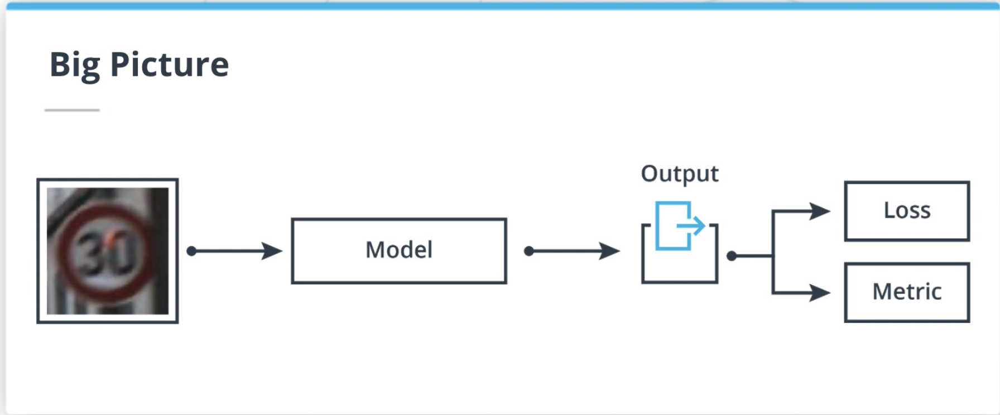

Let's see how everything fits in together. In a case of traffic sign classification, the input or observation is an image of a traffic sign. We feed this image to model, for example, the neural network, and we get an output. This output can take different shapes depending on the model. But in the case of multi-classes classification, it is a vector.

This output will be used to calculate both the loss and the metrics. In this lesson, we will study three different algorithms: linear regression, logistic regression, and neural networks, and the corresponding loss function.

Let's get started with linear regression.


In this course, we will create ML models to predict an output based on an input observation. To estimate the fit of our model, a loss function will be used and the performances of the model created will be quantified with a chosen metric.

* Model: a set of computations that extracts pattern from an input.
* Loss function / cost function: A function that maps the outputs of a model to a single real number.
* Metric: a function that quantifies the performances of an algorithm.

# Linear Regression

Youtube Video: [Link](https://www.youtube.com/watch?v=GA9dkMzA9-c)

### **Summary: Introduction to Linear Regression**

**Overview**
This lesson introduces Linear Regression. While the broader course focuses heavily on classification, linear regression remains a foundational algorithm that is crucial for understanding more complex models and is heavily utilized in tasks like object detection for self-driving cars.

**Key Concepts Covered:**

* **The Problem Scenario:** The video sets up a practical problem: predicting a self-driving car's trip duration (output variable, $y$) based on the geographical distance of the trip (input variable, $x$).
* **The Linear Model:** The algorithm attempts to fit a straight line to the data points (pairs of distance and time). This line is defined by two key parameters, which in machine learning are often called **weights**:
* **Slope ($m$):** The angle or steepness of the line.
* **Intersection ($b$):** Where the line crosses the y-axis (y-intercept).
* **Equation:** The model is represented mathematically as $y = mx + b$.


* **Fitting the Data:** "Fitting" the model means finding the optimal values for the weights ($m$ and $b$) so that the line represents the data as accurately as possible.
* **Evaluating the Fit:** The video contrasts examples of poor, acceptable, and good fits. To determine mathematically *which* fit is best, the algorithm needs to calculate the minimal error—setting the stage for the next topic: the Loss Function.

---

### **Transcript**

Let's dive into our first algorithm, linear regression. Even though the focus on this lesson is classification, many elements from linear regression will be reused in classification algorithms. Later on, when we tackle object detection, we will realize that linear regression occupies a significant place.

To understand linear regression, we can consider the following machine learning problem. Given the distance between two geographical locations, can we predict the trip duration of a self-driving car? We can safely assume that the relation between these variables, time, and distance is not linear, but we will still try to fit a linear model as an experiment. In this scenario, the distance is going to be our input variable, and the duration, our output variable.

To get started, we gathered data points from hundreds of past trips. In this case, a data point is a pair of distance and duration values. We will use this data as a training set for our algorithm. Because we learned the importance of good visualization in earlier lessons, we plotted the time as a function of the distance.

To predict the time spent in the car from the distance for future trips, we will use a linear regression algorithm. Such an algorithm is defined by the following two parameters: the slope, and the intersection. The slope is the angle of the red line and the intersection, the value at which this line intersects the y-axis.

A linear model is defined by the following equation: $y = mx + b$. We can see an example of a linear model fitted to our data set here. Later in this lesson, we will use the term "weights" to describe the parameters of a model.

Now that we have chosen an algorithm, we need to fit it to our data. What does fitting mean? It means that we need to find the best value of $m$ and $b$ such that the loss is minimized. Let's look at three different cases.

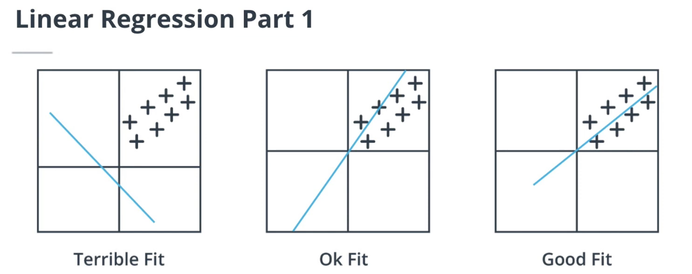

In this case, we can see that the model poorly fits the data. Our model even suggests that the time spent in the car decreases with the distance. In this case, the fit is much better. However, we see that our model does not really fit the data well for larger distances. Finally, we have a pretty good fit in this last case.

But so how do we evaluate the quality of a fit? This is exactly where the loss function comes into play. But before we can fit a model to a data set, we first need to define the loss function, which is the topic of the next video.

---

A **linear regression** model is a type of ML algorithm that assumes a linear relation between the input variable and the output variable. Such a model is described by two parameters, the slope `m` and the intersection `b` such that `y = mx +b`. Fitting or training such a model requires to adjust `m` and `b` to minimize the chosen loss function.


## Linear Regression Loss Functions

Youtube Video: [Link](https://www.youtube.com/watch?v=yODQBvpV8mM)

### **Summary: Understanding Loss Functions (L2 vs. L1)**

**Overview**
This section answers the question of what constitutes the "best fit" for a linear regression model. The "best" fit is the one that minimizes a specific mathematical metric called a **loss function**. The lesson focuses primarily on the **L2 Loss (Mean Squared Error)** and contrasts it with the **L1 Loss (Mean Absolute Error)**.

**Key Concepts Covered:**

* **Mean Squared Error (L2 Loss):** * This is a very common loss function for regression problems.
* It is calculated by taking the sum of the squared differences between the actual ground truth ($y$) and the model's prediction ($\hat{y}$) for every data point in the training set.
* *Goal:* The closer the predictions are to the actual observations, the closer the loss value gets to zero.


* **The Impact of Outliers:**
* **L2 Loss (Squared Error):** Because the difference is *squared*, L2 loss heavily penalizes outliers (anomalous or out-of-distribution data points). If a single prediction is very far off, squaring that large difference will cause the total loss to spike dramatically.
* **L1 Loss (Absolute Error):** This function simply takes the absolute difference between $y$ and $\hat{y}$. It does not square the error, meaning it is much less sensitive to extreme outliers.


* **Looking Ahead (Optimization):**
* Now that the algorithm (Linear Regression) and the metric for success (L2 Loss) are defined, the model needs a way to find the exact weights that minimize this loss.
* Because it is impossible to manually test every combination of weights, the next step is to use an optimization process called **gradient descent**.


---

### **Transcript**

In the previous video, I mentioned that fitting a linear regression model meant finding the best values for the weight. But what does best mean? Well, best according to a loss function that we choose. The loss function will quantify the fit of our model.

We will see many loss functions in this course, and the first one is the mean square error loss, or L2 loss. It is a very common loss function for regression problems in machine learning. This loss function consists in the sum of the square differences between the ground truth $y$, and the prediction of $\hat{y}$ for each of the $n$ data points in the training set.

Let's look at the square function a little bit more in depth. As we can see here, the closer the prediction are from the observation, the closer to zero is the loss. This is exactly the behavior we would want from a good loss function. The better our model is at accurately estimating $y$, the smaller the loss is.

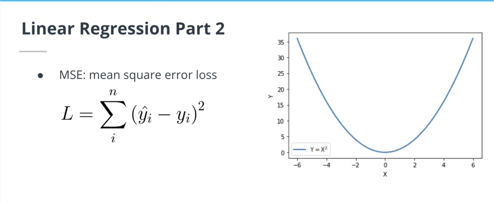

As a side note, the L2 loss has a property of penalizing outliers more than other loss functions. Outliers can be described as out-of-distribution data points. Let's say, for example, that for some reason the duration measured for a particular trip in our training set is wrong. Well, because we use the entire data set to fit our model, chances are that the square difference between the prediction $\hat{y}$ and the outlier is going to be high. The square function emphasizes this difference even more, and the loss value will be greatly affected by this single data point.

The L1 loss, which is the absolute difference between observation and predictions, will not be affected as much. As we can see in this diagram, for lower values of $x$, the absolute function and the square function have similar $y$ values, but they diverge a great deal as $x$ increases. This behavior must be kept in mind when choosing the loss function.

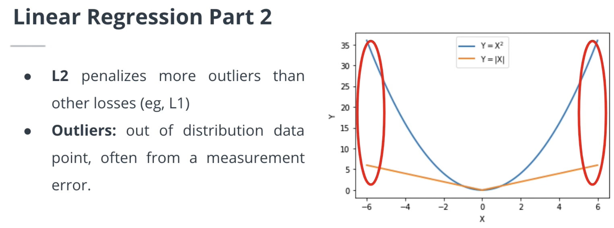

We have picked an algorithm, linear regression, and the loss function, the L2 loss. How do we use this loss to calculate the optimal weights of our models? Well, we cannot try all possible combinations of weights to find the best ones. However, we will learn about a process called gradient descent, which is used to find the optimal weights.

---

The **Mean Squared Error (MSE)** loss or **L2** loss is the one of the most common function used with linear regression algorithm. It is calculated by summing the square difference of the ground truths and the predictions. Because of the nature of the square function, this loss is very sensitive to **outliers** (out of distributions data points). If your dataset contains many outliers, the **L1** loss (absolute difference between ground truth and predictions) may be a better candidate.


# Logistic Regression

Youtube Video: [Link](https://www.youtube.com/watch?v=R8XfDeMo2Yk)

### **Summary: Introduction to Logistic Regression**

**Overview**
This section transitions from regression (predicting continuous quantities) to classification (predicting distinct classes, like types of traffic signs). It introduces **Logistic Regression**, an algorithm used to predict the probability that a given input belongs to a specific class.

**Key Concepts Covered:**

* **The Probability Problem:** * The goal is to estimate the probability of a class ($y$) given an input ($x$).
* If we simply use a standard linear equation (like $y = mx + b$), the output can be any number. However, probabilities *must* be strictly between $0$ and $1$.


* **The Sigmoid (Logistic) Function:**
* To fix the linear model's output range, we transform it using the **logistic function** (also called **sigmoid**).
* The sigmoid function maps any input value $x$ to a value precisely between $0$ and $1$, making it perfect for modeling probabilities.
* *New Term:* This type of function—which transforms the output of a linear operation—is called an **activation function**.
* *Use Case:* Sigmoid is primarily used for **binary classification** (two classes).


* **The Softmax Function:**
* For **multiclass classification** (like identifying many different traffic signs), we need something more advanced than sigmoid. We use the **softmax function**.
* Softmax generalizes the sigmoid function across multiple dimensions. It takes a vector of numbers and normalizes them into a discrete probability distribution.
* *How it works:* It applies an exponential function to each element in the vector, then divides each by the total sum of all the exponential values. This mathematically guarantees that all the output probabilities add up exactly to $1$.


---

### **Transcript**

We now have a good understanding of a regression problem where we're trying to predict the quantity. In a case of classification problems, we are trying to predict a class. For example, a type of traffic signs. More precisely, we're trying to predict the probability that an input belongs to a class.

For this task, we will consider a new algorithm called logistic regression. In logistic regression, we are predicting the probability that a given input belongs to a certain class. To keep things simple, we want to use a linear model to estimate the probability of a class $y$ given an input $x$. Meaning that the conditional probability of $y$ given $x$ is linear in $x$. You will recognize here the linear equation that we saw previously.

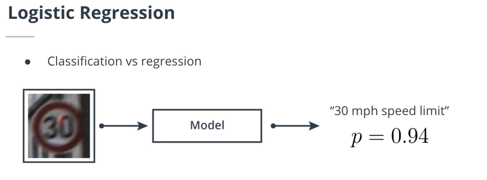

However, we have one issue with using a linear model. We cannot enforce the outputs of a linear model to be between zero and one, which is a default requirement if we are trying to model the probability.

To meet this requirement, we are going to transform the outputs of our linear model. In this slide, we are going to introduce the logistic function, also called sigmoid. The logistic function is defined as exponential of $x$ divided by $1$ plus exponential of $x$. The logistic function's domain is $[0, 1]$, meaning that regardless of the value of $x$, $\sigma(x)$ will fall between zero and one. This is a great property to use when we are trying to model a probability.

Now, we will compose these logistic function with the linear equation shown in the previous slide to create the logistic regression algorithm. Later in this lesson, we will use the term activation function to describe functions transforming the output of a linear operation.

The sigmoid function is used for binary classification, where $x$ is a vector of size one. However, we are mostly interested in multiclass classification problem, such as the traffic sign classification problem. In this case, we need to use the softmax function as our activation function. The softmax function is a generalization of the sigmoid function, but using multiple dimension.

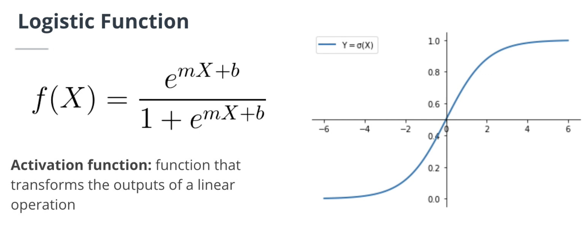

The softmax function normalizes a vector $x$ of $n$ components into a discrete probability distribution, meaning that the sum of the element of $x$ will add up to one. This is how the softmax function works. We start by applying the exponential function to each element of the vector $x$. Then we divide each element of $x$ by the sum of the element of $x$. By doing so, we ensure that the sum of the output vector is one.

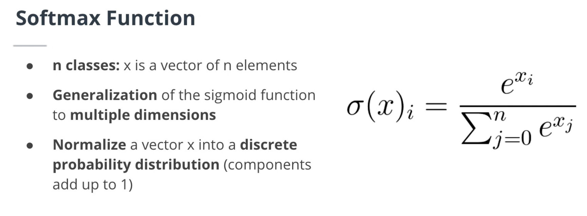

Now that we have a new activation function for the multiclass classification problem, we need a loss function.

---

For classification problems, we can also use a linear expression to model the probability `P(Y|X)` of an input belonging to a certain category. Such a model is called logistic regression and looks like this: `P(Y|X) = mx+b`. However, given that we want to model a probability, we need a way to constrain `mx+b` to the `[0, 1]` interval. To do so, we are going to use the logistic function (or sigmoid). The logistic function maps any real number to the `[0, 1]` interval.

The **softmax function** is the extension of the logistic function to multiple classes and takes a vector as input instead of a real number. The softmax function outputs a discrete probability distribution: a vector of similar dimensions to the input but with all its components summing up to 1. Later in this lesson, we will describe the sigmoid and softmax functions as **activation functions**.


## Cross-Entropy Loss and One-Hot Encoding

Youtube Video: [Link](https://www.youtube.com/watch?v=58CEKZFBZ9I)

Here is the summary of the lesson on Cross-Entropy Loss and One-Hot Encoding, followed by the formatted transcript with improved paragraph spacing.

### **Summary: Ground-Truth and One-Hot Encoding**

**Overview**
This section bridges the gap between the model's predictions and the actual data. Since the softmax function outputs a vector representing a probability distribution ($\hat{y}$), the actual ground-truth data ($y$) must also be formatted as a vector so the algorithm can calculate the cross-entropy loss. To achieve this, the lesson introduces **one-hot encoding**.

**Key Concepts Covered:**

* **Cross-Entropy Loss:** This loss function evaluates the discrete probability distribution ($\hat{y}$) produced by the softmax function against the actual ground-truth ($y$).
* **One-Hot Encoding:** A standard technique used to transform categorical labels (like the name of a traffic sign) into a mathematical vector that the loss function can process.
* **How One-Hot Encoding Works:**
* **Size:** It maps each class in the dataset to a vector where the total length equals the number of possible classes.
* **Values:** The vector consists entirely of `0`s, except for a single `1`.
* **Example:** If a dataset has 6 total classes, and the "traffic light" class is assigned the integer index of 4, its one-hot encoded vector would be `[0, 0, 0, 0, 1, 0]`.


* **Looking Ahead:** With the multi-class algorithm (softmax), the loss function (cross-entropy), and the ground-truth encoding (one-hot) all defined, the next step is to learn how to actually train the algorithm to fit the observations.

---

### **Transcript**

The cross-entropy loss is used on the vector $\hat{y}$ after it has been normalized by the softmax function. In this equation, $\hat{y}$ is thus a discrete probability distribution.

There is something we haven't addressed though. What is $y$, the ground-truth, in the case of multi-class classification? According to this equation, the ground-truth must be a vector. Let's solve this mystery in the next slide.

To represent the ground-truth $y$ as a vector, we are going to use a method called one-hot encoding. With one-hot encoding, we are creating a mapping of each class in our dataset to a vector of size equal to the number of classes. One-hot encoded vectors are made of zero, except for a single element equal to one.

Let's simplify the traffic sign dataset by assuming that we only have six classes. First, we assign an integer $i$ to its class in the dataset. For example, the traffic lights sign will get assigned four. Then we create a vector of zeros of dimension one by six. Finally, we set the $i$-th element of this vector to one.

Keep in mind that one-hot encoding is not the only approach to encode classes in multi-class classification.

We have now defined an algorithm for multi-class classification, as well as a loss function and a way to encode the ground-truth. Now, how do we teach our algorithm to fit the observations?

---

*Error: the subscript `j` in the cross entropy loss formula should be replaced by `i`.*

> [!WaRNING] 
> In the video, the one-hot encoded vector is 1-indexed, which is different from numpy 0-index approach.

The **Cross Entropy (CE)** loss is the most common loss for classification problems. The total loss is equal to the sum over all the observations of the dot product of the ground truth one-hot encoded vector and the log of the softmax probability vector.

For multiple classes classification problems, the ground truth labels need to be encoded as vectors to calculate. A common approach is the **one-hot encoding** method, where each label of the dataset is assigned an integer. This integer is used as the index of the only non zero element of the one-hot vector.

**Summary**: for classification problems, the labels need to be encoded to a vector of dimension `C`, where `C` is the number of classes in the dataset. Thanks to the softmax function, the model outputs a discrete probability distribution vector, also of dimension C. To calculate the cross entropy loss between the input and the output, we calculate the dot product of the one hot vector and the log of the output.


# Introduction to Tensorflow

### **Summary: Introduction to TensorFlow and Tensors**

**Overview**
Taking a brief pause from machine learning theory, this section introduces the core component of TensorFlow: the **tensor**. It focuses on the similarities and key differences between TensorFlow's tensors and standard NumPy arrays.

**Key Concepts Covered:**

* **What is a Tensor?** A tensor is the fundamental data structure in TensorFlow. It operates very much like a multi-dimensional array.
* **Tensors vs. NumPy Arrays:**
* **Similarities:** Tensors share many attributes and behaviors with NumPy arrays, including `shape`, the ability to perform element-wise mathematical operations (like multiplication), and identical broadcasting rules.
* **Conversion:** You can easily move data back and forth between the two formats. Use `tf.convert_to_tensor()` to turn a NumPy array into a tensor, and the `.numpy()` method to convert a tensor back into a standard array.


* **Hardware Management (The Tensor Advantage):**
* Unlike NumPy arrays, tensors are "hardware-aware."
* You can check exactly where your data is stored (e.g., CPU or GPU) by checking the `tensor.device` attribute.
* You can actively move tensors between hardware devices to optimize computation using methods like `tensor.cpu()` or `tensor.gpu()`.


---

### **Transcript**

Let's take a break from the theory of machine learning and learn some new TensorFlow features. TensorFlow uses a special type of arrays called tensor. As you will see, tensors have a lot of common with NumPy arrays.

Let's start by defining the following 2D NumPy array. We can convert it to a tensor using the TensorFlow function, `convert_to_tensor`. We can also convert any tensor back to a NumPy array by using the `tensor.numpy` method.

Tensors share a lot of similar attributes with NumPy arrays such as shape. Moreover, the same operations, such as element-wise multiplication, are also possible on tensors. Similar broadcasting rules on NumPy array also apply to TensorFlow tensors.

Tensors, however, have additional methods that are not available to NumPy arrays. For example, the `tensor.device` attribute will output the device on which the tensor has been loaded, such as CPU or GPU. Similarly, we can call `tensor.cpu` or `tensor.gpu` to move the tensor from one device to another.

# Exercise 1 - Logistic regression

**Objective**

In this exercise, you have to implement 4 different functions:

* `softmax`: compute the softmax of a vector. This function takes as input a tensor and outputs a discrete probability distribution.
* c`ross_entropy`: calculate the cross entropy loss given a vector of predictions (after softmax) and a vector of ground truth (one-hot vector).
* `model`: takes a batch of images (stack of images along the first dimensions) and feeds it through the logistic regression model
* `accuracy`: given a vector of predictions and a vector of ground truth, calculates the accuracy.

As always, you can run `python logistic.py` to check your implementation.

> [!TIP]
> You can leverage the `tf.boolean_mask` function to calculate the cross entropy. Keep in mind that most elements of the ground truth vector are zeros.

## Solution: Logistic Regression

```python
import tensorflow as tf

from utils import check_softmax, check_acc, check_model, check_ce


def softmax(logits):
    """
    softmax implementation
    args:
    - logits [tensor]: 1xN logits tensor
    returns:
    - soft_logits [tensor]: softmax of logits
    """
    exp = tf.exp(logits)
    denom = tf.math.reduce_sum(exp, 1, keepdims=True)
    return exp / denom


def cross_entropy(scaled_logits, one_hot):
    """
    Cross entropy loss implementation
    args:
    - scaled_logits [tensor]: NxC tensor where N batch size / C number of classes
    - one_hot [tensor]: one hot tensor
    returns:
    - loss [tensor]: cross entropy 
    """
    masked_logits = tf.boolean_mask(scaled_logits, one_hot) 
    return -tf.math.log(masked_logits)


def model(X, W, b):
    """
    logistic regression model
    args:
    - X [tensor]: input HxWx3
    - W [tensor]: weights
    - b [tensor]: bias
    returns:
    - output [tensor]
    """
    flatten_X = tf.reshape(X, (-1, W.shape[0]))
    return softmax(tf.matmul(flatten_X, W) + b)


def accuracy(y_hat, Y):
    """
    calculate accuracy
    args:
    - y_hat [tensor]: NxC tensor of models predictions
    - y [tensor]: N tensor of ground truth classes
    returns:
    - acc [tensor]: accuracy
    """
    # calculate argmax
    argmax = tf.cast(tf.argmax(y_hat, axis=1), Y.dtype)

    # calculate acc
    acc = tf.math.reduce_sum(tf.cast(argmax == Y, tf.int32)) / Y.shape[0]
    return acc


if __name__ == '__main__':
    # checking the softmax implementation
    check_softmax(softmax)

    # checking the NLL implementation
    check_ce(cross_entropy)

    # check the model implementation
    check_model(model)

    # check the accuracy implementation
    check_acc(accuracy)
```


# Gradient Descent

Youtube Video: [Link](https://www.youtube.com/watch?v=cDJnbLyOpgo)

### **Summary: Gradient Descent**

**Overview**
This section introduces **Gradient Descent**, a fundamental iterative algorithm used to train machine learning models. Its primary job is to find the optimal combination of model weights by mathematically minimizing the loss function.

**Key Concepts Covered:**

* **The Optimization Problem:** * The goal is to find the minimum of the loss function.
* While calculus allows us to find this by calculating where the derivative equals zero (an analytical solution), this is often impossible for complex machine learning models. Therefore, an iterative approach is required.


* **Global vs. Local Minima:**
* **Global Minimum:** The absolute lowest possible value of a function $f(x)$. This is the optimal solution we want to find.
* **Local Minima:** Points that are the lowest in their immediate surrounding area, but not the lowest overall.
* Complex loss functions have many local minima. A major challenge in optimization is designing the algorithm so it doesn't get "stuck" in a sub-optimal local minimum.


* **How Gradient Descent Works:**
* It is an iterative process that updates the model's weights step-by-step.
* In each iteration, it calculates the gradient (the slope) of the loss function and takes a step in the *opposite* direction of that gradient (heading "downhill").


* **The Learning Rate:**
* This is a crucial parameter that scales the size of the steps the algorithm takes.
* A higher learning rate means larger steps, while a lower learning rate means smaller, more cautious steps.


---

### **Transcript**

At the beginning of this lesson, we learned that a machine learning model consists in the set of computation to map an input to an output. This output is then fed to a loss function that quantifies the model performances. We need to find the optimal combination of weights such that this loss is minimized.

Using calculus, we can find this minimum by calculating the value for which the derivative of this loss function is equal to zero. For example, the square function minimum is reached when $x$ equals zero. The absolute function minimum is also reached when $x$ equals zero. For some machine learning algorithm and losses such as linear regression and L2 loss, an analytical solution exist. However, most of the time, we cannot calculate the analytical solution of our minimization problem.

To find the weights combination that minimizes the loss, we need to use an iterative algorithm called gradient descent. Since the analytical solution is not always available, we need a way to calculate a function minimum. Before we learn about the gradient descent algorithm, we need to differentiate between global and local minima. Let's look at these two functions for example. On the left, we have a square root function and on the right, a much more complex one.

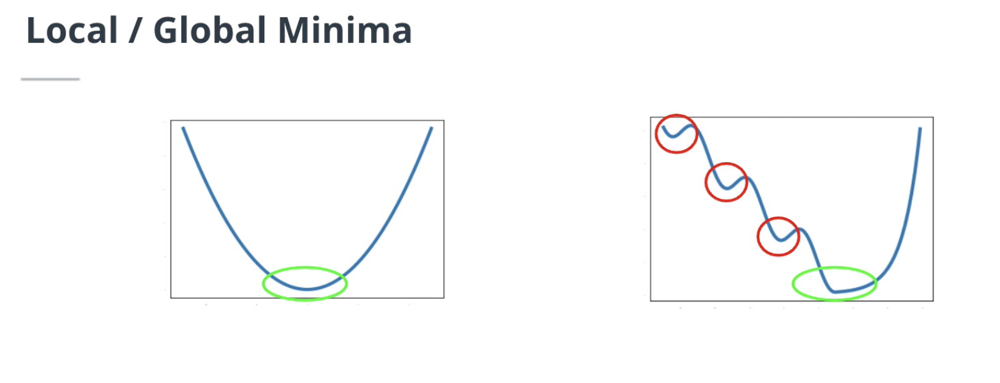

Both functions have a global minimum, meaning that there is a single value of $x$, such that $f(x)$ takes the lowest possible value. However, the right function also have what we call local minima. This local minima are values of $x$ where the function takes the lowest value in the surrounding subspace of $x$. Why does it matter to us? Well, for two reasons, the loss function we will be dealing with in this course tend to have a lot of local minima. However, we are not interested in a sub-optimal solution. We want to find the lowest possible value of $f(x)$. We need to design our optimization algorithm such that it ignores these local minima.

Let's see our first version of this algorithm in the next slide. To find the global minimum of such function, we'll use an algorithm called gradient descent. Gradient descent is an iterative algorithm that consist in updating weights using the gradients value. In each iteration, we take a step in the opposite direction of the gradient.

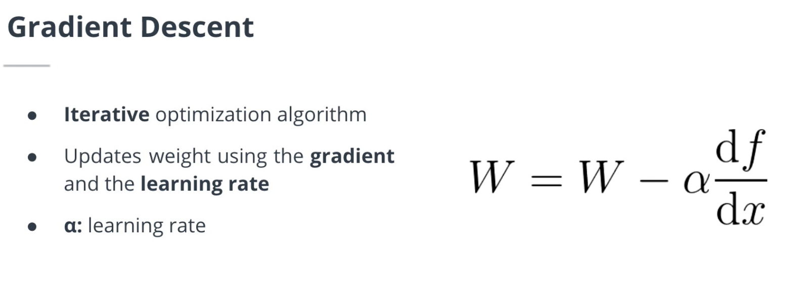

These steps are scaled by a parameter called the learning rate. The higher the learning rate, the larger the steps we take. This is how the vanilla version of the gradient descent algorithm work. We subtract to the model weights, the gradients scaled by the learning rate. In later videos, we will learn how we can improve this algorithm to overcome the local minima problem we mentioned in the previous slide. Moreover, we will also learn about the critical role the learning rate is playing.


---

Fitting or training a ML algorithm consists of finding the combination of weights that **minimizes the loss function**. In some cases, it is possible to find an analytical solution (for example, [linear regression with L2 loss](https://towardsdatascience.com/analytical-solution-of-linear-regression-a0e870b038d5)). However, for most of the algorithms tackled in this course, the analytical solution to the loss minimization problem does not exist.

The **gradient descent** algorithm is an iterative approach to find the minimum of the loss function. This algorithm takes a step towards this minimum using the gradient of the loss function scaled by a float called the **learning rate**.

One of the challenges when using the gradient descent algorithm is the existence of **local minima**. Local minima are minima in a local subset of the loss function domain. They are the smallest value this function can take, only in this small subset, as opposed to the **global minimum** where the loss function takes the smallest value of its entire domain. The gradient descent algorithm can get stuck in local minima and outputs suboptimal solutions. Later in this lesson, we will see how other approaches solve this problem.


# Stochastic Gradient Descent

Youtube Video: [Link](https://www.youtube.com/watch?v=BAfnbGCa13Y)

### **Summary: Stochastic Gradient Descent (SGD)**

**Overview**
This section addresses a practical limitation of standard Gradient Descent: hardware constraints. Because calculating the loss for an entire dataset at once takes too much memory, we need a more efficient way to update our model's weights. This leads to the introduction of **Batch** and **Stochastic Gradient Descent**.

**Key Concepts Covered:**

* **The Hardware Problem:** Ideally, standard gradient descent computes the derivative of the loss function for *every single observation* in the training set before making a single weight update. For large datasets, this requires too much computational power.
* **The Solution (Mini-Batches):** Instead of using the whole dataset, we divide the data into smaller "batches" (e.g., 32 or 64 observations). The algorithm calculates the average loss for just that batch and updates the weights.
* **The Importance of Shuffling:** When using batches, it is absolutely critical to shuffle your data before training. If the data is ordered by class (e.g., all "stop signs" first, then all "speed limit signs"), the algorithm will receive skewed batches and update the weights incorrectly.
* **Terminology Clarification:** * Technically, **Stochastic Gradient Descent (SGD)** refers to updating weights using a batch size of exactly *one* observation.
* However, in the industry, machine learning engineers commonly use the term "Stochastic Gradient Descent" to describe *any* batch-based gradient descent (mini-batch gradient descent), regardless of the batch size.


* **TensorFlow Implementation:** In frameworks like TensorFlow, methods used to update weights (like SGD) are referred to as **optimizers**.

---

### **Transcript**

In the previous videos, we learned about gradient descent. Ideally, we would like to compute the derivative of the loss function for every single observation in the training set before updating the weights of our algorithm. However, we are often constrained by hardware limitations.

Instead, we will use batches of observations. For example, we will calculate the average loss for a set of 32 or 64 observations and use it to update the weights using gradient descent. This is what we call batch gradient descent. This method overcomes the hardware limitations, but it can be dangerous if the right data loading methods are not being used.

For example, it is critical to shuffle the observations instead of having them ordered by class before using batch gradient descent. Machine learning engineers refer to batch gradient descent as stochastic gradient descent, which is technically gradient descent for a batch size of one. However, the term stochastic gradient descent is now used to describe batch gradient descent for any batch size.

In deep learning frameworks such as TensorFlow, stochastic gradient descent is called an optimizer. In the following slides, we will learn about other optimizers.


---

Because of memory limitations, the entire dataset is almost never loaded at once and fed through the model, as is the case in **batch gradient descent**. Instead, batches of inputs are created. Gradient descent performed on batches of just one input at a time is called **stochastic gradient descent (SGD)**, while batches of more than one, but not all at once (e.g. 20 batches of 200 images each), are called **mini-batch** gradient descent.


# Exercise 2 - Custom training loop

**Objective**

In this exercise, you have to implement your first training and validation loops from scratch to train the logistic model you implemented. To do so, you will also have to create an optimizer.

**Details**

A training loop goes through element of the training dataset and uses it to update the model's weights. A validation loop goes through each element of the validation dataset and uses it to calculate the metrics (eg, accuracy). We call epoch an iteration of one training loop and one validation loop.

The input to your model should be normalized. You can do this by dividing them by 255: `X /= 255`.

You can run `python training.py` to train your first machine learning model!

You will need to specify the `--imdir`, e.g. `--imdir GTSRB/Final_Training/Images/`, using the provided GTSRB dataset.

> [!TIP] You don't need `tf.GradientTape` for the validation loop as you will not be updating gradients.
> The `assign_sub` Variable method will be useful to perform the weights update in the sgd optimizer.
> Use the `tf.one_hot` function to get the one vector from the ground truth label.

# Solution: Stochastic Gradient Descent

```python
import argparse
import logging

import tensorflow as tf

from dataset import get_datasets
from logistic import softmax, cross_entropy, accuracy
    
    
def sgd(params, grads, lr, bs):
    """
    stochastic gradient descent implementation
    args:
    - params [list[tensor]]: model params
    - grad [list[tensor]]: param gradient
    - lr [float]: learning rate
    - bs [int]: batch_size
    """
    for param, grad in zip(params, grads):
        param.assign_sub(lr * grad / bs)


def training_loop(lr):
    """
    training loop
    args:
    - lr [float]: learning rate
    returns:
    - mean_acc [tensor]: training accuracy
    - mean_loss [tensor]: training loss
    """
    accuracies = []
    losses = []
    for X, Y in train_dataset:
        with tf.GradientTape() as tape:
            # forward pass
            X = X / 255.0
            y_hat = model(X)
            # calculate loss
            one_hot = tf.one_hot(Y, 43)
            loss = cross_entropy(y_hat, one_hot)
            losses.append(tf.math.reduce_mean(loss))

            grads = tape.gradient(loss, [W, b])
            sgd([W, b], grads, lr, X.shape[0]) 

            acc = accuracy(y_hat, Y)
            accuracies.append(acc)
    mean_acc = tf.math.reduce_mean(tf.concat(accuracies, axis=0))
    mean_loss = tf.math.reduce_mean(losses)
    return mean_loss, mean_acc

def model(X):
    """
    logistic regression model
    """
    flatten_X = tf.reshape(X, (-1, W.shape[0]))
    return softmax(tf.matmul(flatten_X, W) + b)

    
def validation_loop():
    """
    loop through the validation dataset
    """
    accuracies = []
    for X, Y in val_dataset:
        X = X / 255.0
        y_hat = model(X)
        acc = accuracy(y_hat, Y)
        accuracies.append(acc)
    mean_acc = tf.math.reduce_mean(tf.concat(accuracies, axis=0))
    return mean_acc


def get_module_logger(mod_name):
    logger = logging.getLogger(mod_name)
    handler = logging.StreamHandler()
    formatter = logging.Formatter('%(asctime)s %(levelname)-8s %(message)s')
    handler.setFormatter(formatter)
    logger.addHandler(handler)
    logger.setLevel(logging.DEBUG)
    return logger


if __name__  == '__main__':
    logger = get_module_logger(__name__)
    parser = argparse.ArgumentParser(description='Download and process tf files')
    parser.add_argument('--imdir', required=True, type=str,
                        help='data directory')
    parser.add_argument('--epochs', default=10, type=int,
                        help='Number of epochs')
    args = parser.parse_args()    

    logger.info(f'Training for {args.epochs} epochs using {args.imdir} data')
    # get the datasets
    train_dataset, val_dataset = get_datasets(args.imdir)

    # set the variables
    num_inputs = 1024*3
    num_outputs = 43
    W = tf.Variable(tf.random.normal(shape=(num_inputs, num_outputs),
                                    mean=0, stddev=0.01))
    b = tf.Variable(tf.zeros(num_outputs))
    
    lr = 0.1
    # training! 
    for epoch in range(args.epochs):
        logger.info(f'Epoch {epoch}')
        loss, acc = training_loop(lr)
        logger.info(f'Mean training loss: {loss:1f}, mean training accuracy {acc:1f}')
        val_acc = validation_loop()
        logger.info(f'Mean validation accuracy {val_acc:1f}')
```


# Other Optimizers

Youtube Video: [Link](https://www.youtube.com/watch?v=cQWnRwnlhz8)

### **Summary: Advanced Optimizers and Momentum**

**Overview**
This section builds upon Stochastic Gradient Descent (SGD) by introducing enhancements designed to solve one of its biggest vulnerabilities: getting trapped in local minima. The primary focus is on **SGD with Momentum**, alongside a brief introduction to other popular optimization algorithms.

**Key Concepts Covered:**

* **The Local Minima Problem:** * Neural network loss functions are highly complex and filled with "valleys" that are not the true bottom.
* Standard SGD calculates its steps based strictly on the current gradient. If it reaches a small dip (a local minimum) where the gradient flatlines to zero, it stops updating—leaving you with a sub-optimal model.


* **SGD with Momentum:**
* **The Concept:** Inspired by physics, this method treats the optimizer like a ball rolling down a hill. By adding a "velocity" term, the optimizer builds momentum. If it hits a small upward slope (a local minimum), its built-up momentum carries it over the ridge so it can continue searching for the global minimum.
* **How It Works mathematically:** Instead of just using the current batch's gradient, the weight update also factors in the *previous* gradients.
* **The Equation:** The new velocity is calculated as the previous velocity (scaled by a friction/momentum factor, $\mu$) minus the learning rate multiplied by the current gradient. The model's weights are then updated by adding this new velocity.


* **Other Popular Optimizers:**
* While SGD with Momentum is an industry standard, other advanced optimizers are widely used to handle complex loss landscapes.
* Examples mentioned include **Adam**, **RMSprop**, **Nesterov momentum**, and **Lookahead**.
* These advanced methods often incorporate secondary variables (like second-order derivatives of the loss) or adaptive scaling factors to fine-tune the learning process dynamically.


---

### **Formatted Transcript**

We learned about stochastic gradient descent or SGD, but other optimizers exist.

The first one we need to mention is an improvement over SGD. For neural networks, especially, the loss function tends to have many local minima. As we can see on this animation, it is possible that the optimizer gets stuck in a local minimum, giving us a sub-optimal solution to our loss minimization problem. For example, SGD could get stuck in this first local minimum here.

The momentum addition to SGD helps to overcome this problem. This method draws its inspiration from physics. We are adding a velocity term to the SGD, updating the weights using not only the gradient of the current batch but also the previously calculated gradient.

The velocity term is defined as the previously calculated velocity scaled by a factor $\mu$, minus the learning rate times the gradient. The weights are then updated by adding the velocity. As we can see in this animation, adding the momentum helps our optimizer overcome local minima.

Momentum is a very popular method and almost always added to the SGD optimizer. Despite its simplicity, SGD with momentum is still one of the most popular optimizers, but it is worth noting that other very popular methods exist, such as the Adam optimizer, the RMSprop optimizer, the Nesterov momentum, and the lookahead optimizer.

Some of these methods use a secondary variable of the loss to perform updates and add additional scaling factors. We're referencing the different papers below if you want to learn more about these optimizers.

---

One way to overcome the local minima issue is to add a momentum term. This approach is taking its inspiration from physics: the optimizer should gain velocity when taking multiple consecutive steps in the same direction. This velocity will help the optimizer to overcome local minima.

You can read more about momentum in the [original paper](https://citeseerx.ist.psu.edu/viewdoc/download?doi=10.1.1.57.5612&rep=rep1&type=pdf).

This paper provides a nice overview of the most common optimizers used in deep learning: [An overview of gradient descent optimization algorithms](https://arxiv.org/pdf/1609.04747.pdf).


## Learning Rates and Annealing

Youtube Video: [Link](https://www.youtube.com/watch?v=XOKv8i-cQuE)

### **Summary: Learning Rates and Annealing**

**Overview**
This section focuses on the single most critical setting in Stochastic Gradient Descent (SGD): the **learning rate**. It explains how to choose the right learning rate, the difference between parameters and hyperparameters, and how to dynamically adjust the learning rate during training using a technique called annealing.

**Key Concepts Covered:**

* **The Impact of the Learning Rate:**
* **Too Low:** The model takes tiny steps, requiring excessive time and computational power to reach the global optimum.
* **Too High:** The model takes steps that are too large, overshooting the minimum. This can cause the loss to stall or even increase (divergent behavior).
* **Optimal:** The model efficiently and accurately converges to the global minimum.


* **Hyperparameters vs. Parameters:**
* **Hyperparameters:** Settings configured *before* training begins, like the learning rate. Finding the best combination of these settings is called a "hyperparameter search."
* **Parameters:** The internal weights the model actively learns and updates *during* training.


* **Learning Rate Annealing:**
* Instead of keeping the learning rate fixed, it is highly effective to decrease it over time. A high initial rate helps the model learn quickly, while a lower rate later on allows it to make fine-tuned updates to settle perfectly into the global optimum.
* **Common Annealing Methods:**
* **Stepwise Annealing:** Dropping the learning rate by a specific mathematical factor at fixed intervals (e.g., dividing it in half every 500 steps).
* **Cosine & Exponential Annealing:** Gradually decaying the learning rate following smooth mathematical curves (cosine or exponential functions) rather than hard steps.


---

### **Transcript**

The SGD optimizer is so popular partially because it comes with a single parameter: the learning rate. However, picking the correct learning rate is critical to the success of SGD, as we will see in this slide.

If the learning rate is too low, the SGD algorithm will require too many steps to reach the global optimum. We may end up with the best possible solution, but at the cost of many extra hours of training. When the learning rate is too high, the optimizer may not even reach the global optimum and lead to divergent behavior. We will see either an increasing or non-decreasing training loss. However, when the learning rate is at the correct value, the model will quickly converge to its global optimum.

As a side note, we use the term hyperparameter to differentiate scalers like the learning rate from the models' parameters. When experimenting with machine learning models, we often try different values of these hyperparameters to get the best possible results. To do so, we perform what we call a hyperparameter search, which you will have to do in the final project of this course.

When training machine learning models, we can use a fixed learning rate. However, it is pretty common to decrease the learning rate over time. We can think of it this way. At the beginning of training, we can use a high learning rate to have the model converge faster. However, after some time, we will need a smaller learning rate to perform final updates and find the global optimum.

Reducing the learning rate during training is called annealing, and several methods are popular. Stepwise annealing, for example, decreases the learning rate by a constant factor every $n$ steps. For example, we can decide to divide the learning rate by two every 500 steps. Cosine annealing and exponential annealing, are also two very popular ways to decrease the learning rate.

In the next videos, we will see how to use gradient descent to train neural networks.

---

As you will realize in the final project, the learning rate plays a critical role in the success of gradient descent approaches. A very popular approach to improve the performances of gradient descent methods is learning rate annealing which consists of decreasing the learning rate during training. Different strategies exist, such as stepwise annealing, cosine annealing or exponential annealing. The term learning scheduler is also used.


# Neural Networks

Youtube Video: [Link](https://www.youtube.com/watch?v=DQx3WJewb58)

### **Summary: Introduction to Neural Networks**

**Overview**
This section marks the major transition from simpler algorithms like Logistic Regression to **Neural Networks**. By adding multiple layers of computations and non-linear activation functions, neural networks can model highly complex datasets that traditional linear models cannot handle.

**Key Concepts Covered:**

* **Limitations of Logistic Regression:** * Logistic regression assumes that the probability of an input belonging to a class is strictly linear.
* It also has a limited number of parameters, making it insufficient for complex, real-world signals (like those encountered in self-driving car data).


* **Building a Neural Network:**
* To solve this, we move from a single set of weights to *multiple* sets of weights, which are organized into **layers**.
* **Hidden Layers:** Any layer that sits between the initial input and the final output is called a hidden layer.
* **Non-linearity:** After every linear layer, an activation function is applied to introduce non-linearity, drastically increasing the model's ability to understand complex patterns. The final layer still uses the Softmax activation for classification.
* *New Term:* A network built strictly of linear layers followed by activation functions is called a **Feed-Forward Neural Network**.


* **Inside the Layers (The Math):**
* Each layer consists of **neurons**. In a feed-forward network, every neuron connects to every neuron in the previous layer.
* A single neuron performs a linear operation (multiplying inputs by weights and adding a bias).
* **Matrix Operations:** Instead of calculating each neuron one by one, the entire layer's operations are computed simultaneously using matrices. For example, if layer 1 has 5 neurons and layer 2 has 5 neurons, the weights form a 5x5 matrix (*W*), multiplying the input vector (*x*) and adding a bias vector (*b*).


* **The Bias Trick:**
* To simplify the matrix math, engineers use the "bias trick." By appending a `1` to the input vector *x*, the bias parameter can be merged directly into the weight matrix *W*. This turns a two-part equation (weights + bias) into a single, cleaner matrix multiplication step.


---

### **Transcript**

Before we start studying neural networks, let's backtrack a little bit and review logistic regression. In logistic regression for multiple classes, we have an input such as a traffic sign that's being transformed by the set of weights and fed into an activation function like softmax.

What are the limitations of such an approach? Well, one of the main limitations of logistic regression is the linearity and the number of parameters. Logistic regression may be sufficient for a lot of machine learning problems, but some data sets require models with more parameters simply because of the complexity. Moreover, in logistic regression, we made the assumption that the probability of an input belonging to a certain class is linear, which is a pretty strong assumption.

Let's now consider this: Instead of a single set of weights, we will add multiples; we will call this set layers. After each layer, we will add an activation function to add some non-linearity and increase the ability of our algorithm to model complex signals. We will still use the softmax activation for the last activation.

Well, this is your first neural network. We created an algorithm made of several linear layers, followed by non-linear activations. By the way, any layer that is not the input or the output is called a hidden layer. A network made of linear layers and activation functions only is called a feed-forward neural network.

What is happening in these layers exactly? Where each layer is made of neurons. Neurons will simply perform a linear operation similar to a linear regression, for example. Because we are consuming feed-forward neural networks, each neuron in the layer is connected to each neuron in the previous layer.

Let's assume that the previous layer has five neurons, as shown here. What it means is that in our linear equation, *x* is a vector of five elements. The coefficient *w* or weights will also be a vector of five elements. The bias will be a vector of one element.

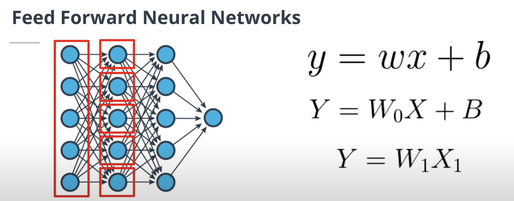

We can repeat this operation for each of the five neurons in the second layer. In total, we have 25 weights and five biases for this layer. Well, we could write this layer as a matrix operation, where *x* is the vector of outputs of the first layer, *b* is a vector of biases, and *W_0* is the matrix of weights. If you've followed me so far, both *x* and *b* are vectors of five elements. While *W_0* here is simply a matrix of dimension five-by-five, because we have five neurons in the first layer and five neurons in the second layer.

There's one more thing we should mention. We can use the bias trick to simplify this calculation. We can add one element to the vector *x* equal to one, and we can merge the bias parameter into the *W* matrix. Now, *x* is a vector of six elements and *W* is a five-by-six matrix.

You will find more examples of such calculations in the text below. In the following slide, we will learn about the different types of activation functions you can find in a neural network.

---

**Feed Forward neural networks (FFNN)** are an extension of the logistic regression algorithm. We can think of logistic regression as a FFNN with a single layer. FFNN are stacking multiple **hidden layers** (any layers that's not the input or output layer) followed by non linear activation, such as the sigmoid or softmax activations.

FFNN are only made of **fully connected layers**, where each neuron in one layer is connected to all the neurons in the previous layer.

Let's consider a neuron in a layer of a FFNN, containing `n` neurons. The previous layer has `m` neurons.

This neuron performs a linear operation `wX+b` using the outputs of the previous layer, meaning that `X` is a `mx1` vector. Instead of looping through each one of the n neurons, we can use a matrix multiplication to perform all the operations at once. The output of this layer will be obtained by calculating `WX+B` where `B` is the `nx1` vector of biases and `W` is the nxm matrix of weights.

To simplify even further, we can incorporate the bias vector `B` in the matrix `W` such that `W` is now of dimensions nx(m+1). We simply need to create a new input vector `X` of dimensions `(m+1)x1`, where `X[m+1]=1` to get the same result as above.

## Activation Functions

Youtube Video: [Link](https://www.youtube.com/watch?v=sfzZzsZN57A)

### **Summary: Activation Functions**

**Overview**
Activation functions act as the decision-makers for individual neurons in a neural network. They take the linear output of a neuron and determine whether that neuron should "fire" (activate) based on its relevance to the problem. To be effective in a deep learning model, an activation function must be **differentiable** (so the optimizer can update weights using gradient descent) and **non-linear** (otherwise, stacking multiple layers would just collapse into a single linear mathematical operation).

**Comparison of Key Activation Functions**

| Activation Function | Mathematical Definition | Key Advantages | Main Drawbacks |
| --- | --- | --- | --- |
| **Sigmoid** | $f(x) = \frac{e^x}{1 + e^x}$ | Bounded strictly between 0 and 1, preventing runaway values. Steep slope around zero allows for quick firing decisions. | **Saturation:** For very high or low input values, the gradient becomes almost zero. This stops the network from learning effectively (vanishing gradient). |
| **ReLU** (Rectified Linear Unit) | $f(x) = \max(0, x)$ | Computationally efficient. Does not saturate for positive values. Creates a sparse network by deactivating negative values. | **Dying ReLU:** Because the gradient is exactly zero for all negative inputs, neurons can become permanently deactivated and stop updating entirely. Unbounded for positive values. |
| **Leaky ReLU** | Similar to ReLU, but with a slight slope for $x < 0$ | Solves the "Dying ReLU" problem. By keeping a tiny gradient for negative numbers, neurons have a chance to reactivate later in training. | - |

---

### **Formatted Transcript**

Let's now talk about activation functions. Activation functions take the output of a neuron and decide whether this neuron is going to fire or not. If this neuron is calculating a feature that is relevant to our classification problem, it should fire; otherwise, it shouldn't. This firing or activation depends on the activation function that we use.

Because we will be using algorithms like gradient descent to update the weights of a neural network, we want our activation function to be differentiable. Finally, we want our activation function to be non-linear. Indeed, if we use a linear activation function, we are losing the purpose of stacking layers of neurons. We will just create a fully linear neural network which could be modeled by a single layer. Let's see some activation functions in the next slides.

When studying logistic regression, we already learned about one activation function, the Sigmoid. As a quick reminder, the Sigmoid is defined as exponential of $x$ divided by $1$ plus exponential of $x$. The Sigmoid bounds the outputs of a neuron to be between zero and one. This bounding property is great because it will limit the value an output of a neuron can take, therefore avoiding that the output of a neural network reaches really high values, which could create a problem for the optimizer.

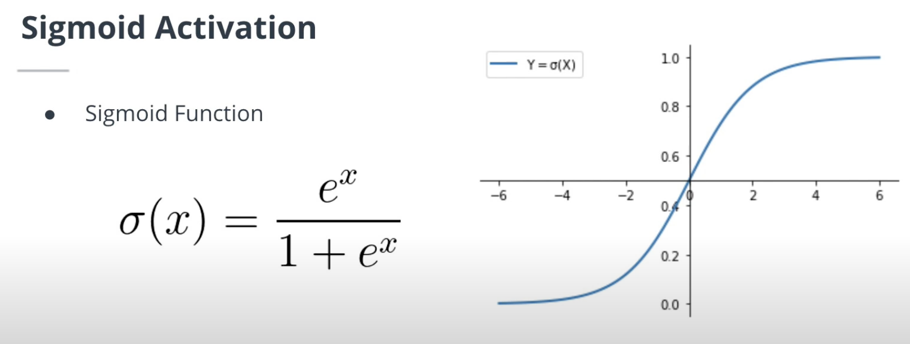

* Sigmoid Function

$$\sigma(x) = \frac{e^x}{1 + e^x}$$


This function has a steep slope between $x$ equal minus 2 and $x$ equal 2. Meaning that small changes of $x$ in this region will lead to significant changes in $y$. We would get high values for the gradient in this region, and it will help the algorithm to quickly decide if this neuron should fire or not.

One issue with the Sigmoid activation, however, is its behavior for low and high values of $x$. In these regions, the gradient of the Sigmoid will be very small. This could lead to issues when the gradient descent algorithm is used, as the updates of the model weights depend on the value of the gradient. We say that the Sigmoid saturates for higher and lower values of $x$. We're going to see another activation function in the next slide.

Let's now learn about another activation function, the rectified linear unit, or ReLU. The ReLU activation is defined as the maximum between zero and $x$. When $x$ is negative, this function will output zero, and when $x$ is positive, it will act as a linear function in $x$. This function is differentiable except in zero, and nonlinear, fitting the requirements of a good activation function.

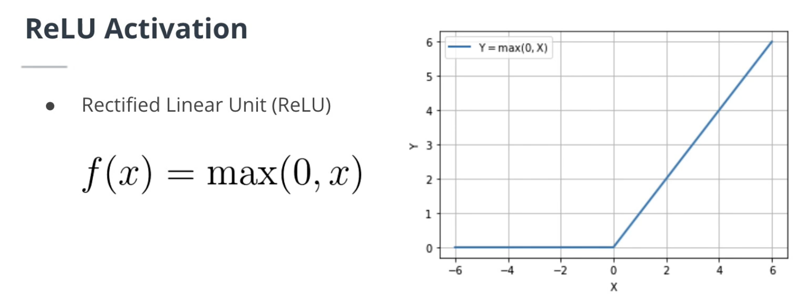

We say that ReLU is a sparse activation function, because it deactivates neurons outputting negative values. Because ReLU behaves like a linear activation when $x$ is positive, it does not have the saturation property of Sigmoid. However, this property makes ReLU unbounded, which could lead to very high values in our network.

The behavior of ReLU for negative values of $x$ is another issue, because it can lead to the dying ReLU problem. It is possible that the gradient of a ReLU unit becomes zero, which would permanently deactivate the neuron. Indeed, in this case, the gradient descent algorithm will not perform any updates and the neuron weights will not be updated anymore during training.

To avoid a dying ReLU problem, we can use the Leaky ReLU activation function. This activation function also behaves linearly for negative values of $x$, but the slope coefficient is usually very small. By doing so, we are not fully deactivating the neuron, and we are giving the neuron the opportunity to be reactivated later during training.

Other activation functions, such as the hyperbolic tangent, exist. In practice, however, the ReLU activation function is still one of the most popular.

Now that we have learned about the different components of a neural network, let's get a better understanding of the weight updating mechanism.

---

**Activation functions** play a critical role in neural networks because they add non-linearity to the system. The most common activation function is the **ReLU** activation function, but other activation functions like sigmoid or the hyperbolic tangent are also popular.


# Backpropagation

Youtube Video: [Link](https://www.youtube.com/watch?v=20Tuqg4ohKg)


### **Summary: Backpropagation and the Chain Rule**

**Overview**
This section introduces **backpropagation**, the core mechanism used to train multi-layer neural networks. Because deep networks have multiple hidden layers and non-linear activations, a simple gradient calculation isn't enough. The lesson starts by reviewing a fundamental calculus concept—the **chain rule**—which makes calculating these complex gradients possible.

**Key Concepts Covered:**

* **The Need for Backpropagation:** * In a simple, single-layer model (like logistic regression), updating weights with gradient descent is straightforward.
* In a neural network with many layers, we must calculate how much each individual weight in the network contributed to the final error.
* To do this, we compute the gradient of the loss function at the output layer and propagate it *backward* through the network to the very first layer.


* **The Chain Rule (Calculus Refresher):**
* The chain rule is used to find the derivative of a composite function (functions nested inside other functions).
* **The Formula:** If you have a composite function $f(g(x))$, its derivative is calculated as $f'(g(x)) \cdot g'(x)$.


* **Practical Application (Derivative of Sigmoid):**
* The video demonstrates the chain rule by calculating the derivative of the Sigmoid activation function, $\sigma(x)$.
* **Step 1:** Rewrite the standard Sigmoid function as $\sigma(x) = \frac{1}{1 + e^{-x}}$.
* **Step 2:** Break it into two composite functions:
* The outer function: $f(x) = \frac{1}{x}$ (a reciprocal function).
* The inner function: $g(x) = 1 + e^{-x}$.


* **Step 3:** Apply the chain rule by taking the derivatives of $f(x)$ and $g(x)$ and multiplying them together, yielding the final gradient equation used to update the model's weights during training.


---

### **Transcript**

Let's now dive a little deeper in the optimization problem created when trying to fit a model to a dataset. Remember that SGD and other optimizers use a derivative of the loss function to update the weights of the algorithm. Whereas logistic regression is made of a single layer of weights, neural networks are made of many layers with non-linear activation; we need to have a mechanism to update the weights of the neurons using the gradient of the loss.

Such a mechanism is called backpropagation. We are propagating the gradient from the last layer to the first one. But before we can learn about backpropagation, we need a small calculus reminder of the chain rule.

What is the chain rule? The chain rule is a way to calculate the derivative of a composite function. Let's consider two functions with the same domain, $g$ and $f$. The derivative of $f(g(x))$ is equal to the derivative of $f$, $f'$ composed with $g$, times the derivative of $g$, $g'$.

Let's use this chain rule to calculate the derivative of the sigmoid function. The sigmoid function can also be written as follows by dividing the numerator and the denominator by exponential of minus $x$. We can use this definition to calculate the derivative of $\sigma$ with respect to $x$.

To do so, we can express $\sigma$ as the composite of two functions, $f$ and $g$. We'll define $f$ as a reciprocal function and $g$ as $1 + e^{-x}$. Using the chain rule, we can calculate the derivative of the sigmoid.

Because we know that the derivative of the reciprocal function is $-1 / x^2$, the first part of the derivative is $-1 / (1 + e^{-x})^2$. We also know the derivative of an exponential function and we can calculate the derivative of $1 + e^{-x}$. Bringing everything over the same denominator, we now have the derivative of $\sigma$.

I hope this example helped you refresh your knowledge of the chain rule. Let's now dive in the backpropagation mechanism.


---

The chain rule allows you to decompose the calculation of the derivative of a composite function. Because we can think of an ANN as a giant composite function, the chain rule is at the core of the backpropagation algorithm. Backpropagation is the mechanism used to calculate the gradient of the loss with respect to each weight of the neural network.


## An Example Backpropagation Calculation

Youtube Video: [Link](https://www.youtube.com/watch?v=Ag2wsYMMHco)


### **Summary: An Example Backpropagation Calculation**

**Overview**
This section takes the theoretical concept of the chain rule and applies it to a concrete example. It demonstrates how to calculate the gradient of a loss function with respect to weights by visualizing the mathematics as a computational graph, or "circuit view."

**Key Concepts Covered:**

* **The Circuit View:** * To understand backpropagation, it helps to break down a complex formula (like the Sigmoid function) into a sequence of its most basic mathematical operations.
* *Example:* The Sigmoid function is broken down into four sequential steps (nodes): multiply by $-1$, apply the exponential function, add $1$, and apply the reciprocal function.


* **Step 1: The Forward Pass**
* Before we can go backward, we must go forward.
* You start with an initial input (e.g., $x_0 = 2$) and pass it through each operation in the circuit one by one until you reach the final output.


* **Step 2: The Backward Pass (Backpropagation)**
* Once the forward pass is complete, you reverse direction. Starting from the final output, you calculate the "local gradient" at each node.
* Using the chain rule, the local gradient is calculated by taking the derivative of the current node's function and multiplying it by the gradient passed backward from the previous node.
* *Walkthrough:* The lesson traces this math step-by-step backward through the reciprocal, addition, exponential, and multiplication operations.


* **Application to Neural Networks:**
* While this example breaks down a single activation function, the exact same logic applies to full neural networks. In a real network, each "node" in the circuit represents an entire layer of neurons. The calculated local gradients are ultimately what the optimizer (like SGD) uses to update the network's weights.


---

### **Transcript**

Now that we have reviewed the chain rule, we have all the tools to understand backpropagation. First, let's remember the initial problem. How do we calculate the gradient of the loss with respect to each neuron's weights? Well, we're going to use something called backpropagation.

Let's consider the sigmoid function once again as an example. We can express that function as a succession of the following operation. First, we multiply the input by minus one. Then we compose it with the exponential function. We add one to the output and compose everything with the reciprocal function. This circuit view is the way I learned backpropagation. I find it particularly useful to understand this mechanism.

Let's now consider an example. The input of our circuit $X_0$ has a value of two. First of all, we do a forward pass, meaning that we're going to calculate the output of each node of this circuit. We multiply the input by minus one, feed it in the exponential function, add one, and finally, compose it with the reciprocal function.

In a second time, we can backpropagate the gradients, meaning that we are going to calculate the local gradient of each node with respect to its input. Let's calculate together the first value of the local gradient. The derivative of the reciprocal function is minus one over $x$ square. The previous gradient value is equal to one. Therefore, the local gradient is equal to $-1 / 1.14^2 \cdot 1$, which is $-0.77$.

Let's move it to the next node. While the derivative of this function is one, so the local gradient is $1 \cdot -0.77$.

Let's keep moving on to the next node. The derivative of exponential $x$ is exponential $x$. Following the chain rule, the local gradient is exponential of minus $2$ times $-0.77$.

We can apply this logic one more time to the last node to compute its gradient.

Hopefully, this view gives you a good understanding of the backpropagation mechanism. In a neural network, each node would be a layer made of many neurons. But the main idea behind backpropagation remains the same. We can use these local gradients to update the weights using SGD or another optimizer.


---

The circuit approach is an intuitive way to understand the backpropagation algorithm. Using the chain rule, we can backprogate the gradient from the last node to the first.

For example, the input to the third node is -2 and this node applies the exponential function to its input. The output of this node is exp(-2) = 0.14. When backpropagating the gradient, we get a value of -0.77 before this node. Thanks to the chain rule, and because the derivative of the exponential function is the exponential function, we can backpropagate the gradient as follow: exp(-2) * (-0.77) = -0.10.