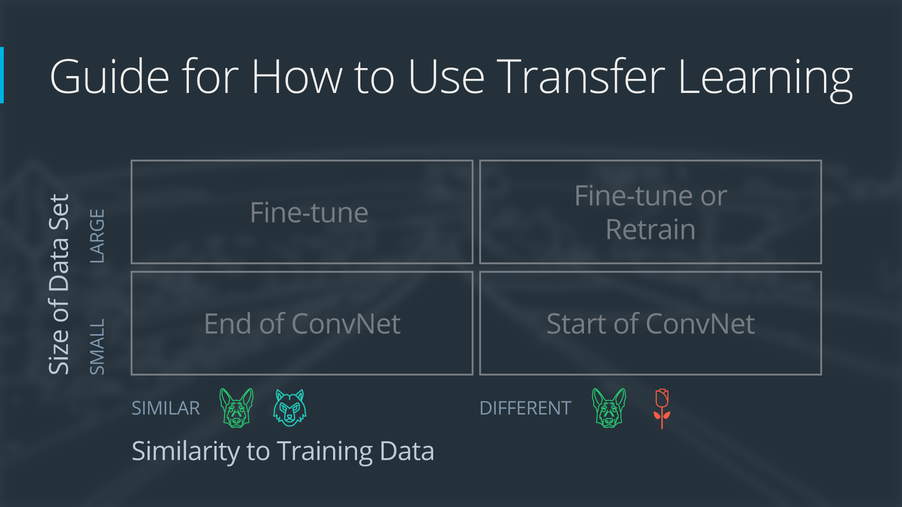
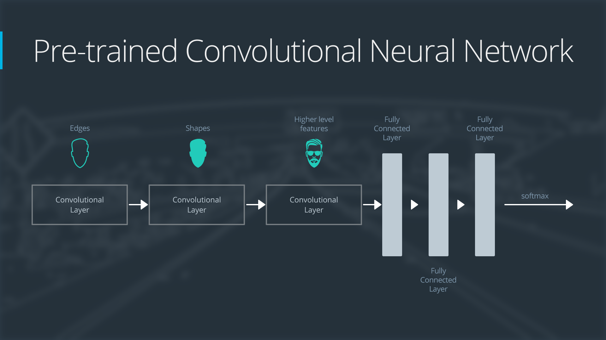
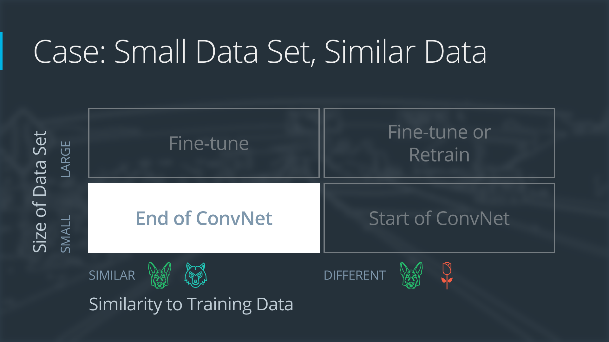
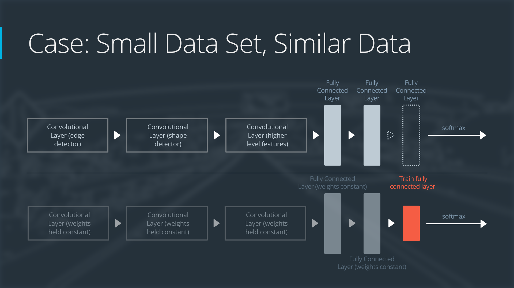
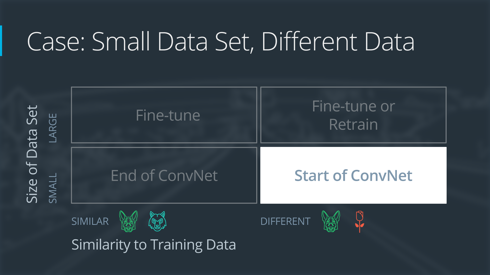
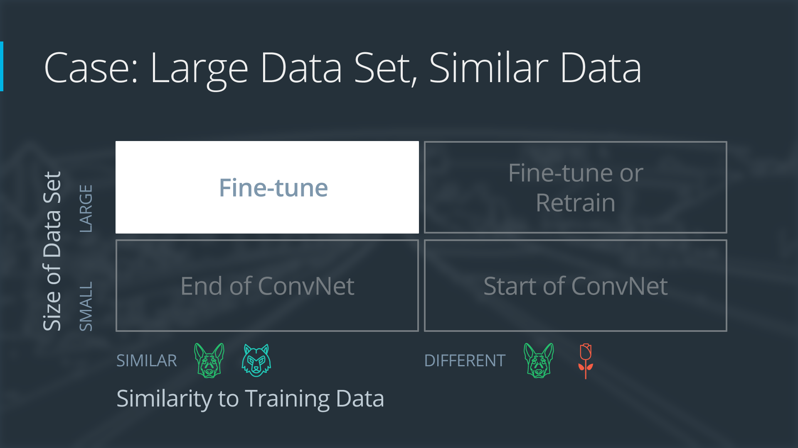
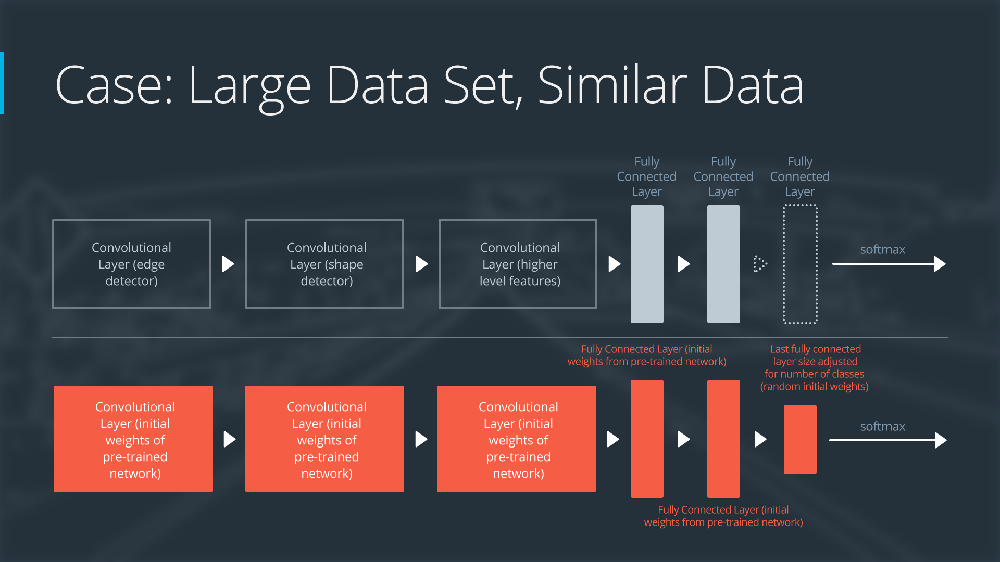
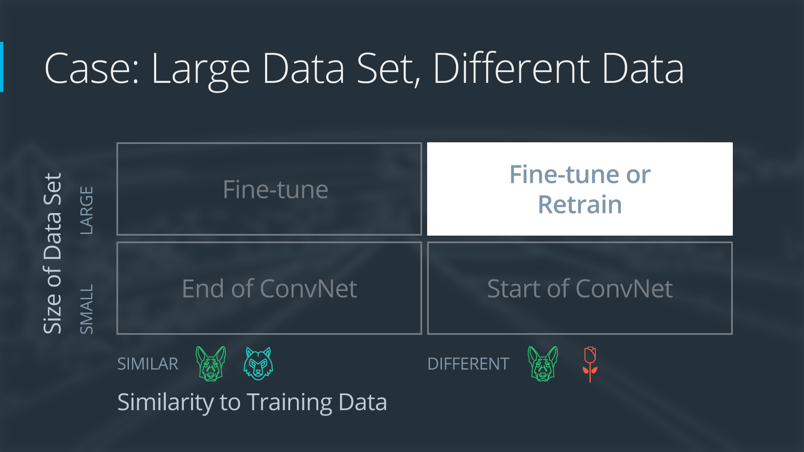

# IMAGE CLASSIFICATION WITH CNN

- [IMAGE CLASSIFICATION WITH CNN](#image-classification-with-cnn)
- [Intro to Image Classification with Neural Networks](#intro-to-image-classification-with-neural-networks)
    - [**Summary: Intro to Image Classification with Neural Networks**](#summary-intro-to-image-classification-with-neural-networks)
    - [**Transcript**](#transcript)
- [Limitations of Feedforward Neural Networks](#limitations-of-feedforward-neural-networks)
    - [**Summary: Limitations of Feedforward Neural Networks**](#summary-limitations-of-feedforward-neural-networks)
    - [**Transcript**](#transcript-1)
- [Introducing Convolutional Layers](#introducing-convolutional-layers)
    - [**Summary: Introducing Convolutional Layers**](#summary-introducing-convolutional-layers)
    - [**Transcript**](#transcript-2)
  - [The Convolution Operation](#the-convolution-operation)
- [Convnet Layers and Parameters](#convnet-layers-and-parameters)
    - [**Summary: Convnet Layers and Parameters**](#summary-convnet-layers-and-parameters)
    - [**Transcript**](#transcript-3)
- [Pooling Layers](#pooling-layers)
    - [**Summary: Pooling Layers**](#summary-pooling-layers)
    - [**Transcript**](#transcript-4)
- [Exercise 1 - Pooling](#exercise-1---pooling)
  - [Solution: Pooling Layers](#solution-pooling-layers)
- [Typical Convolutional Network Architecture](#typical-convolutional-network-architecture)
    - [**Summary: Typical Convolutional Network Architecture**](#summary-typical-convolutional-network-architecture)
    - [**Transcript**](#transcript-5)
- [Dropout and Batch Normalization](#dropout-and-batch-normalization)
  - [Dropout](#dropout)
    - [**Summary: Dropout Layer**](#summary-dropout-layer)
    - [**Transcript**](#transcript-6)
  - [Batch Normalization](#batch-normalization)
    - [**Summary: Batch Normalization**](#summary-batch-normalization)
    - [**Transcript**](#transcript-7)
- [AlexNet](#alexnet)
    - [**Summary: AlexNet Architecture**](#summary-alexnet-architecture)
    - [**Formatted Transcript**](#formatted-transcript)
  - [VGG](#vgg)
    - [**Summary: VGG Architecture**](#summary-vgg-architecture)
    - [**Formatted Transcript**](#formatted-transcript-1)
  - [ResNet](#resnet)
    - [**Summary: ResNet Architecture**](#summary-resnet-architecture)
    - [**Formatted Transcript**](#formatted-transcript-2)
- [Exercise 2 - CNN](#exercise-2---cnn)
  - [Solution: Build a Custom Architecture](#solution-build-a-custom-architecture)
- [Transfer Learning](#transfer-learning)
    - [**Summary: Transfer Learning and Fine-Tuning**](#summary-transfer-learning-and-fine-tuning)
    - [**Formatted Transcript**](#formatted-transcript-3)
  - [The Four Main Cases When Using Transfer Learning](#the-four-main-cases-when-using-transfer-learning)
  - [Demonstration Network](#demonstration-network)
  - [Case 1: Small Data Set, Similar Data](#case-1-small-data-set-similar-data)
  - [Case 2: Small Data Set, Different Data](#case-2-small-data-set-different-data)
  - [Case 3: Large Data Set, Similar Data](#case-3-large-data-set-similar-data)
  - [Case 4: Large Data Set, Different Data](#case-4-large-data-set-different-data)
  - [Extra Resources](#extra-resources)
- [Augmentations](#augmentations)
    - [**Summary: Data Augmentations**](#summary-data-augmentations)
    - [**Formatted Transcript**](#formatted-transcript-4)
  - [Albumentations](#albumentations)
- [Exercise 3 - Augmentations](#exercise-3---augmentations)
  - [Solution: Augmentations](#solution-augmentations)
- [Lesson Conclusion](#lesson-conclusion)
- [Glossary](#glossary)


# Intro to Image Classification with Neural Networks

Youtube Video: [Link](https://www.youtube.com/watch?v=pH0PMjPKifM)

### **Summary: Intro to Image Classification with Neural Networks**

**Overview**
This section kicks off a highly practical module focused on **Convolutional Neural Networks (CNNs or Convnets)**. It serves as a roadmap for the upcoming lessons, highlighting why CNNs are the absolute gold standard for computer vision tasks in autonomous driving.

**Key Concepts Covered:**

* **The Reign of CNNs:** * CNNs are specifically tailored for image data.
* Since their breakthrough in the 2012 ImageNet Competition (a massive challenge involving over one million images), CNN architectures have dominated the field.
* They are now the core engine behind everything from simple image classification to advanced semantic segmentation and object detection.


* **Module Roadmap (What's Next):**
1. **The Core Problem:** Exploring exactly why standard feed-forward networks (from the previous lessons) are not suited for complex image data.
2. **The Convolutional Layer:** Introducing the primary solution to that problem.
3. **Supporting Layers:** Learning about other essential building blocks found in modern architectures, such as pooling layers, dropout, and batch normalization.
4. **Building Custom Networks:** Organizing these layers to build a custom CNN from scratch to classify traffic signs.
5. **Studying the Greats:** Analyzing classic and highly successful modern architectures like **ResNet** and **VGG**.
6. **Data Augmentation:** Learning techniques to artificially expand and add variability to your training datasets.


---

### **Transcript**

Welcome for the next lesson of this course. In this lesson, we are going to concentrate on a special type of neural networks, convolutional neural networks. We're going to see why these networks are perfect for analyzing image data. Let's get started.

Convolutional neural networks or CNN or convnets are a type of neural network particularly suited for image data. I previously mentioned the ImageNet Competition, where a team of researchers tried to get the best possible performances on the classification datasets over one million images. Well, since 2012, this competition has been dominated by CNN architectures.

Convnets are now at the core of most deep learning algorithms for computer vision, from image classification to semantic segmentation or object detection. I cannot wait for you to unleash the power of convolutional neural networks. I use them every day and I'm still amazed by their performances.

This lesson is going to be organized as follows. First, we're going to see why the feed-forward neural network introduced previously are not suited to image data. We will introduce the convolution layer as a solution. We're going to spend a lot of time talking about this layer, and it is critical that you get a good understanding of its properties.

Convnets are not only made of conditional layers, but also other types of layer, such as pooling layers, dropout, or batch normalization, which are very common to find in modern architectures. We will then learn how to organize these layers to create custom convolutional neural network architectures to classify traffic signs.

We'll spend some time studying classic and modern convnet architectures, such as ResNet or VGG. Finally, we will spend the last part of the lesson learning about augmentations, a way to virtually increase the size and variability of your image datasets.

Convnets are very exciting addition to feed-forward neural networks, and I'm really excited for you to learn about them.


---

This lesson will focus on Convolutional Neural Networks, also known as CNNs or Convnets. CNNs are a special type of neural network particularly well suited to image data. Since 2012, [the ImageNet competition](http://www.image-net.org/) has always been won by CNN architectures.

In this lesson, we will tackle:

* Limitations of feed-forward networks
* The convolution layer (conv layer)
* Pooling layers, dropout and batch normalization (batchnorm)
* Build a custom architecture to classify traffic signs
* Modern architectures
* Augmentations

# Limitations of Feedforward Neural Networks


### **Summary: Limitations of Feedforward Neural Networks**

**Overview**
This section explains exactly why standard Feedforward Neural Networks (FNNs) fall short when processing image data, and introduces how Convolutional Neural Networks (CNNs) solve these fundamental scaling issues.

**Key Concepts Covered:**

* **The Problem with Feedforward Networks:**
* **Reshaping (Flattening):** FNNs require images to be flattened from a 3D array into a 1D vector.
* **Parameter Explosion (Fully Connected):** In an FNN, every neuron is connected to every single input value. If you flatten a small 64x64 RGB image, you get a vector of over 12,000 elements ($64 \times 64 \times 3$). Connecting just 10 neurons to this vector creates over 120,000 learnable weights.
* **Lack of Scalability:** Because of this "fully connected" architecture, FNNs scale terribly. Applying them to higher-resolution images or building deeper networks requires an impossible amount of computational power and memory.


* **The Convolutional Solution:**
* **Retaining Native Dimensions:** Instead of flattening the image, CNNs process the image in its natural 3D volume (Height $\times$ Width $\times$ Depth).
* **Local Connectivity:** Instead of every neuron connecting to every pixel, neurons in a CNN are only connected to a small, localized spatial region of the input image.
* **The Sliding Volume:** A convolutional layer consists of a volume of neurons that "slides" across the input image. This allows the network to extract visual features efficiently without the massive parameter overhead of an FNN.


---

### **Transcript**

Why do we need convolutional neural networks? In the previous lesson, didn't we successfully classify traffic sign using simple feedforward neural networks? Well, we did, but if you remember, we had to reshape the input image before feeding it into the network.

What actually happened after the reshape operation? Well, each element of the reshaped input image is connected to each neuron in the first layer of our network. If we consider a 64 by 64 RGB image and reshape it to one-dimensional vector, we created a vector of over 12,000 elements.

What happens next in a feedforward neural network? Well, each neuron in the first layer is connected to each component of this vector, which means that each neuron in this layer has over 12,000 weights. If our first layer has 10 neurons, then we just created a new network of over a 120,000 parameters. We can see how this is not going to scale well to higher resolution images and deeper network. Thankfully, the convolution operation is going to help us with that.

What did we learn from the previous slide? Well, we learned that the limitation of the feedforward neural networks are the necessity to reshape the inputs, as well as the fact that each neuron is connected to all neurons in the previous layer.

Instead of this approach, we're not going to reshape the image, but instead we'll consider it as an input volume of dimension height, by width, by depths. Neurons will only be connected to small spatial location of the input volume. We will say that they are locally connected.

What does it look like? Well, in a convolutional layer, our neurons will be organized as a volume and it will slide over the input volume. By doing this, we are solving our problem. Neuron in this volume, are only connected to a small spatial location of the input volume.

We will get a chance to do a deeper dive into convolutional layer in the next videos. But first, I wanted to give you a high level understanding of this layer.


---

> [!NOTE] 
> From 1:32-onward in the above video, the first bullet should say "No resizing is needed".

Flattening the image is required to use it as an input to a fully connected layer. In the previous lesson, we saw that a fully connected layer of `n` neurons following a layer of `m` neurons has `(m+1)xn` parameters.

If our network has a single layer of 10 neurons and if we are using images of resolution `64x64x3`, this layer will have 122880 weights and 10 biases. This is not going to scale well with more layers, more neurons and a higher image resolution. Thankfully, convolutional layers will help solve this problem!

Instead of flattening the image, we are now considering the image as an input volume. The convolutional layer, as opposed to the fully connected layer, will be **locally connected**. Indeed, each neuron in the convolutional layer will only be connected to small portion of the input volume.

# Introducing Convolutional Layers

Youtube Video: [Link](https://www.youtube.com/watch?v=L3yDNwv0du0)

### **Summary: Introducing Convolutional Layers**

**Overview**
This section dives into the mechanics of the **Convolutional Layer**, the foundational building block of a CNN. It explains how these layers use specialized 3D filters to scan across an image and extract visual features, drastically reducing the number of parameters compared to a standard feedforward network.

**Key Concepts Covered:**

* **Filters:**
* A convolutional layer is composed of **filters** (sometimes called kernels). A filter is a small 3D volume of learnable weights.
* **Dimensions:** The height and width of a filter are hyperparameters chosen by the engineer (common sizes are $3 \times 3$, $5 \times 5$, or $7 \times 7$). However, the **depth** of a filter is *always* strictly equal to the depth of the input volume it is scanning.
* *Example:* If the input is an RGB image (which has a depth of 3 color channels), a $7 \times 7$ filter will actually be $7 \times 7 \times 3$. This single filter contains $147$ learnable weights, plus one bias parameter.


* **Convolving (Sliding):**
* The filter "slides" (or convolves) across the spatial dimensions of the input volume.
* At each location it stops, it performs a mathematical operation to output a single value.


* **Activation Maps (Feature Maps):**
* Once a single filter has finished sliding across the entire input image, it produces a 2D grid of values known as an **activation map** or **feature map**.


* **The Output Volume:**
* A convolutional layer uses multiple filters, not just one. Every filter creates its own 2D feature map.
* These feature maps are then stacked on top of one another to create the final 3D **output volume** of that layer. Therefore, the depth of the output volume is exactly equal to the number of filters used.


* **Receptive Field:**
* Because neurons in a CNN are only connected to a small local area rather than the whole image, the specific spatial extent of a neuron's connectivity to the original input is called its **receptive field**.


---

### **Transcript**

What is exactly a convolutional layer? Well, a convolutional layer is made of filters. A filter, in this case, is a 3D volume of learnable weights. Each filter is going to slide over the input volume. For each sliding location, the filter will output a single value. By the way, another term for sliding here is convolving, hence the name of this layer.

Once the filter has been convolved over the entire input volume, we have a 2D output for this particular filter. The filter's height and width are hyperparameters, meaning that their value is set by the user. However, the depths of a filter is always equal to the depths of the input volume.

The output array is called an activation map or feature map. In general, we have more than one filter per convolutional layer. We're going to repeat this operation for such filter and therefore create a set of 2D feature maps. These feature maps are then stack together to create the output volume. The depths of these output volume is controlled by the number of filters. In the following videos, we'll learn how exactly this output volume is built. But for now, I want you to remember that a convolutional layer is made of filters convolving over the input volume.

Let's talk about these filters a little bit more. Convolutional filters are usually spatially small. Common values are three by three, five by five or seven by seven. Even though modern architecture tend to use smaller filter sizes.

As we learned in the previous slide, each neuron of the output volume is only connected to a small spatial area of the input volume. Well, we will also use the term receptive field of a neuron to describe the spatial extent of its connectivity. It is similar to the filter size, as I mentioned in the previous slide, the depths of the filter is equal to the depths of the input volume.

Let's consider a convolutional layer with a seven by seven filter that's taking as input an RGB image. While each filter of such layer will have dimension of seven by seven by three. Filters are made of learnable weights that we are going to tweaks through back propagation. If we consider an example of a seven by seven by three filter, such a filter is made of a 147 learnable weights. Similarly to the feedforward neural network, we also have a bias parameter per filter.

Let's look at an example together. Our input volume here is an RGB image, and we are using a three by three filter. Well, our filter is actually made of three channels, and they will be convolved over the entire depth of the input image.

In the following video, we are going to learn about the different parameters of a convolutional layer.

---

A convolutional layer is made of filters. Such filters are `HxWxD` arrays of learnable weights that are sliding or convolving over the input volume. Each filter is convolved over the entire input volume. The convolution of such a filter creates an 2D output array called a feature map. Because a convolutional layer has multiple filters, it outputs multiple feature maps. They will be stacked together to create the output volume.

The filters in a convolutional layer are defined by two hyperparameters: the height and width. They are usually small and the most common filter sizes are `3x3` or `5x5`.


## The Convolution Operation

Youtube Video: [Link](https://www.youtube.com/watch?v=Bg_nJpdaRNE)


---


In addition to the filter size `F` , a convolutional layer has additional hyperparameters. The stride `S` controls the size of the step by which the filter is moving. The padding `P` controls the size of the output by adding zeros (or other values) to the border of the input.

The spatial dimensions of the output volume can be calculated using the formula below. We are calculating the width of the output volume but the same formula would apply for the height.

**Convolution Output Width Formula**

$$W_{out} = \frac{W - F + 2P}{S} + 1$$

# Convnet Layers and Parameters

### **Summary: Convnet Layers and Parameters**

**Overview**
This section walks through the mathematical process of calculating the number of learnable parameters (weights and biases) in a convolutional layer. It introduces the critical concept of **weight sharing**, which is the primary reason Convolutional Neural Networks (CNNs) are so computationally efficient compared to standard feedforward networks.

**Key Concepts Covered:**

* **The Problem: Parameter Explosion**
* If a CNN operated without weight sharing, every single spatial location on the output volume would require its own unique set of weights.
* *Example:* For a $64 \times 64 \times 3$ image passed through 32 filters of size $3 \times 3$, the output volume is $62 \times 62 \times 32$. If every neuron in that output volume had its own weights ($3 \times 3 \times 3 + 1 = 28$ parameters), the single layer would have over 3 million parameters!


* **The Solution: Weight Sharing**
* To solve this, CNNs assume that **all neurons at the same depth share the exact same weights and biases**.
* *Why?* A filter acts as a feature detector (e.g., a "left ear" detector). If detecting a left ear is useful in the top-right corner of an image, that exact same detector will be useful in the bottom-left corner.
* *Result:* Instead of 3 million parameters, the layer only needs to learn the weights for the 32 filters. $32 \text{ filters} \times 28 \text{ parameters} = 896 \text{ total parameters}$.


* **Calculating Parameters (Two-Layer Example)**
* Visualizing the feature maps helps us understand what the network is learning. To track potential overfitting, engineers must know how to count these parameters layer by layer.
* **Layer 1:** Input depth is 3 (RGB). Filter size is $3 \times 3$. Number of filters is 64.
* Weights per filter = $3 \times 3 \times 3 = 27$.
* Total weights = $27 \times 64 = 1,728$.


* **Layer 2:** Input depth is now 64 (from Layer 1's output). Filter size is $3 \times 3$. Number of filters is 128.
* Weights per filter = $3 \times 3 \times 64 = 576$ (plus 1 bias = 577).
* Total weights = $577 \times 128 \approx 73,856$.


---

### **Transcript**

Let's use the following example to count the number of parameters in a convolutional layer. We have our $64 \times 64 \times 3$ input image. The first layer of our network is a convolutional layer with the following hyperparameters: the stride is equal to one, we do not use padding, we use a filter size of three, and we use 32 filters.

Using this formula, we can calculate the output size and we get an output volume of the following dimension, $62 \times 62 \times 32$. Each element of this output is a neuron that has $3 \times 3 \times 3$ weights and one bias parameter. Let's do some quick math. Each neuron of this layer has 28 parameters. We have in total over 123,000 neurons in this layer. Given the number of weights per neuron, the number of trainable parameters for the first layer reaches over three million.

I initially claimed that convolutional layers were improving over feedforward layers partially because they reduced the number of weights. However, three million weights is very high for a single layer. Well, we are actually going to make the assumption that all the neurons at the same depths are sharing weights and biases. Instead of $62 \times 62 \times 32$ neurons in our layer, we will only have 32 neurons. This is bringing down the number of parameters for this layer to $32 \times 28$, which is a little less than 900.

Why can we make this assumption? In a convolutional layer, a filter acts as a feature detector. With this assumption, we are saying that a feature learned at a particular spatial location should also be useful at a different spatial location. Let's look at this image for example. Well, for example, if one of our filters is a left ear feature detector, wouldn't it be useful to have this filter available at other spatial locations?

To better understand the role played by the filter, we can visualize the 2D feature maps of each filter. This is a great way to understand what our neural network is learning.

Let's consider the following architecture. We have a very small convolutional neural network with only two convolutional layers. How many parameters does our convnet have? For the sake of simplicity, we will consider that both layers are using a stride of one and no padding. They are also both using a filter size of three.

Because the input of our first layer is an RGB image, its depth is equal to three. Therefore, each neuron in the first layer will have 27 weights and one bias. Because we have 64 neurons in this layer, the total number of weights for this first convolutional layer of our network is $27 \times 64$, which is equal to 1,728.

The second layer, however, takes an input volume of depth 64. Hence, each neuron of the second layer will have $3 \times 3 \times 64$ weights, which is equal to 576, plus 1 bias is 577. Because these layers have 128 neurons, the total number of weights in the second layer is $577 \times 128$, which is over 73,000.

Modern convolutional architectures have a few millions of weights in general, but some mobile-oriented models barely reach a million. Being able to count the number of weights in the network is pretty important as you want to keep in mind the number of learning parameters in case you're starting to overfit. It is also important to understand how the parameters of each layer affect the total number of parameters.

With this, we are now done with the convolutional layer and we can focus on other types of layers present in convolutional neural networks.


---

> [!TIP] 
> At approximately 3:05, the math performed on the slide includes the bias parameter in the math, which I do not include while talking, leading to 27x64 instead of the 28x64 on the slide.

A filter acts as a `feature detector` in convolutional layers, and the deeper the layer, the more specialized the filters are. For example, when training an algorithm to classify dog and cat images, a filter in a deep layer might be a left ear detector.

The number of parameters in a convolutional layer is determined by the filter size, the number of filters and the depth of the input volume `D`. If we consider a `3x3` filter size with 32 filters:

* each filter has` 3x3xD + 1` learnable parameters
* the whole layer has `(3x3xD+1)x32` learnable parameters

CNNs have in general a few millions parameters but some mobile-oriented architectures barely reach one million.


# Pooling Layers

Youtube Video: [Link](https://www.youtube.com/watch?v=MQdrZlLGjxw)

### **Summary: Pooling Layers**

**Overview**
This section introduces the **Pooling Layer**, a common building block in Convolutional Neural Networks (CNNs) designed to spatially aggregate information. By summarizing the data, pooling layers help the network look at larger areas of the image at once while simultaneously reducing the computational load.

**Key Concepts Covered:**

* **Why Use Pooling Layers?**
* **Increasing the Receptive Field:** Pooling helps neurons in deeper layers "see" a larger portion of the original input image. By condensing the feature maps, subsequent convolutional layers can extract information from a broader context.
* **Decreasing Parameters:** By aggregating information and shrinking the spatial dimensions (height and width) of the volume, pooling drastically reduces the number of parameters the network has to process moving forward.


* **How Pooling Works:**
* Like convolutional layers, pooling layers use a **filter size** and a **stride** to slide across a feature map.
* However, pooling layers **do not have any learnable parameters** (weights or biases). They purely perform a fixed mathematical operation.
* **Max Pooling:** The most popular method. It slides a window (e.g., $2 \times 2$) over the feature map and retains only the maximum value in that window, assuming the strongest visual signal is the most important.
* **Average Pooling:** Similar to max pooling, but it calculates and retains the mean value of the window instead.


* **Caveats and Best Practices:**
* **Destructive Nature:** Because pooling throws away data (especially max pooling), it is an inherently destructive operation.
* **Small Filters:** To minimize information loss, machine learning engineers typically favor small filter sizes, most commonly $2 \times 2$.
* **Modern Trends:** While highly popular (especially max pooling), pooling layers are not strictly required, and some modern architectures omit them entirely.


---

### **Transcript**

Let's introduce a new layer for our convnets: the pooling layer. The goal of the pooling layer is to spatially aggregate information. Why would we want to do this?

I previously introduced the concept of receptive fields. You can think of the receptive field as the area in the previous layer that the neuron will consider. Because in convolutional neural networks we are stacking convolutional layers, the size of the receptive field of a neuron in deeper layers is higher than the one of a neuron in shallower layers. Well, thanks to the pooling layer, we are going to increase this receptive field even more than with plain convolutional layers.

Let's look at an example. In this network, we have two layers. The first one is a pooling layer, and the second one is a convolutional layer. Let's consider the receptive field of this neuron. Because we use this three-by-three filter, its receptive field is a three-by-three square. The pooling layer is going to increase the receptive field of this neuron even more. Ultimately, we want the neurons in deeper layers to have larger receptive fields to get information from the whole input image instead of just a limited area.

Another advantage of the pooling layer is its ability to decrease the number of parameters. Because we are aggregating information over the input volume, we're going to reduce the size of the output volumes, as we saw in the previous slide. Finally, the pooling layer has some parameters in common with the convolutional layer: the filter size, and the stride.

In the following slide, we are going to see a pooling layer in action. The most common type of pooling layers are average pooling and max pooling layers. Let's consider the following example. We have a feature map from the output of a convolutional layer. This feature map is a four-by-four array. We are going to use a max pooling layer of filter size 2 and stride 2.

For each one of the color-coded areas, we're going to retain the maximum value and put it in the output feature map. For example, the maximum value of the red area is six. In a case of average pooling layer, we take the mean value instead of the maximum value.

Let's see some more properties of the pooling layer in the following slide. Pooling layers do not have any learnable parameters, and therefore, they do not increase the computational complexity of the convolutional neural network. Because we are aggregating information with the pooling operation, we also take the risk of losing information.

Max pooling is a rather destructive operation, and we are making the assumption that the strongest signal is the most significant. Therefore, pooling operations should be used with care and the filter size should remain on the smaller side. In general, machine learning engineers tend to favor a filter size of two-by-two for pooling layers.

Whereas both pooling methods are popular, max pooling has empirically shown better performances and gained more popularity than average pooling. Finally, it is worth noting that convolutional neural networks do not necessarily require pooling layers, and some modern architectures do not have any.

With the convolutional and pooling layers, we now have enough tools to build our first convolutional neural network.


Pooling layers are very common in CNNs. They decrease the number of parameters in the network by aggregating spatial information, usually by taking the mean (average pooling) or the max (max pooling). They do not have any learnable parameters.

# Exercise 1 - Pooling

**Objective**

In this exercise, you will implement a simplified version of the max pooling layer.

**Details**

You will have to implement two functions and a small script. The first function is a padding function. Using the input size and the pooling layer parameters (stride and filter size), this function finds the padding `wpad` and `hpad` (width and height padding) such that the input dimensions are padded.

The next function calculates the output dimensions after pooling given the padded array dimensions and the pooling parameters (stride and filter size).

Finally, the script calculates the pooling layer output.

You can run `python pooling.py` to check your implementation - note that the checking of the output will require input of a 3x3 filter and stride of 3.

> [!TIP] 
> Pooling only affects the spatial dimensions and preserves the batch size (first axis of the padded array) and the number of channels (last axis).

## Solution: Pooling Layers

```python
import argparse

import numpy as np

from utils import check_output


def get_paddings(array, pool_size, pool_stride):
    """ 
    get padding sizes 
    args:
    - array [array]: input np array NxwxHxC
    - pool_size [int]: window size
    - pool_stride [int]: stride
    returns:
    - paddings [list[list]]: paddings in np.pad format
    """
    _, w, h, _ = array.shape
    wpad = (w // pool_stride) * pool_stride + pool_size - w
    hpad = (h // pool_stride) * pool_stride + pool_size - h
    return [[0, 0], [0, wpad], [0, hpad], [0, 0]]


def get_output_size(shape, pool_size, pool_stride):
    """ 
    given input shape, pooling window and stride, output shape 
    args:
    - shape [list]: input shape
    - pool_size [int]: window size
    - pool_stride [int]: stride
    returns
    - output_shape [list]: output array shape
    """
    w = shape[1]
    h = shape[2]
    new_w = (w - pool_size) / pool_stride + 1
    new_h = (h - pool_size) / pool_stride + 1
    return [shape[0], int(new_w), int(new_h), shape[3]]


if __name__ == '__main__':
    parser = argparse.ArgumentParser(description='Download and process tf files')
    parser.add_argument('-f', '--pool_size', required=True, type=int, default=3,
                        help='pool filter size')
    parser.add_argument('-s', '--stride', required=True, type=int, default=3,
                        help='stride size')
    args = parser.parse_args()   

    input_array = np.random.rand(1, 224, 224, 16)
    pool_size = args.pool_size
    pool_stride = args.stride

    # padd the input layer
    paddings = get_paddings(input_array, pool_size, pool_stride)
    padded = np.pad(input_array, paddings, mode='constant', constant_values=0)

    # get output size
    output_size = get_output_size(padded.shape, pool_size, pool_stride)
    output = np.zeros(output_size)

    idx = 0
    for i in range(0, input_array.shape[1], pool_stride):
        jdx = 0
        for j in range(0, input_array.shape[2], pool_stride):
            local = padded[:, i: i + pool_stride, j: j + pool_stride, :]
            local_max = np.max(local, axis=(1, 2))
            output[:, idx, jdx, :] = local_max
            jdx += 1
        idx += 1
    check_output(output)
```

Extra Resources
[Pooling layers for CNN](https://machinelearningmastery.com/pooling-layers-for-convolutional-neural-networks/)


# Typical Convolutional Network Architecture

Youtube Video: [Link](https://www.youtube.com/watch?v=oIpiI-R5su8)

### **Summary: Typical Convolutional Network Architecture**

**Overview**
This section pulls together all the previous components (convolutional, activation, and pooling layers) to construct a complete Convolutional Neural Network (CNN). It outlines the standard repeating pattern used in most architectures, explains how to transition from feature extraction to classification, and introduces a classic, foundational CNN: **LeNet-5**.

**Key Concepts Covered:**

* **The Standard Convnet Block:**
* Most CNN architectures are built by repeating a standard block of three layers:
1. **Convolutional Layer:** Extracts features.
2. **Activation Layer:** Introduces non-linearity (most commonly ReLU).
3. **Pooling Layer:** Aggregates information and reduces dimensions (Max or Average pooling).


* **Filter Scaling (Rule of Thumb):**
* As the network gets deeper, you should *increase* the number of filters (e.g., Layer 1 has 16, Layer 2 has 64, Layer 3 has 256).
* *Why?* Shallow layers detect very basic patterns (like straight lines or edges). Deeper layers combine those basic patterns to detect highly complex concepts (like a specific number on a speed limit sign). More filters are needed to capture this increasing complexity.


* **The Classifier (Feedforward Network):**
* **The Feature Extractor:** The stack of convolutional/pooling blocks. It outputs a 3D volume.
* **Flattening / Embedding:** To classify the image, this 3D volume must be flattened into a 1D vector (often called an image representation or embedding).
* **The Classifier:** This flattened vector is fed into a small, standard Feedforward Neural Network (fully connected/linear layers) placed at the very end of the architecture. The final layer's neuron count equals the number of target classes.
* *Constraint:* While convolutional layers can handle variable image sizes, the fully connected classifier requires a fixed input size.
* *Parameter Heavy:* These final linear layers contain the vast majority of the network's learnable parameters (sometimes over 80%).


* **Introduction to LeNet-5:**
* A pioneering architecture originally designed to classify handwritten digits (0-9).
* **Input:** 32x32 image.
* **Structure:** Alternates Conv layers (using 5x5 filters) and Average Pooling layers (2x2 filters, stride 2), ending with three fully connected layers.
* **Output:** 10 neurons with a Softmax activation for the 10 possible digits.


---

### **Transcript**

In the previous videos, we learned about convolutional and pooling layers. Well, now we have enough to start stacking layers and create our first convolutional neural network.

A lot of convnet architectures follow the same pattern. We start with a convolutional layer, we then use an activation layer. An activation layer is similar to what we have seen in the lesson on feedforward neural networks. ReLU is one of the most popular activations. This activation layer is followed by a pooling layer, either max or average pooling. These three layers are often described as a block, and many convnet architectures consist in a repetition of this block.

Keep in mind that the different layers' hyperparameters, such as stride or filter size, as well as the number of blocks in your architecture need to be experimented with. There is no free lunch theorem, and an architecture that works well for one problem may not perform as well for another one.

Finally, a good rule of thumb is to increase the number of filters in a convolutional layer with the depth of the network. For example, your first layer may have 16 filters. Your second layer 64, and your third 256 filters. Why do we do this? Each filter is going to learn how to detect a pattern or a feature. Filters in shallow layers are going to recognize simple patterns, such as edges or lines. By increasing the number of filters with the depth, we allow the filters in deeper layers to combine more features and detect more complex patterns. For example, in the case of traffic sign classification, filters in deeper layers may recognize numbers on the traffic signs.

There is something we haven't talked about yet. How the convolutional neural network is going to classify images. So far, what we have created is a stack of convolution, activation, and pooling layers. The output of such a stack is a volume. How do we use this volume to classify the image?

Well, we are going to bring back an old friend of ours, the feedforward neural network. We are going to flatten this output volume and fit it into a small feedforward network. Such a network is usually made of two or three layers. The number of neurons in the last layer is equal to the number of classes we are trying to separate.

One of the consequences of using a feedforward neural network is a constraint that it imposes on the input image dimensions. Convolutional layers are not sensitive to the image dimension, meaning that you could fit different image sizes to the same layer. However, we need a constant size output volume to know the number of neurons in the first feedforward layer. Because all the neurons in this layer will be connected to all the neurons of the output volume.

By the way, the flattened vector created by reshaping the output volume is called an embedding or image representation. There's a whole field of research that consists in learning the best possible embeddings. Finally, by using linear layers at the end of the network, we are dramatically increasing the number of parameters. Some modern architectures have over 50 million parameters, and more than 80 percent of them are contained in the linear layers. By the way, we sometimes use the term feature extractor to talk about the convolutional blocks, and the term classifier to talk about the linear layers.

Let's look at a first architecture together. I'm very excited to show you a first convolutional architecture, LeNet-5. It's a very simple yet powerful architecture. It was originally designed to classify handwritten digits.

The image size for this network is 32 by 32. The first convolutional layer of this network has six filters of size 5 by 5. By the way, for convolutional layers, padding is defaulted to zero, and stride to one. If I do not mention these parameters, they take the default value. The next layer is an average pooling layer using a filter size of 2 by 2, and a stride of two. We then use another pair of convolutional and pooling layers with a higher number of filters for the convolutional layer.

Finally, the last three layers are fully connected layers or linear layers. Because we're trying to classify digits from 0-9, the last layer has 10 neurons. We can use a ReLU activation for each layer, apart from the pooling layer that does not use activation and the last layer that uses a softmax.

This is your first convolutional neural network. This is one of the simplest, yet it performs very well on many problems. We will study more architectures in the following videos. But we first need to talk about two more types of layers you will encounter in neural networks.

---

The following pattern is common in CNNs architectures:

* Convolutional layer
* Activation
* Pooling

Such block of layers is then repeated. Another common strategy is to increase the number of filters in convolutional layers with depth.

The output of the last convolutional layer is flattened and fed into a classic feedforward NN, called a classifier, similar to the ones seen in the previous lesson. Because the first fully connected layer of the classifier needs a fixed size input, CNNs with such designs require a fixed resolution input image.

# Dropout and Batch Normalization

## Dropout

Youtube Video: [Link](https://www.youtube.com/watch?v=iTNEVVprxPo)


### **Summary: Dropout Layer**

**Overview**
This section introduces the **Dropout Layer**, a powerful technique used in neural networks to prevent the model from overfitting to the training data. It works by artificially and temporarily reducing the capacity of the network during the training phase.

**Key Concepts Covered:**

* **The Mechanism of Dropout:** * In a standard fully connected network, every neuron connects to every neuron in the adjacent layers.
* A dropout layer randomly "drops" or deactivates a percentage of these neurons (and their connections) at every single training step.
* *Example:* If the dropout probability is set to 0.5, roughly 50% of the neurons in that layer are temporarily turned off for that specific forward/backward pass. For the next piece of training data, a *different* random 50% will be deactivated.


* **Training vs. Validation/Testing:**
* The dropout layer is unique because it behaves completely differently depending on the phase of the model.
* **During Training:** It actively drops neurons randomly to force the network to learn robust features rather than relying heavily on a few specific neural pathways.
* **During Validation/Testing (and Production):** It is completely turned off. **Zero** neurons are dropped. This ensures that the model's performance is deterministic, stable, and uses its full learned capacity when making actual predictions.


* **Characteristics:**
* Like pooling layers, dropout layers do not contain any learnable parameters (weights or biases).
* It is one of the most common and effective tools used in modern architectures to combat overfitting.


---

### **Transcript**

The next layer I would like you to know about is the dropout layer. What is the dropout layer? Let's consider an example of a small feed-forward network. Without dropout, we see that each neuron in a network layer is connected to each neuron of the previous and the next layers.

Well, what dropout is going to do is drop some of this connection by deactivating neurons with a set probability. For example, we can use dropout with a probability of 0.5 for each layer, meaning that roughly half of the neurons of this layer will be randomly deactivated. We will repeat this process for each input of the training data set, meaning that different neurons are deactivated at each training step. This is a great technique to prevent overfitting and potentially improve your model performances.

Let's look at some of the properties of the dropout layer. Well, first of all, the dropout layer does not have any learnable parameters. The dropout layer has the particularity of behaving differently during training and validation. During training, it will follow the behavior that we have described in the previous slide by randomly dropping neurons.

However, during testing, it does not drop any neurons. Why is that? Because along the line, we care about the performances of the model on the validation and test sets. Such performances should be deterministic. What if you were to deploy a model to production that randomly performs poorly? This would be terrible.

The power of dropout comes from its capacity to prevent overfitting because it artificially reduces the number of parameters. It is a great tool and often used in modern architectures. Dropout has also some interesting properties that are out of the scope of this course, but I included some of the research papers below.


---

Dropout was introduced in a [2014 paper](https://jmlr.org/papers/volume15/srivastava14a/srivastava14a.pdf) as a way to prevent overfitting. Dropout can be used in fully connected or convolutional layers and simply randomly disable neurons during training. Dropout does not have any learnable parameters and has only one hyperparameter, the probability p of a neuron being disabled.

It is important to note that Dropout does not behave similarly during training and testing. Indeed, because we want the behavior of our model to be deterministic in production, dropout is turned off and neurons are not randomly disabled anymore. The main consequence of this is the need to scale the neurons output. To be understand this, let us consider a simple fully connected layer containing 10 neurons. We are using a dropout probability of 0.5. Well during training, a neuron in the next fully connected layer will on average receive an input from 5 neurons. However, during testing, the same neurons will receive an input from 10 neurons. To get a similar behavior during training and testing, we need to scale the neuron's output by 0.5 during testing time.

In practice, we use something called inverted dropout, where scaling is happening during training. Why? Because we want the model to be as fast as possible when deployed, so we'd rather have even this small operation happen during training instead of at inference time.


## Batch Normalization

Youtube Video: [Link](https://www.youtube.com/watch?v=GQ9PzUxvH9A)

### **Summary: Batch Normalization**

**Overview**
This section introduces the **Batch Normalization** (or Batch Norm) layer. Its primary purpose is to scale the inputs of a layer, which drastically speeds up the convergence time of the neural network during training.

**Key Concepts Covered:**

* **How it Works (The Math):**
* During training, the layer looks at the current mini-batch and calculates its mean ($\mu$) and variance ($\sigma^2$).
* It normalizes the input $x$ by subtracting the mean and dividing by the square root of the variance. A tiny parameter, epsilon ($\epsilon$), is added to the denominator to prevent dividing by zero.
* $$\hat{x} = \frac{x - \mu}{\sqrt{\sigma^2 + \epsilon}}$$


* Finally, it introduces two new **learnable parameters**, Gamma ($\gamma$) and Beta ($\beta$), to scale and shift the normalized value:
* $$y = \gamma\hat{x} + \beta$$


* **Placement in the Network:**
* A Batch Norm layer is typically inserted immediately *after* a Convolutional layer, but *before* the Activation layer (like ReLU).


* **Training vs. Testing Behavior:**
* Like the Dropout layer, Batch Norm behaves differently depending on the phase.
* **During Training:** It calculates the mean and variance statistics dynamically for every incoming mini-batch. (Because of this, it works best with larger batch sizes).
* **During Testing/Inference:** It completely stops calculating new statistics. Instead, it uses the historical statistics it calculated during the training phase. This ensures that the size of the test batch doesn't artificially skew the model's predictions.


---

### **Transcript**

In this video, we are going to focus on another very popular layer, the batch normalization layer, or batch norm. The batch norm layer works as follows.

During training, we are going to calculate the mean value of the input of this layer as well as the variance. Both mean and variance are calculated over the entire mini-batch. This layer also has two learnable parameters, gamma and beta. Let's see how all of these fit together.

First, we are going to normalize the input $x$ by removing its mean and dividing it by the square root of its variance. The epsilon parameter ensures that we never have a denominator of zero. This normalized input will be multiplied by gamma and added beta.

Why are we doing such an operation? Well, the main improvement of the batch norm layer is over the convergence time of the neural network. Neural networks with batch normalization layers are converging much faster than neural networks without. The batch norm layer is actually scaling the inputs. The batch norm layer is often located after the convolution layer but before the activation layer.

Because the batch norm uses batch statistics, it is actually sensitive to the batch size and should be used with larger batch sizes.

Finally, similarly to the dropout layer, the batch norm behaves differently at training and testing. During training, it calculates statistics over mini-batches. During testing, however, the statistics calculated during training are used instead of the test mini-batches statistics. This layer has such behavior simply because the batch size should not influence the prediction at testing time.

Well, with these two more layers, we are now ready to look at deeper and more modern convolutional neural network architectures.

---

Batch Normalization or Batchnorm was first introduced in a [2015 paper](https://arxiv.org/pdf/1502.03167.pdf). A batchnorm layers computes batch statistics and scales its inputs using these statistics. By doing so, Batchnorm improves the convergence time of neural networks. Similarly to Dropout, Batchnorm behaves differently during training and testing. During training, this layer calculates an exponential moving average of batch statistics. During testing, these statistics are used instead of the batch statistics from the test batches.

# AlexNet

Youtube Video: [Link](https://www.youtube.com/watch?v=QpvVlF1Hfyc)

### **Summary: AlexNet Architecture**

**Overview**
This section introduces **AlexNet**, the groundbreaking Convolutional Neural Network (CNN) that won the 2012 ImageNet competition by a landslide. While it is no longer actively used in modern applications, it is a massive historical milestone that proved the dominance of deep learning in computer vision.

**Key Architecture Specifications:**

* **Input:** A 224x224 RGB image.
* **First Layer:** A convolutional layer featuring 96 filters of a massive **11x11** size, immediately followed by a 3x3 max pooling layer.
* **Middle Layers:** A continued sequence of convolutional and pooling layers.
* **The Classifier:** The network finishes with fully connected (linear) layers. The final output layer has exactly 1,000 neurons to match the 1,000 distinct classes in the ImageNet dataset.
* **Total Size:** AlexNet contains approximately 61 million learnable parameters.

**The Key Takeaway / Legacy:**
The most important design detail to remember about AlexNet is the unusually large **11x11 filter size** in its first layer. As the course will soon demonstrate, modern architectures quickly abandoned these massive filters in favor of stacking smaller ones. AlexNet paved the way for the next generation of networks, such as the VGG network.

---

### **Formatted Transcript**

I previously mentioned the ImageNet competition, a yearly event where teams of researchers try to create the best image classification algorithm possible. Well, in 2012, a CNN named AlexNet won the competition by a landslide. Even though some of the design choices made by AlexNet are a little out of date now, it was such a groundbreaking algorithm in the field of deep learning for computer vision, that I wanted us to learn about it.

AlexNet takes a 224 by 224 RGB image as an input. The first layer is a convolutional layer made of 96 filters of size 11 by 11. It is followed by a 3 by 3 max pooling layer. The rest of the architecture is made of convolution and pooling layers.

The last few layers are fully connected, and since the ImageNet dataset contains 1,000 classes, the last layer has 1,000 neurons. In total, AlexNet has around 61 million parameters.

The most important detail I would like you to remember about AlexNet is the filter size of the first convolutional layer. As we will see, such a large filter size is a design decision that was quickly abandoned in more modern architectures.

Overall, AlexNet is not particularly used anymore, unlike the VGG network that we are going to study in the following video.

---

The Alexnet architecture was a critical breakthrough in the field of computer vision for deep learning. In this [2012 paper](https://proceedings.neurips.cc/paper/2012/file/c399862d3b9d6b76c8436e924a68c45b-Paper.pdf), the authors successfully used a CNN trained on GPU to classify images.

## VGG

Youtube Video: [Link](https://www.youtube.com/watch?v=rrH0sY-qKio)

Here is the summary of the lesson on the VGG architecture, followed by the formatted transcript with improved paragraph spacing.

### **Summary: VGG Architecture**

**Overview**
This section introduces the **VGG network**, the winner of the 2014 ImageNet competition. Unlike AlexNet, VGG remains a highly popular and influential architecture today. Its defining characteristics are its depth and its exclusive use of small filters.

**Key Concepts Covered:**

* **The VGG Algorithm (VGG16 & VGG19):**
* VGG comes in two primary versions, defined by their depth: 16 layers and 19 layers. The focus here is on **VGG16**.


* **Convolutional Blocks (Conv Blocks):**
* VGG formalized the concept of "Conv Blocks." A block consists of multiple stacked convolutional layers followed by a single pooling layer.
* *The Pattern:* Throughout the entire network, the filter size remains exactly the same ($3 \times 3$). However, the *number* of filters doubles every time you move to a new Conv Block.


* **The Power of Small Filters ($3 \times 3$ vs. $7 \times 7$):**
* Why use three $3 \times 3$ layers instead of one large $7 \times 7$ layer (like older architectures)?
* **Receptive Field Equivalence:** If you stack three $3 \times 3$ convolutional layers, the neurons in the final layer will look at the exact same $7 \times 7$ spatial area of the original image as a single $7 \times 7$ filter would.
* **Advantage 1 (More Non-linearity):** Three layers mean three activation functions. More non-linearity allows the network to understand and model much more complex signals.
* **Advantage 2 (Fewer Parameters):** A stack of three $3 \times 3$ filters actually requires mathematically fewer learnable weights than a single massive $7 \times 7$ filter, making the network more efficient.


---

### **Formatted Transcript**

Whereas AlexNet is not an architecture that you will encounter in modern CNNs, the VGG architecture is one that is still very popular nowadays. The VGG algorithm won the 2014 ImageNet competition and brought the following improvements: It uses smaller filter sizes for the convolutional layers and is much deeper than previous architectures.

Two versions of the VGG architecture exist: VGG16 and VGG19 with 16 and 19 layers respectively. In this video, we are going to look at the VGG16 version.

The VGG introduced the notion of convolutional blocks or conv blocks. A conv block is made of stacked convolutional layers followed by a pooling layer. For example, VGG 16 has five conv blocks. In this architecture, each convolutional layer in a block has the same filter size $3 \times 3$, and the same number of filters. Whereas the filter size remains constant in this network, the number of filters doubles for each conv block. This approach remains one of the most common designs of convolutional neural networks.

What are the pros of using smaller filter sizes in comparison to larger ones, like in AlexNet? Remember when I mentioned that the spatial area where the filter is convolved is called the receptive field of a neuron? If you stack multiple convolutional layers with $3 \times 3$ filters, you increase the receptive field of the neurons in the last layer.

Let's look at an example of three stacked convolutional layers, which is similar to what we have in the last conv blocks of the VGG16 architecture. Let's look at an element of a depth slice of the last output volume. The filter size of the last layer is $3 \times 3$. We can draw the receptive field of this element. We can repeat this operation for each element of this array and then we can repeat this operation again and obtain a $7 \times 7$ square.

Basically, a block of three convolutional layers with a filter size of $3 \times 3$ has the same receptive field than a single convolutional layer with a $7 \times 7$ filter size. How is that an improvement?

Having three layers introduces more non-linearity in our system, which is great because we are trying to understand complex signals and it also reduces the number of parameters. Indeed, a stack of three convolutional layers with $3 \times 3$ filters has less parameters than a single convolutional layer with $7 \times 7$ filters. We will go over this calculation in your future exercise. For now, I want you to remember this convolutional block design and the smaller filter sizes.

---

In this [2015 paper](https://arxiv.org/pdf/1409.1556.pdf), the authors introduced two very important concepts:

* using smaller filter sizes, in this case `3x3` filters.
* using convolutional blocks: blocks of 2 or 3 convolutional layers followed by one pooling layer.

By stacking multiple convolutional layers with small filters, we create a block that has less parameters than a single layer with larger filter sizes, while having the same effective receptive field and more non-linearities.

## ResNet

Youtube Video: [Link](https://www.youtube.com/watch?v=U2IDL3F_iAk)

Here is the summary of the lesson on the ResNet architecture, followed by the formatted transcript with improved paragraph spacing and minor speech-to-text corrections for clarity.

### **Summary: ResNet Architecture**

**Overview**
This section introduces **ResNet** (Residual Networks), a pivotal architecture that solved a major roadblock in deep learning: the degradation problem. By introducing the concept of "skip connections," ResNet allowed engineers to build networks exponentially deeper than previous models like VGG.

**Key Concepts Covered:**

* **The Degradation Problem:**
* As researchers tried to make networks deeper than VGG to improve performance, they hit a wall. Adding more layers actually caused performance to *degrade*.
* Crucially, this was **not** caused by overfitting, because both the training error and the test error increased.
* The authors of ResNet realized that standard, ultra-deep architectures were simply too mathematically difficult for the optimizer to train effectively.


* **The Solution: Skip Connections (Shortcuts):**
* To fix this optimization issue, ResNet introduced **skip connections**.
* Instead of forcing data to flow strictly layer-by-layer, a skip connection takes the original input of a convolutional block and passes it directly to the end of that block, adding it to the output.


* **The Math (Residual Mapping):**
* Let $x$ be the input and $f(x)$ be the complex mapping the block is trying to learn.
* *Without* a skip connection, the block struggles to learn $f(x)$ directly.
* *With* a skip connection, the block instead learns $f(x) - x$ (the "residual"). It turns out it is significantly easier for gradient descent to optimize this residual mapping than the original mapping.


* **Impact and Legacy:**
* This seemingly simple addition completely revolutionized CNNs. It allowed the creation of incredibly deep networks like ResNet-101 (101 layers) and ResNet-152 (152 layers).
* ResNet easily won the 2015 ImageNet competition and remains one of the most heavily used architectures in image classification today.


---

### **Formatted Transcript**

There is one last architecture that I would like us to go over, the ResNet model, because it introduced another very important concept. But first, let's talk about an issue that architectures like VGG have. VGG was the first very deep convolutional neural network, and researchers realized that going deeper was improving performances. Naturally, people tried stacking even more layers than VGG.

However, they quickly realized that the performances of such networks was degrading when extra layers were added. As we can see here, not only the error on the test set is higher for networks with more layers, but also the error on the training set. Overfitting is not the problem here. Why are larger networks getting worse performances? Indeed, deeper networks should not perform worse than shallower ones.

Let's consider the VGG network, for example. If we added a few more convolutional blocks to it, this new network should at least perform as well as the original architecture simply because this newly added layer could learn the identity function. But in practice, researchers did not observe that, and the authors of the ResNet paper argued that it was way too hard to optimize over larger architectures. To remediate this, they introduced shortcuts or skip connections, which we'll learn about in the next slide.

The authors of ResNet decided to add skip connections, meaning that the input of a convolutional block is added to its output. Let's add some formal notation by calling $x$ our input and $f(x)$, the mapping of the input $x$. Without the skip connection, the conv block is trying to learn $f(x)$. With the skip connection, the conv block is now trying to learn $f(x) - x$, which is the residual of $f(x)$.

The authors argue that it is easier to learn the residual mapping than the original mapping. With this simple trick, they were able to create very deep architectures such as ResNet-101 that contains 101 layers, or ResNet-152 that contains 152 layers. Thanks to this approach, the authors won the 2015 ImageNet competition. Skip connections are a very important component of modern architecture. The ResNet model remains one of the most popular models to date for image classification.

---

In another very important [paper published in 2015](https://arxiv.org/pdf/1512.03385.pdf), the authors introduced the Resnet architecture. They realized that networks with more layers started underperforming. To solve this and allow for deeper networks, the authors introduced the concept of residual connections or skip connections. A skip connection simply adds the input of a layer or a block of layers to its output. By doing so, it will alleviate gradient propagation issues linked to activation functions.

**Inception**

One last neural network that may be of interest to you is the Inception network, introduced in [this 2014 paper](https://arxiv.org/pdf/1409.4842.pdf). While it is beyond the scope of this course, it also has some interesting and ground-breaking research, such as the use of multiple different sizes of convolutional filters within a "layer", as well as the use even of 1x1 filters, enabling deep networks with often fewer parameters. Make sure to check out the paper if you want to dive deeper!

# Exercise 2 - CNN

**Objective**

In this exercise, you will use the Keras API to create a first CNN.

**Details**

Using the Keras API, you have to create a small convolutional neural networks using less than 15 layers, containing at least one convolutional layer, one pooling layer and one dense (fully connected layer). You can find a list of the different layers available [here](https://www.tensorflow.org/api_docs/python/tf/keras/layers).

You should experiment with different designs (number of layers, types of pooling, filter sizes, number of fully connected layers, number of neurons).

You will need to feed the image directory to `training.py` (`GTSRB/Final_Training/Images/`) with `-d`, and can view the final metrics visualization in the Desktop.


> [!TIP] A good starting point for small networks is LeNet5. You will find many existing implementations online.
> Don't forget the basic structure of a convnet: convolutional layer, activation and pooling.
> You can use the [summary](https://www.tensorflow.org/api_docs/python/tf/keras/Model#summary) method of the Keras model API to print the description of your model.

## Solution: Build a Custom Architecture

```python
import argparse
import logging

import tensorflow as tf
from tensorflow.keras.layers import Dense, Flatten, Conv2D, MaxPooling2D

from utils import get_datasets, get_module_logger, display_metrics


def create_network():
    net = tf.keras.models.Sequential()
    input_shape = [32, 32, 3]
    net.add(Conv2D(6, kernel_size=(3, 3), strides=(1, 1), activation='relu', 
                   input_shape=input_shape))
    net.add(MaxPooling2D(pool_size=(2, 2), strides=(2, 2)))
    net.add(Conv2D(16, kernel_size=(3, 3), strides=(1, 1), activation='relu'))   
    net.add(MaxPooling2D(pool_size=(2, 2), strides=(2, 2)))
    net.add(Flatten())
    net.add(Dense(120, activation='relu'))
    net.add(Dense(84, activation='relu'))
    net.add(Dense(43))
    return net


if __name__  == '__main__':
    logger = get_module_logger(__name__)
    parser = argparse.ArgumentParser(description='Download and process tf files')
    parser.add_argument('-d', '--imdir', required=True, type=str,
                        help='data directory')
    parser.add_argument('-e', '--epochs', default=10, type=int,
                        help='Number of epochs')
    args = parser.parse_args()    

    logger.info(f'Training for {args.epochs} epochs using {args.imdir} data')
    # get the datasets
    train_dataset, val_dataset = get_datasets(args.imdir)

    model = create_network()

    model.compile(optimizer='adam',
              loss=tf.keras.losses.SparseCategoricalCrossentropy(from_logits=True),
              metrics=['accuracy'])
    history = model.fit(x=train_dataset, 
                        epochs=args.epochs, 
                        validation_data=val_dataset)
    display_metrics(history)
```


# Transfer Learning

Youtube Video: [Link](https://www.youtube.com/watch?v=Od9EU9QeWKI)

### **Summary: Transfer Learning and Fine-Tuning**

**Overview**
This section introduces a highly practical and widely used industry technique: **Transfer Learning**. It explains how to train powerful deep learning models even when you have a relatively small dataset by repurposing the "knowledge" a network has already learned from a massive dataset (like ImageNet).

**Key Concepts Covered:**

* **The Concept of Transfer Learning:**
* Convolutional Neural Networks (CNNs) act as feature extractors.
* Early (shallow) layers always learn very basic, general visual features like straight lines, edges, and simple color gradients. Because these features appear in almost *all* images, they are "data-agnostic."
* Therefore, a network trained to recognize thousands of objects can have its foundational knowledge transferred to a completely new, specific task without starting from scratch.


* **Pre-trained Weights vs. Training from Scratch:**
* Instead of initializing a network with random weights and requiring millions of images to teach it what an edge looks like, you initialize the network with **pre-trained weights** (e.g., from a model that already won the ImageNet competition).
* In the professional machine learning industry, engineers rarely train complex architectures entirely from scratch.


* **Fine-Tuning Strategies:**
* Once the pre-trained weights are loaded, the network must be adapted to your specific dataset through a process called **fine-tuning**.
* **Strategy 1 (Retrain Everything):** You can continue to train and update the weights of every single layer in the network using your new, smaller dataset.
* **Strategy 2 (Freeze and Retrain):** You can "freeze" the feature extractor (keeping the convolutional layer weights locked exactly as they were) and only retrain the classifier (the final linear layers) to recognize your specific new classes.


---

### **Formatted Transcript**

I previously said that deep learning requires a lot of data. Well, this is not entirely true. Thanks to transfer learning, we can use deep learning models on smaller datasets.

What is transfer learning? Transfer learning leverages a very cool property of convolutional neural networks. As we mentioned earlier, convnets act as feature extractors. The shallower layers of a convolutional neural network learn general features such as lines or edges, whereas deeper layers learn more specialized features. These features learned in the shallow layers are data agnostic and should be useful for an entirely different dataset than the one the network was trained on. This is exactly what transfer learning is.

Instead of using randomly initialized weights, we're going to use the weights of a network trained on another dataset. In practice, it means that we are almost never training a network from scratch, but instead initializing our network with ImageNet weights, for example. In my many years training deep neural networks, I have trained very few neural networks from scratch. Instead, we'll do something called fine tuning.

There are many different ways to perform fine tuning. For example, we can decide to retrain every single layer of the network. We can also decide to just retrain the classifier and not the feature extractor. You will have a chance to experiment with transfer learning and fine tuning for the final project.

Transfer learning is a very powerful idea as it overcomes some of the challenges of training deep neural networks.

---


## The Four Main Cases When Using Transfer Learning

Transfer learning involves taking a pre-trained neural network and adapting the neural network to a new, different data set.

Depending on both:

the size of the new data set, and
the similarity of the new data set to the original data set
the approach for using transfer learning will be different. There are four main cases:

1. new data set is small, new data is similar to original training data
2. new data set is small, new data is different from original training data
3. new data set is large, new data is similar to original training data
4. new data set is large, new data is different from original training data



Four Cases When Using Transfer Learning

A large data set might have one million images. A small data could have two-thousand images. The dividing line between a large data set and small data set is somewhat subjective. Overfitting is a concern when using transfer learning with a small data set.

Images of dogs and images of wolves would be considered similar; the images would share common characteristics. A data set of flower images would be different from a data set of dog images.

Each of the four transfer learning cases has its own approach. In the following sections, we will look at each case one by one.

## Demonstration Network
To explain how each situation works, we will start with a generic pre-trained convolutional neural network and explain how to adjust the network for each case. Our example network contains three convolutional layers and three fully connected layers:


General Overview of a Neural Network

Here is an generalized overview of what the convolutional neural network does:

* the first layer will detect edges in the image
* the second layer will detect shapes
* the third convolutional layer detects higher level features

Each transfer learning case will use the pre-trained convolutional neural network in a different way.


## Case 1: Small Data Set, Similar Data



If the new data set is small and similar to the original training data:

* slice off the end of the neural network
* add a new fully connected layer that matches the number of classes in the new data set
* randomize the weights of the new fully connected layer; freeze all the weights from the pre-trained network
* train the network to update the weights of the new fully connected layer

To avoid overfitting on the small data set, the weights of the original network will be held constant rather than re-training the weights.

Since the data sets are similar, images from each data set will have similar higher level features. Therefore most or all of the pre-trained neural network layers already contain relevant information about the new data set and should be kept.

Here's how to visualize this approach:




## Case 2: Small Data Set, Different Data

If the new data set is small and different from the original training data:

* slice off most of the pre-trained layers near the beginning of the network
* add to the remaining pre-trained layers a new fully connected layer that matches the number of classes in the new data set
* randomize the weights of the new fully connected layer; freeze all the weights from the pre-trained network
* train the network to update the weights of the new fully connected layer

Because the data set is small, overfitting is still a concern. To combat overfitting, the weights of the original neural network will be held constant, like in the first case.

But the original training set and the new data set do not share higher level features. In this case, the new network will only use the layers containing lower level features.

Here is how to visualize this approach:



Neural Network with Small Data Set, Different Data


## Case 3: Large Data Set, Similar Data



Case 3: Large Data Set, Similar Data

If the new data set is large and similar to the original training data:

* remove the last fully connected layer and replace with a layer matching the number of classes in the new data set
* randomly initialize the weights in the new fully connected layer
* initialize the rest of the weights using the pre-trained weights
* re-train the entire neural network


Overfitting is not as much of a concern when training on a large data set; therefore, you can re-train all of the weights.

Because the original training set and the new data set share higher level features, the entire neural network is used as well.

Here is how to visualize this approach:


Neural Network with Large Data Set, Similar Data

## Case 4: Large Data Set, Different Data


Case 4: Large Data Set, Different Data

If the new data set is large and different from the original training data:

remove the last fully connected layer and replace with a layer matching the number of classes in the new data set
retrain the network from scratch with randomly initialized weights
alternatively, you could just use the same strategy as the "large and similar" data case
Even though the data set is different from the training data, initializing the weights from the pre-trained network might make training faster. So this case is exactly the same as the case with a large, similar data set.

If using the pre-trained network as a starting point does not produce a successful model, another option is to randomly initialize the convolutional neural network weights and train the network from scratch.

Here is how to visualize this approach:


## Extra Resources
[Transfer Learning and Fine Tuning](https://www.tensorflow.org/tutorials/images/transfer_learning)


# Augmentations

Youtube Video: [Link](https://www.youtube.com/watch?v=0-PsNLi2jKc)

### **Summary: Data Augmentations**

**Overview**
This section introduces **Data Augmentation**, a critical technique used to artificially expand the size and variability of a training dataset. It is the go-to solution when gathering more real-world data is too expensive, difficult, or impossible.

**Key Concepts Covered:**

* **The Problem with Limited Data:**
* A model is only as good as its data. If you train a self-driving car model exclusively on images taken on clear, sunny days, it will likely fail when it encounters night conditions, heavy rain, or fog in the real world.


* **The Solution (Data Augmentation):**
* Instead of collecting millions of new images, you artificially alter the images you already have to simulate different conditions.
* These transformations happen *dynamically* as the data is loaded into the neural network, meaning you don't have to save thousands of altered image files to your hard drive.


* **Two Main Types of Transformations:**
* **Pixel-Level:** Changing the actual pixel values (e.g., adjusting brightness, adding blur, shifting colors).
* **Geometric:** Altering the spatial properties of the image (e.g., rotating, cropping, scaling).


* **The Golden Rule of Augmentation (Realism):**
* Augmentations must always make logical sense for your specific problem domain.
* *Example:* Vertically flipping an image of a dog might be fine for a general image classifier, but you should never vertically flip a traffic sign for an autonomous vehicle, because cars do not encounter upside-down traffic signs in the real world.


**Traffic Sign Augmentation Examples:**

* **Blurring:** Simulates foggy weather or motion blur from driving fast.
* **Small Rotations:** Simulates a camera mounted at a slight angle or a slightly bent signpost.
* **Brightness Adjustments:** Simulates daytime vs. nighttime, or sunny vs. overcast weather.
* **Occlusions:** Artificially blocking parts of the sign to teach the network to recognize it even if a tree branch or another vehicle is partially in the way.

---

### **Formatted Transcript**

As machine learning engineers say, an algorithm is only as good as the data you feed it. To get good performances, you need good data. However, we learned that getting data might be expensive, difficult, or simply not possible. In many cases, you won't be able to get more data.

Moreover, your dataset might not contain enough variability to train a robust model. Let's look at this training set for example. We mostly have images with clear weather. A model built using this set would probably perform very well in clear weather conditions. However, this is what the real data is sometimes going to look like: nighttime conditions and overcast weather. Our model trained on clear weather data would not perform well in such conditions. If you cannot gather more data to increase the variability of your training dataset, data augmentation may be the solution for you.

Data augmentation is a way to introduce more variability in your dataset by transforming your input image at the pixel level by adding blur, for example, or transforming your input image using geometric operations such as rotation. We are going to see some examples in the next slide.

Data augmentations should be carefully curated as you want them to reflect what you could potentially see in your dataset but you were not able to capture. For example, a vertical flip augmentation would not be suited for traffic sign classification. As you can hope, the car will never have to read the traffic sign upside down.

Finally, augmentations are often performed dynamically while loading the image and before feeding it into the network. This way, we are not saving the augmented images to disk.

Let's look at some augmentations together in the next slide. Let's consider this image of a crossing sign and let's see what kind of augmentations we can apply to this image. Keep in mind that these augmentations should reflect something that we could see in our test set.

First, we could consider blurring as an augmentation. For example, the weather might be foggy. The car may also be driving fast, in which case we would see some motion blur in the image. We could also apply some small rotation to our image. However, the angle of the rotation should remain small because we would not expect upside-down traffic signs in our test set.

Increasing and decreasing the brightness is a great way to simulate sunny and overcast weather. Finally, we can mimic potential occlusion on the traffic sign. Indeed, a tree or another obstacle could occlude the traffic sign, and we should make our network robust to occlusion.

In the following video, we'll learn how to leverage Albumentations, a Python library that creates augmentations.

---

Data augmentation is a way to increase the variability in the training dataset without having to capture more images. By applying pixel-level and geometric transformations during training, we can artificially simulate different environments. For example, a blur filter could be used to mimic motion blur. The augmentations should be carefully chosen.

You can follow [this tutorial](https://www.tensorflow.org/tutorials/images/data_augmentation) to use data augmentation in Tensorflow. This approach is using the Keras API to create combinations of augmentations. A list of available augmentations can be found [here](https://www.tensorflow.org/api_docs/python/tf/keras/layers/experimental/preprocessing).

Below we are introducing Albumentations, a framework agnostic data augmentation library.

## Albumentations

https://www.youtube.com/watch?v=AKMPesL3MpQ


Many image augmentations libraries are available but one of the most popular is [albumentations](https://albumentations.ai/docs/). It provides fast and easy ways to apply pixel-level and geometric transformations to images and labels, including bounding boxes.

You can use the workspace below to play around with the code from the video.

# Exercise 3 - Augmentations

**Objective**

In this exercise, you will experiment with the [Albumentations](https://albumentations.ai/docs/) library to perform different data augmentations.

**Details**

Write down a list of relevant augmentations and store them in the transforms variable. You should also implement a quick script to visualize the batches and check your augmentations.

You can run `python augmentations.py` to display augmented images (in the Desktop window).

> [!TIP]
> * You should use the `Compose API` to use multiple augmentations. You can find an example of an augmentation pipeline using `Compose` [here](https://albumentations.ai/docs/examples/example/#define-an-augmentation-pipeline-using-compose-pass-the-image-to-it-and-receive-the-augmented-image).
> * This [Github repository](https://github.com/albumentations-team/albumentations_examples) contains different examples of augmentations.

## Solution: Augmentations

```python
import argparse
from functools import partial

import albumentations as A
import matplotlib.pyplot as plt
import numpy as np
import tensorflow as tf
from tensorflow.keras.preprocessing import image_dataset_from_directory

from utils import plot_batch


transforms = A.Compose([A.Rotate(limit=30, p=0.5),
                        A.Blur(blur_limit=5, p=0.5)])


def aug_fn(image):
    """ augment an image """
    aug_data = transforms(image=image.squeeze())
    aug_img = aug_data["image"]
    aug_img = tf.cast(aug_img/255.0, tf.float32)
    return aug_img


def process_data(image, label):
    """ wrapper function to apply augmentation """
    aug_img = tf.numpy_function(func=aug_fn, inp=[image], Tout=tf.float32)
    return aug_img, label


if __name__ == '__main__':
    parser = argparse.ArgumentParser(description='Augment dataset')
    parser.add_argument('-d', '--imdir', required=True, type=str,
                        help='data directory')
    args = parser.parse_args()    

    dataset = image_dataset_from_directory(args.imdir, 
                                           image_size=(32, 32),
                                           validation_split=0.1,
                                           subset='training',
                                           seed=123,
                                           batch_size=1)
    dataset = dataset.map(process_data).batch(256)
    for X,Y in dataset:
        batch_np = X.numpy()
        plot_batch(batch_np)
        break
```

**Extra Resources**

[Data Augmentation](https://www.tensorflow.org/tutorials/images/data_augmentation)

# Lesson Conclusion

In this lesson, we learned about:

* The limitations of feed-forward networks and why neural networks with only fully connected layers are not suited to image data.
* The convolution layer, a new layer for neural network and its different parameters.
* Pooling layers, dropout and batch normalization, different layers that are very common in CNNs.
* The build of a custom architecture to classify traffic signs and how to order the different layers in a CNN.
* Modern architectures and their design.
* Augmentations, a way to artificially increase variability in a dataset.

# Glossary

* Augmentations: a way to artificially increase the diversity of a dataset by applying pixel-level and geometric transformations.
* Batch Normalization: a layer that uses batch statistics to scale its inputs and accelerate the overall convergence of a NN.
* Convolutional layer: a type of NN layer that is particularly well suited to analyze image data. This layer is made of filters * convolving over an input volume.
* Dropout: a technique that randomly turns off neurons to prevent overfitting.
* Feature map: the 2D array resulting of a filter convolution over the input volume.
* Padding: the act of adding integers (often zeros) to the border of an image.
* Pooling layer: a layer that spatially aggregates information.
* Stride: the step size a computing window is shifted by.
* Transfer Learning: using pretrained networks as a starting point when training a new NN.